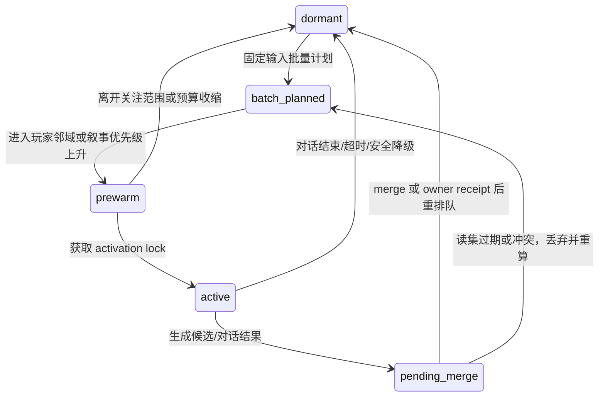

# 群体模拟与角色分级连续性

状态：`implemented bounded for one Siming-led bakery seed vertical; complete population simulation remains incomplete`

对应母规格：[Character Simulation Memory Seed And Continuity Design](../../superpowers/specs/world-character-siming-authority-mainline/2026-08-22-character-simulation-memory-seed-continuity-design.md)，映射范围：cohort batch、fidelity tier、activation/requeue 和 owner-bound intent。

## 为什么

玩家不在场时，世界仍需以低成本持续变化；玩家接近时，角色不能从静止数据瞬间跳到完整对话。群体模拟负责广域反应，角色运行时负责连续具身，完整 agent 只用于高价值时刻。

## 三档同身份模型

| 档位 | 输入与输出 | 禁止事项 |
| --- | --- | --- |
| 远场批量 | scoped owner projections -> 区域/组织/家庭计划、行为种子、owner-bound intent | 影子 NPC、自由生产写入、逐人完整 LLM |
| 中场预热具身壳 | 同一 CharacterRecord 的 canonical snapshot、当前任务、可见行为种子 -> 本地低成本演出 | 独立记忆/账户/关系真相，直接结算 |
| 近场完整 agent | activation lock、场景快照、私有五池记忆 -> 对话/复杂候选 -> revision checked merge/requeue | 绕过 owner、永久占用 agent |

## 修订

群体模拟不再被描述为独立 population truth。它是 planner/activation consumer：把实际可能改变世界的结果压缩为 owner-bound intent；owner receipt 回流后，才更新图谱、下一轮批量计划和近场行为种子。

这里的“不能直接写世界”是越权边界，不是禁止推进。群体模拟对世界的实际推进路径
是：先基于 scoped projection 计算候选，再提交已准入的 `owner_bound_intent`；对应领域
owner 负责业务校验和 settlement，成功后追加正式 world event 并返回 receipt。没有
owner receipt 的结果只能停留在 candidate、requeue、no-op 或 branch/preview，不能成为
下一轮的生产事实。

## PopulationPlanner 正式内部模块矩阵

群体模拟属于司命的受控能力域。PopulationPlanner 是司命内部的群体计算与候选生成模块，
不是独立 authority、不是第二个司命，也不是世界真相或角色记忆 owner。它没有独立
principal；司命授予它本批次的 scope、cadence、policy、selector 和 budget，并负责
审阅其结果、决定是否执行。

| 能力 | PopulationPlanner 允许 | PopulationPlanner 禁止 | 必须产出 / 最终 owner |
| --- | --- | --- | --- |
| Read | 读取冻结 cadence projection、scoped owner projection、公开事件和授权的角色/组织摘要 | 读取原始五池、角色私有关系、隐藏知识、任意 owner store、未来或 branch-only 数据 | 带 source vector、scope digest、revision 的不可变 batch read-set |
| Simulate | 选择 cohort，在预算内运行确定性 B0-B2 规则，计算压力/传播并生成 `BatchReport` | 创建影子 NPC 真相、无控制逐角色 LLM 循环、自行推进时钟、把预测当事实 | `BatchReport` 和派生候选 |
| Write | 追加 planner 自有 candidate、report、audit、`presentation_seed`、activation hint | 追加世界 event、库存/价格/关系事实、actor runtime state、`SeedDelta` 或五池记录 | 派生层记录；不产生生产结算 |
| Edit | 追加 selector、ruleset、候选顺序和解释的 revision | 编辑锁定 owner fact、receipt、历史记录或其他 owner 的 catalog entry | planner/branch 范围内的 revision |
| Execute | 为司命准备 owner-bound typed intent，等待司命 guarded admission | 独立调用 capability；自选 owner、stream、event family；直调 `GameplayEventStore`；被拒后换 owner 重试 | 司命 decision；准入后才形成 owner settlement request |
| Continuity | 在 owner receipt 后为司命准备 state/memory candidate 和连续性请求 | 独立接纳命令、追加 `SeedDelta`、结算 actor runtime state、推进角色游标 | 司命请求；Character Core command 和 receipt |

简化成一句话：

```text
司命统辖策略、准入和提交；PopulationPlanner 负责批量计算和候选生成。
Character Core 能结算角色连续性，不能结算世界真相。
领域 owner 结算世界真相。
```

因此“司命/群体模拟不能直接写”并不意味着群体模拟只能生成报告。司命可以调用
PopulationPlanner 计算结果，再通过 owner-bound intent 真实推进生产世界；只是最终
world event 必须由对应领域 owner 产生 receipt，角色的 runtime state 与 SeedDelta
必须再经过 Character Core。PopulationPlanner 单独产生的结果不能推进生产世界。

## 批量运行细节

### 2026-08-31 bounded V1 evidence

当前已实现并由 direct Harness profile 验证一条受司命监管的三角色、双节奏
纵切：W0/W1 固定 `char_a`、`char_b`、`char_c`，均经唯一
`SimingRuntime.tick(...)` 进入内部 planner。`char_a` 仅通过既有 Organization
Owner 产生 `schedule_gated_supply` receipt 并进入 Character Core；`char_b` 仅产生
无 memory candidate 的 `routine_work` 表现种子；`char_c` 仅产生激活候选，玩家结构化
输入后接管同一 `CharacterRecord`。重复、篡改、私有/branch/nested scope、预算耗尽、
缺失 Owner receipt 与未知行为均保持 zero-write。该证据不代表完整人口、社会、经济、
文明或多区域模拟，后者仍未完成。

一个 batch 以 `(world mode ref/revision, cadence source ref/revision, scoped source vector, policy/ruleset revision, seed, budget, report scope)` 固定输入。`world mode` 和“本轮为何有资格运行”的 cadence 只能从既有、已提交的 world-mode/schedule projection 读取；仅当本轮已有相关 activation 状态时才读取其既有 projection。当前生产 game-start 路径传递真实空 activation projection，不在 `SimingRuntime.tick()` 外预先准入群体计划。本模块既不拥有 `SimulationClock`，也不创建 scheduler。缺失、私有不可读、已撤销、revision 不匹配或超出本轮 budget 的 cadence 输入只产生可审计 no-op/requeue，绝不以墙钟、进程启动顺序或模型自行判断替代。

它先按区域、组织、地点、关系强度和玩家接近度选择 cohort；再对普通移动、工作、买卖和信息传播运行确定性规则或小模型；只有谈判、创新、道德两难、重大冲突和玩家即将观察到的转换才升级高成本 agent。

每个 cohort 结果必须拆成三类：`presentation_seed`（不改变真相）、`activation_candidate`（只改变调度优先级）和 `owner_bound_intent`（可能改变真相）。`presentation_seed` 不是可独立 append 的群体事件，也不进入新 bus/store；它是当前 `PresentationView` 可重建的语义层输入或可丢弃缓存，带 source vector、scope 与 mapping revision。第三类必须通过既有 `GovernedAuthorityContractCatalog` 中静态 capability 映射到一个既有或单独 admission 的 owner fragment；未知结果只报告，不写入。

OASIS 的大规模离散 action 和信息传播分层可用于 action taxonomy、cohort 预算和传播抽样；不能将其社媒平台状态直接移植为世界事实。Concordia 的 entity/component/prefab 模式可用于组装角色壳和情境；其单一 GM 必须被 Paralls 的多领域 owner 替换。Generative Agents 的日程/反思适合作为中场行为种子，不能成为每个远场角色的常驻 LLM 循环。

## 执行状态

先 formalize one existing-owner consumer row，证明远场计划 -> owner receipt -> 中场种子 -> near activation 的闭环；再扩展其他 row。未知 work、迁移、人口、社会或文明事实保持 blocked，不能用聚合报告代替 owner contract。

第一条具体纵切采用 `schedule_gated_supply`，其 capability、owner settlement、receipt
回流和角色 SeedDelta 见 [13-群体模拟生产纵切与推进闭环设计](13-群体模拟生产纵切与推进闭环设计.md)。

当前已验证的限定实现从游戏开始时的已提交 world-mode/组织 schedule projection 产生
`population_cadence_event`，经唯一 `SimingRuntime.tick()` 调用内部
`PopulationPlanner`，由 Organization owner 结算，再把结构化
`CharacterSimulationSeed` 交给 Character Core。玩家对同一角色发起结构化对话时，
activation policy 获取既有 activation lock 并激活同一 `CharacterRecord`；接管的是认知
保真度与私有记忆加载，不是世界权威或角色身份。该玩家输入实际经过生产
`_handle_envelope` 路径，当前离线验证由 L1-L4 产生 `observe` 结构化执行请求，并明确记录
`continuity_floor` 无模型保底。证据见
`.harness/verification/siming-led-population-seed-continuity-report.json`。

## 同一角色的运行状态机

角色不因 fidelity tier 而产生第二身份。`CharacterRecord` 的 owner、私有五池记忆、关系和已提交业务事实始终只有一份；系统仅调节计算预算和可见具身程度。



- `dormant` 只由 cohort 规则维持摘要、日程压力和表现候选；它不能读取私有记忆或执行 owner intent。
- `batch_planned` 固定本批的 world-mode/cadence refs 与 revisions、source vector、policy revision、seed、cohort selector 与预算；输出可重复，不能依赖迭代顺序、墙钟或实时模型随机性。
- `prewarm` 只装载 canonical snapshot、经 scope 过滤的场景上下文和行为种子，用于本地壳体连续演出；禁止加载私有五池记忆或创建独立关系状态。
- `active` 必须持有 activation lock，才可载入角色获准的私有记忆并生成强关注候选。锁冲突、revision 冲突或内存预算触发时，候选被丢弃/requeue 而不是双写。
- `pending_merge` 把结果交给既有角色/领域路径做 revision 检查；merge 成功、owner receipt 或明确拒绝都是可审计终点。

## Cohort 选择与公平性

群体调度不能只看“玩家眼前的角色”，否则远离玩家的区域永远不更新。cohort selector 先按固定的区域/组织/家庭桶排序，再按可解释的权重抽样：`baseline aging + unresolved owner consequences + propagation pressure + player proximity + narrative obligation + starvation credit`。其中 `starvation credit` 只影响下一轮计算机会，绝不等价于写入事实。

每批报告必须记录 selector revision、候选池大小、入选原因的聚合计数、seed、预算消耗和未处理桶。这样既能验证玩家邻域的平滑演出，也能证明低关注区域没有被无期限饿死。任何需要跨桶改变库存、人口、雇佣、关系或文明状态的结果，仍只允许以 owner-bound intent 离开本模块。
