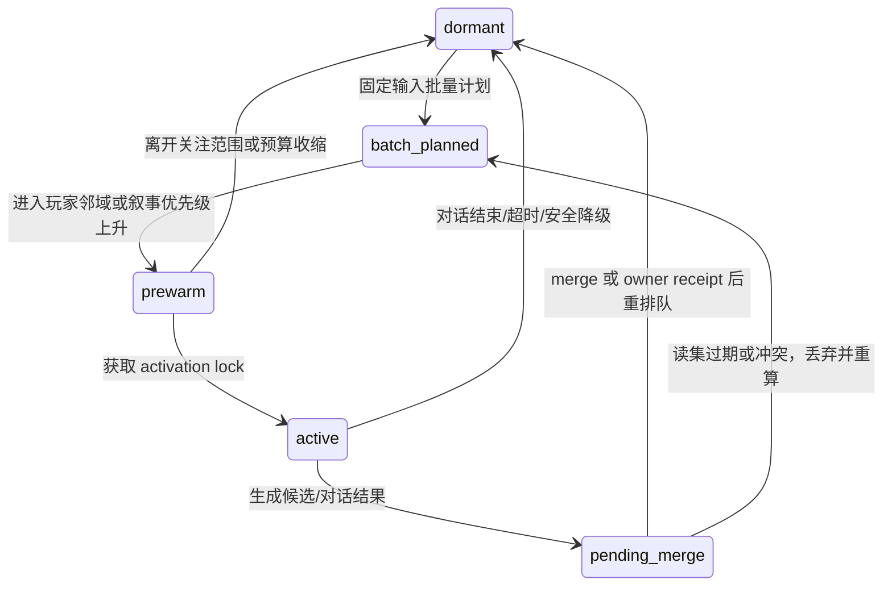

# 群体模拟与角色分级连续性

状态：`proposed amendment; P3/INF-4 planner, activation and selected consumer rows are implemented bounded`

## 为什么

玩家不在场时，世界仍需以低成本持续变化；玩家接近时，角色不能从静止数据瞬间跳到完整对话。群体模拟负责广域反应，角色运行时负责连续具身，完整 agent 只用于高价值时刻。

## 三档同身份模型

| 档位 | 输入与输出 | 禁止事项 |
| --- | --- | --- |
| 远场批量 | scoped owner projections -> 区域/组织/家庭计划、行为种子、owner-bound intent | 影子 NPC、自由生产写入、逐人完整 LLM |
| 中场预热具身壳 | 同一 CharacterRecord 的 canonical snapshot、当前任务、可见行为种子 -> 本地低成本演出 | 独立记忆/账户/关系真相，直接结算 |
| 近场完整 agent | activation lock、场景快照、私有五池记忆 -> 对话/复杂候选 -> revision checked merge/requeue | 绕过 owner、永久占用 agent |

## 修订

群体模拟不再被描述为独立 population truth。它是 planner/activation consumer：把实际可能改变世界的结果压缩为 owner-bound intent；owner receipt 回流后，才更新图谱、下一轮批量计划和近场行为种子。

## 批量运行细节

一个 batch 以 `(world mode ref/revision, cadence source ref/revision, scoped source vector, policy/ruleset revision, seed, budget, report scope)` 固定输入。`world mode` 和“本轮为何有资格运行”的 cadence 只能从既有、已提交的 world-mode/activation/schedule projection 读取；本模块既不拥有 `SimulationClock`，也不创建 scheduler。缺失、私有不可读、已撤销、revision 不匹配或超出本轮 budget 的 cadence 输入只产生可审计 no-op/requeue，绝不以墙钟、进程启动顺序或模型自行判断替代。

它先按区域、组织、地点、关系强度和玩家接近度选择 cohort；再对普通移动、工作、买卖和信息传播运行确定性规则或小模型；只有谈判、创新、道德两难、重大冲突和玩家即将观察到的转换才升级高成本 agent。

每个 cohort 结果必须拆成三类：`presentation_seed`（不改变真相）、`activation_candidate`（只改变调度优先级）和 `owner_bound_intent`（可能改变真相）。`presentation_seed` 不是可独立 append 的群体事件，也不进入新 bus/store；它是当前 `PresentationView` 可重建的语义层输入或可丢弃缓存，带 source vector、scope 与 mapping revision。第三类必须通过既有 `GovernedAuthorityContractCatalog` 中静态 capability 映射到一个既有或单独 admission 的 owner fragment；未知结果只报告，不写入。

OASIS 的大规模离散 action 和信息传播分层可用于 action taxonomy、cohort 预算和传播抽样；不能将其社媒平台状态直接移植为世界事实。Concordia 的 entity/component/prefab 模式可用于组装角色壳和情境；其单一 GM 必须被 Paralls 的多领域 owner 替换。Generative Agents 的日程/反思适合作为中场行为种子，不能成为每个远场角色的常驻 LLM 循环。

## 执行状态

先 formalize one existing-owner consumer row，证明远场计划 -> owner receipt -> 中场种子 -> near activation 的闭环；再扩展其他 row。未知 work、迁移、人口、社会或文明事实保持 blocked，不能用聚合报告代替 owner contract。

## 同一角色的运行状态机

角色不因 fidelity tier 而产生第二身份。`CharacterRecord` 的 owner、私有五池记忆、关系和已提交业务事实始终只有一份；系统仅调节计算预算和可见具身程度。

- `dormant` 只由 cohort 规则维持摘要、日程压力和表现候选；它不能读取私有记忆或执行 owner intent。
- `batch_planned` 固定本批的 world-mode/cadence refs 与 revisions、source vector、policy revision、seed、cohort selector 与预算；输出可重复，不能依赖迭代顺序、墙钟或实时模型随机性。
- `prewarm` 只装载 canonical snapshot、经 scope 过滤的场景上下文和行为种子，用于本地壳体连续演出；禁止加载私有五池记忆或创建独立关系状态。
- `active` 必须持有 activation lock，才可载入角色获准的私有记忆并生成强关注候选。锁冲突、revision 冲突或内存预算触发时，候选被丢弃/requeue 而不是双写。
- `pending_merge` 把结果交给既有角色/领域路径做 revision 检查；merge 成功、owner receipt 或明确拒绝都是可审计终点。

## Cohort 选择与公平性

群体调度不能只看“玩家眼前的角色”，否则远离玩家的区域永远不更新。cohort selector 先按固定的区域/组织/家庭桶排序，再按可解释的权重抽样：`baseline aging + unresolved owner consequences + propagation pressure + player proximity + narrative obligation + starvation credit`。其中 `starvation credit` 只影响下一轮计算机会，绝不等价于写入事实。

每批报告必须记录 selector revision、候选池大小、入选原因的聚合计数、seed、预算消耗和未处理桶。这样既能验证玩家邻域的平滑演出，也能证明低关注区域没有被无期限饿死。任何需要跨桶改变库存、人口、雇佣、关系或文明状态的结果，仍只允许以 owner-bound intent 离开本模块。
