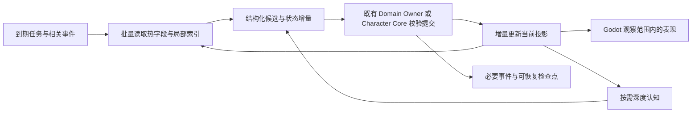

# 群体模拟开源参考与数据导向架构分析

状态：`research; proposed and non-authorizing`

调研日期：2026-09-15。通过在线搜索及打开官方文档、维护者源码和作者论文核实。本文是后续正式 spec/plan 的输入，不授权实现，也不表示已完成容量验证。

当前验证状态：`backend_local_probe_only; godot_unverified`。本轮未发现可用 Godot executable，未完成 editor/runtime 或 headless 场景验证；后续会话应读取 `.harness/verification/population-data-oriented-research/session-handoff.md` 继续验证，不能把本文件的后端/静态证据写成 Godot 完成。

## 1. 结论与范围

建议把人口模拟的高频数值计算、候选筛选、局部关系更新和增量投影做成数据导向内核；保留角色认知、领域 Owner、Authority、LLM 调用和 Godot 表现之间的现有边界。可以在内核中全面采用数据导向布局，没有必要让每项业务服务、自然语言记忆和外部协议都变成 ECS。

“一局更新量巨大”取决于人口、仿真时间跨度、时间加速倍率、各子系统频率、关系密度、历史保留策略及并行局数。人口本身不是唯一决定因素。应优先削减全历史扫描、全对象复制、全量序列化和无效轮询，再决定是否引入连续数组或原生计算模块。

本文将三类内容分开：官方项目事实；本仓库源码与局部探针证据；面向本项目的推断与建议。第 4 节是显式假设下的算术，第 8 节是本机局部实测，不移植其他项目不同硬件、不同模型的吞吐成绩。

现有九月产品分析以 54 名首发居民为方向；以下另设 100、1,000、10,000 人作为容量探索档位，不把它们视为已经批准的产品目标。参见 [九月分析入口](README.md)。

## 2. 开源项目实际能借鉴什么

| 项目 | 定位及已核实的机制 | 对本项目的价值 | 适用限制 |
|---|---|---|---|
| Mesa | Python ABM；AgentSet 批量选择、分组、分阶段激活；NumPy 环境属性层；事件与固定步长可混用 | 最接近现有 Python 开发方式，适合参考调度与环境场布局 | AgentSet 批量调用仍可逐个执行 Python agent 方法，不等于 SIMD、SoA 或自动并行 |
| Agents.jl | 通用 ABM；离散步进与 EventQueueABM；容器可选 Dict/Vector；v7 实验性 StructVector/SoAType | 直接证明“agent 语义接口”与“数组存储”可以分离 | SoA 目前限制单一 agent 类型；EventQueueABM 尚无 checkpoint IO；不建议为这些机制直接迁移语言 |
| FLAME GPU 2 | GPU ABM；SoA 变量布局；分阶段消息；空间分桶、键分桶、直接数组访问；依赖图 | 高频同构计算、减少数据移动、局部交互的参考 | GPU 不消除全员两两交互、资源争抢、CPU/GPU 数据传输或复杂分支成本 |
| Flecs | Archetype ECS；相同组件组合成表；缓存查询；系统频率配置；关系查询 | 稳定组件组合、多字段批量迭代和明确调度阶段 | 大量动态关系组合会造成表碎片；ECS 不自动提供业务持久化及授权语义 |
| EnTT | C++ ECS；按组件类型组织的 sparse-set pool；版本化 entity ID；选择性 snapshot | 较简单的稀疏组件布局、活跃集、稳定句柄和选择性状态输出 | 仍需自己处理系统执行、业务冲突与存储协议；组件池也不等于所有字段均为 SoA |
| Stanford Generative Agents | 研究型社会模拟；感知、检索、计划、反思、执行；3/25 agent 示例 | 认知任务按条件触发、注意力限制、记忆去重 | 是异构认知对照，不是万级人口生产引擎或现成容量依据 |

### Mesa：混合方式已有成熟形态，但 AgentSet 不是内存布局

Mesa 官方文档同时保留 agent 类、AgentSet 阶段式激活和 NumPy PropertyLayers。这里最值得借鉴的是：人物保留身份和行为接口，环境中每个格子的同类量集中存放；调度器统一选择哪些人物在什么阶段执行。不能仅因为用了 `agents.do()` 就宣称已向量化。[Mesa Overview](https://mesa.readthedocs.io/stable/overview.html)

版本需区分：本次打开的迁移文档标明 stable 为 3.5.1，4.0 为预发布。`ABMSimulator` 等实验类在 3.5 弃用，4.0 移除；当前方向是 `Model.schedule_event()`、`schedule_recurring()`、`run_for()`。借鉴混合调度理念即可，不应复制旧教程的过时接口。[Mesa Migration Guide](https://mesa.readthedocs.io/latest/migration_guide.html)

### Agents.jl：对象语义与数据布局可以独立演进

官方 stable v7 文档明确提供实验性 `StructVector` 容器，使 agent 内部采用 Struct-of-Arrays，接口使用 `SoAType`；它目前仅支持单一 agent 类型。一般模型仍可选择 Dict，生命周期不删除 agent 时可选择 Vector。可借鉴的是按访问模式选容器，并让外部身份不依赖内存位置。[Agents.jl Introduction](https://juliadynamics.github.io/Agents.jl/stable/)、[Agents.jl API](https://juliadynamics.github.io/Agents.jl/stable/api/)

`EventQueueABM` 用事件决定连续时间的推进，当前文档同时说明它尚不支持 `save_checkpoint`。已有事件队列不意味着已有完整恢复路径。官方性能指南还明确区分“多局并行”与“单局内部并行”：后者需要自行证明共享写、增删 agent 等操作安全；并建议把普遍存在的环境属性存为数组。[Agents.jl API](https://juliadynamics.github.io/Agents.jl/stable/api/)、[Agents.jl Performance Tips](https://juliadynamics.github.io/Agents.jl/stable/performance_tips/)

### FLAME GPU 2：关键是少搬数据、局部通信及显式冲突处理

作者论文的图 3 和第 3.1 节直接说明 SoA 存储，并把数据移动粒度从“整个 agent/message”缩小到“实际访问的变量”。论文也说明将串行资源争抢搬到并行执行后，需要显式解决冲突才能保持原模型行为；不能只把循环改成并行。[FLAME GPU 2 作者论文](https://eprints.whiterose.ac.uk/id/eprint/199416/1/Softw%20Pract%20Exp%20-%202023%20-%20Richmond%20-%20FLAME%20GPU%202%20%20A%20framework%20for%20flexible%20and%20performant%20agent%20based%20simulation%20on%20GPUs.pdf)

官方消息文档直接警告大人口的 all-to-all 昂贵，提供空间桶、键桶和数组访问。空间桶返回的是候选消息，还需要精确距离过滤；不能把分桶结果当作已经满足感知范围。运行时 message 的 `setPersistent()` 指跨仿真步保留消息，不是磁盘持久化。[FLAME GPU Communication](https://docs.flamegpu.com/guide/defining-messages-communication/index.html)

Host API 提供归约、排序及人口访问，但官方不建议频繁逐项操作设备人口。因此 GPU 应在有实测依据时承接足够大的批次，避免每轮 CPU 取回完整人口、逐个处理后再传回。[FLAME GPU Host Agent Operations](https://docs.flamegpu.com/guide/host-functions/agent-operations.html)、[Dependency Graph](https://docs.flamegpu.com/guide/defining-execution-order/dependency-graph.html)

### Flecs 与 EnTT：ECS 有不同布局，也有维护成本

Flecs 将具有相同组件组合的实体集中到表，查询可以按表匹配并缓存；系统可以配置执行间隔。这适合对某类活跃人物统一执行同一规则。[Flecs Queries](https://www.flecs.dev/flecs/Queries.html)、[Flecs Systems](https://www.flecs.dev/flecs/Systems.html)

Flecs 官方明确指出，大量不同关系组合可能造成 archetype 碎片，增加建表和查询成本。对社会模拟而言，不宜未经测量就把每条“认识某人/信任某人”的动态边编码为人物的独特组件组合。独立的边数据和邻接索引是值得比较的候选。[Flecs Relationships](https://www.flecs.dev/flecs/Relationships.html)

EnTT 则按组件类型维护 sparse-set pool，组件数据使用紧凑的分页存储，entity ID 带版本，并提供按组件与实体范围选择的 snapshot。它说明可以不用“大而全”的 archetype 系统，也能把身份、数据和批处理分开。其 snapshot 接口只是序列化机制，崩溃一致性、事件幂等和领域冲突仍需应用定义。[EnTT Entity Component System](https://github.com/skypjack/entt/wiki/Entity-Component-System)

### Generative Agents：深度认知不应成为所有数值更新的前置条件

作者仓库提供 3 人及 25 人起始模拟；README 将回放定位为调试，并说明原始回放路径不以最小存储体积为目标。因此它适合作为认知机制参考，不能据此推断万级人口实时能力。[Generative Agents Repository](https://github.com/joonspk-research/generative_agents)

`Persona.move()` 组织感知、检索、计划、反思与执行；感知接口说明注意力带宽和近期事件去重。反思代码先检查累计重要性阈值，再触发 LLM 相关处理，也有对话结束触发。值得借鉴的是条件触发及分层记忆，不是把这条完整认知链机械复制到每人每帧。[persona.py](https://raw.githubusercontent.com/joonspk-research/generative_agents/main/reverie/backend_server/persona/persona.py)、[reflect.py](https://raw.githubusercontent.com/joonspk-research/generative_agents/main/reverie/backend_server/persona/cognitive_modules/reflect.py)

## 3. 本仓库当前实现审计

审计基于当前提交 `9361c6f9df58b89c94b512f8dc3bc202888a2561`。上述开源机制不代表本仓库已经具有对应实现。

### 3.1 已有混合架构的基础，尚未形成连续数组人口内核

当前链路为：`PopulationCadenceDriver → WorldContinuityRuntime → AuthorityEventBus → SimingEventPipeline → SimingRuntime → PopulationSimulationCapability → Domain Owner / Character Core → 角色连续状态与图谱投影`。

已有的有利条件是：名单独立于完整 Profile；普通居民可以只保留 dormant continuity；决策合约已区分 B0–B3；候选、预算、revision、Owner receipt 和角色连续性提交有明确接口。可以保留这些语义接口，替换其中的数据存储与批处理实现。

但所检查的人口热路径仍是 Pydantic 模型、嵌套字典、字符串引用与逐条循环。`CharacterDynamicStateStore` 采用 `dict[actor_id, dict]`，读取、合并包含多次 deepcopy 和模型构造。这是对象/事件/投影混合的运行时，不等于已经有 SoA 数值内核。参见 [动态状态存储](../../backend/app/character_agent/storage/dynamic_state_store.py)、[人口决策表面](../../backend/app/population_continuity/decision_surface.py)、[名单说明](../population-roster.md)。

### 3.2 首要优化点：图谱适配器每次成功写入重写整库

`SQLiteHeavenlyGraphAdapter.write_batch()` 在写入前调用 `_snapshot_mutable_state()` 深拷贝全图；成功后 `_persist()` 对 `graph_nodes`、`graph_relations`、`graph_idempotency`、`graph_checkpoints`、`graph_stream_revisions`、`graph_branch_state` 六张表执行 DELETE，再遍历全部历史版本重新 INSERT，最后 commit。原子事务保证并不能消除这一写放大。

角色每次成功提交 continuity command 会调用 `_persist_graph_continuity()`，因此这条路径与普通居民更新直接相关。**这里应先改适配器的增量事务和失败恢复实现；仅更换 SQLite、添加 WAL 或引入 ECS 都不能解决源头的整库重写。** 当前已经启用 WAL。

建议保留现有图谱接口和授权语义，只对本批新增版本及变化的幂等/游标行执行增量 SQL，并为回滚保留明确的事务边界；不能以减少复制为由移除失败恢复。具体迁移仍需正式设计及回归验证。证据：[SQLite 适配器](../../backend/app/services/sqlite_heavenly_graph.py) 第 47、203 行；[全图快照](../../backend/app/services/in_memory_heavenly_graph.py) 第 1978 行。第 8 节给出实际 SQL 计数。

### 3.3 每窗口全历史读取、复制与哈希

`WorldContinuityRuntime.build_population_cadence()` 读取全部 gameplay events，把每个模型转成 JSON 数据，再整体排序编码并计算 SHA-256。底层 `GameplayEventStore.read_events()` 还会排序并深拷贝全部返回事件；即使只读取一条流，`read_stream()` 也先过滤全局列表。

正常 driver 先构建 cadence，`main.py` 中 publisher 又经 `publish_population_cadence_window()` 重新构建一次。其后 `publish_authorized_population_cadence()` 查找 source event 和 `assemble_committed_population_projections()` 还会各自读取历史。`SimingEventPipeline` 的恢复账本调用又会深拷贝 Authority 总线历史。人口不变也会随着历史增长而增加成本。

建议优先复用同一份已验证 cadence、维护流/序号索引和增量投影，再设计稳定的检查点摘要加 tail。不能直接去掉 digest 或只哈希任意子集；摘要覆盖、版本校验、scope 和重放一致性必须保持等价。现有 `global_sequence_after` 参数内部仍会扫描列表，仅换调用参数并不自动得到增量读取复杂度。

证据：[world.py](../../backend/app/population_continuity/world.py) 第 111 行；[event_store.py](../../backend/app/gameplay/event_store.py) 第 262、268 行；[main.py](../../backend/app/main.py) 第 1193、1336 行；[投影组装](../../backend/app/population_continuity/store_projection_assembler.py) 第 40 行；[事件管线](../../backend/app/services/siming_event_pipeline.py) 第 38 行。

### 3.4 小状态变化携带完整角色历史

`_apply_continuity_command()` 对普通 routine 也追加 session event 和 receipt；随后 `_persist_graph_continuity()` 每次构造包含完整 session timeline、goal history、receipts、多个角色状态的快照。筛选单人的 continuity/materialization receipts 还会遍历全角色对应字典。图谱保留各 revision，每个 revision 又含该角色的增长历史，产生“历史快照内嵌历史”的放大。

若一个角色每次增加一条时间线记录，并在每个版本重复保存从头至今的时间线，那么仅重复历史这一项，K 次更新累计可达 `1 + 2 + … + K = O(K²)` 条记录副本；这是有条件的复杂度推导，不是当前磁盘大小测量。外层整图重写会再放大实际写入量。

建议将当前态、追加历史和检查点的生命周期分开，按 actor 索引 receipts；仍由 Character Core 承担角色状态/记忆权威。幂等记录不能随意截断，检查点与增量必须覆盖恢复承诺。证据：[角色提交](../../backend/app/character_agent/runtime/runtime_loop.py) 第 1561 行及[角色快照](../../backend/app/character_agent/runtime/runtime_loop.py) 第 4362 行；[图谱连续存储](../../backend/app/character_agent/storage/graph_continuity_store.py) 第 53 行。

另需区分当前存储：`main.py` 第 678 行构造的是内存 `GameplayEventStore`，SQLite 用于 Heavenly Graph；可选 `DurableGameplayEventStore` 是全量 JSON 快照实现，并非当前主线已采用 SQLite GameplayEventStore。默认文件图谱配置还可能开启 `CharacterAgentSessionStore` 的 JSON 持久化，其 `_persist()` 会重写全部角色 session 数据；`:memory:` 或特定恢复模式会关闭这一旁路。不能把这些不同存储的保证合并描述。

### 3.5 全人口构造与筛选，最终只选择两个候选

当前生产默认 `window_size=86400`；启动后立即尝试推进一个窗口，此后 sleep 86400 秒。默认模式 `batch_limit=4`、`catch_up_limit=2`，后者还被 `default_decision_policy()` 用作 `max_candidates=2`。窗口补跑数量与单窗口选人数量共用一个字段，扩大名单不会自动扩大正常推进预算。

`build_population_projections()` 每窗口为全部 N 人分配投影，`evaluate()` 构造 N 个候选，`select()` 对全体排序并保留 deferred 列表，最后最多挑两个。探针在 100、1,000、10,000 人均观察到此结果。名单轮转能改善公平性，但不能证明所有人每仿真日都得到应有推进。

建议分开“廉价连续状态应在何时推进到哪一时刻”和“昂贵决策本轮允许执行多少次”：前者按到期集合批量积分，后者沿用预算；统计最大延迟和积压，而不仅统计总人数。先在轻量字段上筛出到期/受影响人物，再为跨边界提交构造完整模型。

同时，当前默认 routine 主要提供 `stress_load=0.0` 与 `daily_routine`，并非完整的万人需求、经济、社交模拟。因此本轮局部时延只能作为这条准备路径的成本证据，不能换算成完整模拟容量。证据：[窗口与默认模式](../../backend/app/main.py) 第 227、252、1528 行；[全员投影](../../backend/app/population_continuity/world.py) 第 155 行；[默认决策策略](../../backend/app/services/siming_population_capability.py) 第 149 行。

### 3.6 内存历史与同步执行也需预算

`InMemoryAuthorityEventBus` 用列表保留全部事件；TTL 只影响查询过滤，不清除历史，publish 对每个订阅者深拷贝 payload 并同步调用。因此大人口投影不仅构造一次，还会复制并留在历史里；角色快照写入也可能延长同一同步调用链。asyncio task 本身不意味着这些工作并行执行。

建议先用序号/引用投递已提交、不可变的内部数据，减少重复 materialization；建立 bounded diagnostics 与可靠恢复账本的分工，并明确确认点和背压。不能简单删掉用于幂等或恢复的历史，也不宜先靠线程掩盖写放大。证据：[Authority 总线](../../backend/app/services/authority_event_bus.py) 第 39–89 行。

## 4. 数据量应该怎样算

以下都是规划算术，不是当前代码实测。十进制 MB/GB；人口数记为 N，平均局部邻居数为 k，时间加速倍率为 a，子系统每仿真秒频率为 f。

粗略计算工作量为 `a × Σ(N_active × f × 单人规则成本)`；局部交互额外考虑 `a × N × k × 交互频率`。历史大小、快照次数和深度认知任务必须分别计算，不能全部折合成一个“NPC 数量”。

| 假设情景 | 100 人 | 1,000 人 | 10,000 人 |
|---|---:|---:|---:|
| 每人 128 B 的紧凑热状态，单份容量 | 12.8 KB | 128 KB | 1.28 MB |
| 每仿真秒 10 次，每次逻辑触及 128 B | 0.128 MB/s | 1.28 MB/s | 12.8 MB/s |
| 每人 20 条有向活跃社会边，每边 64 B | 128 KB | 1.28 MB | 12.8 MB |
| 一轮朴素有向两两检查 `N×(N-1)` | 9,900 | 999,000 | 99,990,000 |
| 一轮检查固定 20 个邻居 `20×N` | 2,000 | 20,000 | 200,000 |
| 每人完整快照 2,000 B，每秒 10 次输出 | 2 MB/s | 20 MB/s | 200 MB/s |

表中的 128 B 只代表假设的紧凑数值热状态，不包含 Python 对象、字符串、容器、索引、双缓冲、图谱、记忆、模型权重及 Godot 资源。实际内存流量也可能高于“逻辑触及字节”，不能把第二行直接当作硬件带宽需求。

因此，即使热数值状态本身不大，全量 JSON、历史扫描、对象复制、密集关系和日志仍可能先成为问题。例如，10,000 人每仿真分钟产生一条 1,024 B 的语义事件，24 个仿真小时就约 14.75 GB；还没有索引、复制及存储开销。若同时保留每帧全状态，增长会更快。

加速模拟还会放大吞吐要求：60 倍速运行意味着每现实秒推进 60 个仿真秒。同一局完整跑完后的逻辑事件总数不因此减少；现实每秒 CPU、LLM 和写盘压力却可能约增 60 倍。

LLM 另外核算：假设每人每仿真分钟一次调用、每次只需一个请求，10,000 人约为每现实秒 166.7 个请求（1 倍速）；54 人约为 0.9 个请求（1 倍速）、54 个请求（60 倍速）。一次完整认知可能包含多个请求、检索和生成，因此这只是示意下界。SoA 不能降低外部模型推理本身的费用和延迟。

## 5. 混合与全面数据导向如何落位

以下为本线程提议。数据导向的核心是按实际读取字段、处理批次和生命周期组织数据，不是删除所有类，也不等于必须引入 ECS、GPU、数据库或新语言。

| 数据或职责 | 建议组织方式 | 原因 |
|---|---|---|
| 身份、角色档案、规则定义 | 稳定 ID + 冷数据对象/记录 | 小频率读取，语义丰富，不应每轮复制 |
| 需求、疲劳、情绪数值、活动阶段、下次唤醒时间 | 按更新系统组织的紧凑表或数组 | 相同规则批处理，减少字段查找和无关数据移动 |
| 区域环境数值场 | 每区域/网格的连续数值层 | 环境属性不必各自包装成 agent |
| 空间、住所、组织和活动成员 | 明确的索引与活跃集合 | 候选查询应先缩小集合，再做精确判断 |
| 社会关系 | 稀疏边表 + 按人物/组织的邻接索引 | 只处理存在且受事件影响的关系，避免默认 N² |
| 角色长期记忆、文本、证据 | 冷存储及检索索引，热路径保留引用和摘要 | 体积及生命周期与数值状态不同 |
| 领域修改 | 结构化命令，经现有 Owner/Authority 验证与提交 | 数据布局优化不得产生第二套世界真相 |
| Godot 场景、动画及音频 | 保留本地高频表现，接收语义结果/增量 | 符合现有跨边界约定 |

可以在人口内核里全面数据导向：稳定 ID 映射到内部槽位，system 读取明确字段，对活跃行批处理，产生结构化意图或增量。外部仍保留角色服务接口和验证契约。内部槽位会因压缩、删除而变化，不能作为持久角色身份；异步结果也需要检查身份与版本，避免误写复用槽位。

例如疲劳系统可只读取 `fatigue[]`、`activity[]`、`last_update_tick[]`，完全不读取姓名、背包 JSON、完整记忆和对白记录；社会更新只访问受影响人物的关系边。Python `list[float]` 仍是对象引用数组，不能把字典改成几个 list 就宣称具有原生连续数值与向量化收益。当前后端依赖未声明 NumPy/Numba；先利用现有容器、索引及标准库 `heapq` 减少工作量，若数值循环仍占主要 CPU，再比较 NumPy 或原生批处理的完整收益。

必须事先选定每类字段的唯一权威：如果数组是某项 runtime 数值的 owner，对象接口只能读取它；如果数组是现有 owner 的物化投影，只能按其提交后的增量更新。禁止数组和角色对象各自修改同一权威值，再靠全量来回同步“对齐”。

建议的数据通路是：`当前投影/热表 → 批量规则与候选选择 → 结构化意图 → 现有 Owner 校验提交 → 更新增量投影 → 按观察范围输出`。这不改变 Siming 只能发高层催化、Godot 不拥有世界真相、角色认知不直接绕过领域权限的边界。



接收深度认知或并行计算的结果时，要同时验证输入版本和执行时刻。并行决策可以读取同一窗口快照；库存、席位、金钱等竞争结果仍需由原 Owner 按稳定顺序解决。不能通过全体共享可变数组绕过这些冲突规则。

## 6. 多频率、LOD 与一致性

以下频率是需要通过产品语义和实测确定的候选，不是新的默认配置。

| 工作 | 触发建议 | 不应丢失的语义 |
|---|---|---|
| 具身表现与动画 | Godot 本地高频 | 不从表现位置直接推断权威交互成功 |
| 近场移动/局部交互规则 | 活跃区域批量更新 | 阻挡、占用及交互结果按权威校验 |
| 需求和活动进展 | 低频批处理或基于 elapsed time 积分 | 阈值跨越、完成时刻及中断必须处理 |
| 日程、工作结束、预约、关系事件 | 按下一截止时间/事件唤醒 | 同时刻稳定顺序、取消及重复执行规则 |
| 复杂规划、反思和自然语言生成 | 有意义的感知/事件、计划失效、玩家接触等触发 | 异步返回后检查状态版本、上下文有效性和权限 |
| 社会关系变化 | 接触或语义事件更新相关边 | 不以一次全镇轮询代替具体因果 |

LOD 应降低不可见人物的计算细度，不能让背景世界停止时间，也不能使不在镜头中的人物免除饥饿、工作、占用、支付或后果。纯线性衰减可以累计时间后一次计算；存在阈值、随机事件、资源冲突时，必须保留事件时间与对应结算。按镜头距离跳过数值迭代需要行为等价或允许误差的依据。

“每轮只挑少数人”是预算控制，不自动等于合理 LOD。要验证所有居民会被公平唤醒，长时间未入选者不会无限饥饿；高频唤醒的角色也不能垄断全局深度认知预算。

Godot 侧应把“全镇被模拟的人口”与“当前可见的完整角色实例”分开计量。对于大量重复的远景表现，可评估按区域分组的 MultiMesh/RenderingServer；MultiMesh 不能自动替代每个角色的完整骨骼、独立行为或近景交互，并有整组可见性裁剪的限制。官方说明支持连续 buffer 批量提交，但这只是表现优化，不把世界权威移入客户端。[Godot MultiMesh](https://docs.godotengine.org/en/stable/tutorials/performance/using_multimesh.html)、[Godot Servers](https://docs.godotengine.org/en/stable/tutorials/performance/using_servers.html)

## 7. 历史、投影与存储的边界

以下为本项目建议，不是上述开源框架已保证的能力。

- **当前态读取**：增量维护可查询投影；从最后处理的序号向前消费，避免每个更新窗口重新扫描和序列化全部历史。
- **权威事件**：保留业务要求的审计、幂等、因果与恢复记录；减少的是重复读取和重复输出，不能随意丢弃承载权威结果的事件。
- **细粒度数值**：内存中可多次更新，不应默认每次变化都生成完整角色 JSON、知识图谱版本和网络消息。依据恢复目标采用检查点及必要增量。
- **恢复完整性**：检查点不仅包括数值，还要考虑仿真时钟、随机数状态、待执行事件、事件序号、版本、外部请求与已接纳结果。只有实体快照不足以证明整局可继续。
- **输出**：客户端只订阅观察范围及所需字段；日志分清业务证据与诊断采样。写入合并不得丢失外部已确认操作或跨 Owner 事务的承诺。
- **回放**：有外部 LLM 的系统不能只依赖随机种子重现。需要保留接纳的结构化结果及版本边界，或明确回放仅验证结果流，不重新生成同一句自然语言。

先复用现有 event store、投影及持久化能力。只有当实测确认单一进程或单一存储机制不能达到所需恢复/吞吐目标时，再评估额外数据库、分片或消息系统。

## 8. 本地基准与证据

可复现脚本：[research_probe.py](../../.harness/verification/population-data-oriented-research/research_probe.py)；原始结果：[results.json](../../.harness/verification/population-data-oriented-research/results.json)。证据位于忽略的 `.harness/verification/`，用于本地核查。

环境为 Windows 11、Python 3.12.14、Pydantic 2.13.5；计时一次预热后取五次中位数，未限制机器其他负载。只导入局部模块，不导入 `app.main`，不启动后端、不调用 provider、不读写真实游戏数据库。图谱探针用 `SQLiteHeavenlyGraphAdapter(':memory:')`。

### 8.1 人口准备路径

| 人口 | 构造全员投影 | 构造并哈希 ReadSet | 评估、过滤与选择 | 投影 JSON 大小 | 选中 / 延后 |
|---|---:|---:|---:|---:|---:|
| 100 | 0.232 ms | 0.430 ms | 0.846 ms | 32,071 B | 2 / 98 |
| 1,000 | 2.374 ms | 4.275 ms | 8.931 ms | 323,510 B | 2 / 998 |
| 10,000 | 60.839 ms | 83.329 ms | 133.110 ms | 3,260,760 B | 2 / 9,998 |

三个阶段单独计时；不能把中位数之和称为完整 tick 实测。未包含总线复制、Siming 主流程、Character Core 更新、领域结算、图谱落库和网络。这也不是已经执行了 N 人模拟。

### 8.2 历史长度独立于人口产生的成本

| 合成历史事件条数 | 一次 build_population_cadence 的中位数 |
|---|---:|
| 1,000 | 9.948 ms |
| 10,000 | 144.994 ms |
| 50,000 | 665.983 ms |

用一条真实模型形状的事件复制出只读夹具，直接填充独立内存 store 的事件列表，以测现有读取/复制/编码/哈希代码；不证明这些夹具具有真实交易或重放语义。真实生产历史 payload 大小与类型不同，不能据此线性外推整局吞吐。

### 8.3 更新一个图节点的 SQL 放大

先通过真实 `write_batch()` 一次创建 N 个节点，再提交其中一个节点的 revision 2。通过 SQLite trace callback 统计第二次提交：

| 既有节点数 | 实际修改节点数 | DELETE 语句数 | graph_nodes INSERT 语句数 |
|---|---:|---:|---:|
| 100 | 1 | 6 | 101 |
| 1,000 | 1 | 6 | 1,001 |
| 10,000 | 1 | 6 | 10,001 |

多出的一条是被更新节点的新版本；旧版本保留。除此之外还会重新写入幂等/其他表数据。计数有可运行断言验证，证明整库重写，**不代表真实磁盘 IOPS、字节写放大或生产响应时间**。

复现本轮命令（项目有可用 Python 时也可直接使用对应解释器）：

```powershell
& 'D:/MyConfiguration/TCLXUSER/.cache/codex-runtimes/codex-primary-runtime/dependencies/python/python.exe' .harness/verification/population-data-oriented-research/research_probe.py
```

尚未运行开源项目横向 benchmark、完整后端测试、全量 Harness、Godot 或端到端压力测试。本轮没有运行时代码改动，也不作这些里程碑的完成声明。

## 9. 实施前需要验证的最小集合

以下是后续计划的验收建议，并非本轮已经执行。

1. 固定种子和事件输入，以当前实现作为行为基线；先确认一日内所有居民的应有推进、领域结果和审计记录。
2. 单独测 54/100/1,000/10,000 人及短/长历史，避免只测“新增多少人物”；对比正常与时间加速情景。
3. 记录每阶段 p50/p95/p99、CPU 时间、峰值 RSS、对象分配、全历史读取次数、投影更新数量、序列化和持久化字节。
4. 把 LLM stub 测试与真实 provider 小流量测试分开；记录请求数、token、排队、超时、过期结果丢弃数，避免把 API 等待误判为循环布局问题。
5. 先比较“同一数据布局 + 增量投影/索引/按期调度”；再比较仅热数值字段的表/数组版本。这样才能判断收益来自算法还是布局。
6. 若考虑 GPU/原生批处理，计入数据打包、跨语言调用、传输和冲突合并的全程成本；不能只报告 kernel 时间。
7. 验证重启、重复事件、延迟 LLM 结果、并发资源争抢、居民增删和 LOD 切换，防止吞吐提升改变世界结果。

升级门槛应是目标硬件上某一明确预算持续失败，而不是只按居民数决定“必须 ECS/GPU”。100 个带长记忆且每步重放历史的人物，可能比 10,000 个局部数值 agent 更重。

建议后续工作的顺序及各步检查：

1. **先控制历史增长带来的成本。** 图谱增量事务、按 actor 索引回执、追加历史与检查点分离；验证修改一行不再重写全表，以及断电/异常回滚和旧记录恢复。
2. **消除重复全量读取。** 复用 cadence、当前态投影及流索引；固定人口增加历史，检查每次更新不再随全部历史线性增长，并验证摘要与 full/tail replay 等价。
3. **修正规模化调度口径。** 分开 B0 到期推进与昂贵决策预算；验证同一仿真时长所有人物的状态进度、最大延迟、资源后果和暂停恢复，而非仅验证最后都被轮到过。
4. **仅迁移热状态与热计算。** 对比优化过的字典基线与 SoA/紧凑表版本，在相同规则、种子、输入下检查最终状态、领域事件和接受的误差，再测吞吐与内存。
5. **最后判断语言与 GPU。** 如果优化后的批处理仍不能满足目标倍速，才迁移实际 CPU 热循环；LLM 受限则处理认知频率/并发预算，磁盘受限则处理提交与数据体积，分别针对根因。

100 人优先完成前 1–3 步；1,000 人可开始比较紧凑热表；10,000 人及高倍速应认真评估批量数值内核、稀疏关系和只实例化必要角色。以上是工程优先级，不是未经实测的容量分界线。面向数据优化与当前 Owner/角色心智边界兼容，最终可以让人口内核全面面向数据。

## 10. 本轮边界

已完成并验证：一手资料搜索与读取、源码调用路径核查、合成数据局部计时、内存 SQLite 写入 SQL 计数及其断言；已形成架构建议、规模算术与后续检查顺序。

未做：运行时代码迁移、依赖安装、数据库替换、GPU 接入、Git 提交；本文不构成 Godot 或端到端运行里程碑完成证明。
