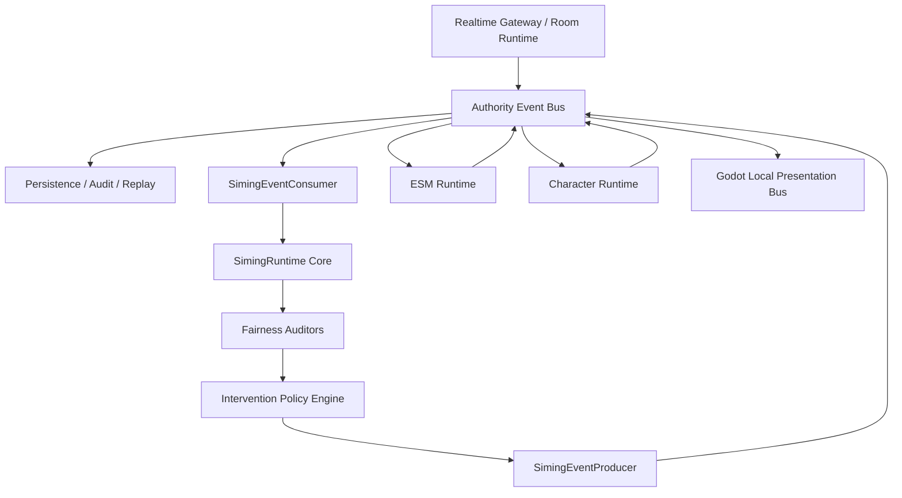

# 19-司命接入事件总线后端设计

## 1. 文档定位

本文档冻结 `Phase 1` 司命接入后端权威事件总线的后端设计口径。

它回答：

- 司命从事件总线消费什么。
- 司命向事件总线发布什么。
- 司命如何保持 replay / audit 可解释。
- 司命如何不越过 `ESM`、角色智能体与 Godot 本地表现边界。

本文档不重写：

- 事件总线公共信封规范。
- 司命公平裁判领域对象。
- `ESM` 物理结算协议。
- 角色智能体私有感知与行为决策协议。
- Godot 本地表现总线执行细节。

上游约束：

- [事件总线/01-事件总线总纲.md](../事件总线/01-事件总线总纲.md)
- [事件总线/02-后端权威叙事与事实总线设计.md](../事件总线/02-后端权威叙事与事实总线设计.md)
- [事件总线/05-事件信封与字段分层规范.md](../事件总线/05-事件信封与字段分层规范.md)
- [15-司命后端框架设计文档.md](15-司命后端框架设计文档.md)
- [17-司命Canonical Schema与验收对象.md](17-司命Canonical%20Schema与验收对象.md)

## 2. 核心结论

司命必须接入事件总线，但司命不是事件总线本体。

司命在总线中的正确身份是：

```text
受限消费者 + 公平裁判器 + 高层事件生产者 + 审计链写入者
```

一句话：

> 司命消费后端权威事件流，产出可 replay / audit 的高层裁判与调度事件，但不能直接写物理成功事实、不能直接控制角色低层动作、不能把 Godot 本地表现总线当作权威总线。

## 3. 总体架构



### 3.1 与当前架构图对照

当前架构图表达的是“最小实现态 + Phase 1 预留态”的混合视图。本文档中的 `Authority Event Bus` 对应图中的 `L6 事件总线层`，不是新增一条平行总线。

| 图中层级 | 当前组件 / 状态 | 与司命接入事件总线的关系 |
| --- | --- | --- |
| `L1 世界执行层：Godot + ESM` | Godot 本地具身执行器、场景回放与可见结果已实现；`ESMService` 已有对象交互成功 / 失败和环境状态变化的最小结算 | L1 / ESM 负责产生或确认世界事实，司命只消费这些事实，不直接写物理成功结果 |
| `L1 原始事实生产` | `visual_fact / spatial_access` 已有最小事实出口 | 这些事实进入 L6 后端权威总线，再由司命、感知链路、replay / audit 消费 |
| `L2 智能层：角色智能体 + 司命` | `CharacterService`、`CharacterPerceivedInput`、`focus / relation / runtime projection` 是最小骨架；`SimingService` 当前是 `attention_prompt / catalyst` 最小实现 | 司命在 L2 内做高层裁判与催化，但跨系统通信必须通过 L6，不直接调用下游低层执行 |
| `L3 视觉增强层` | `Visual Enhancement Request` 当前是未来预留 | 若后续司命请求视觉增强，只能发布高层 `visual_enhancement_requested` 或同类事件，不应直接驱动 Godot 视觉实现 |
| `L4 下行执行编排` | 主项目预留层当前未正式实现 | 司命 dispatch 不应直接落到角色 / ESM / Godot，应先进入下行编排或事件总线调度路径 |
| `L5 适配 / 落地` | 主项目预留层当前未正式实现 | 后续接外部框架、持久化、NATS adapter 或具体执行 adapter 时，应挂在端口后，不污染司命领域对象 |
| `L6 事件总线层` | 当前最小形态是 `FastAPI main.py / ws / debug`、`raw_fact_event -> candidate` 主链、Godot 本地表现总线、Replay / Audit / Debug Stream | Phase 1 应把这层收束成后端权威事件总线端口；司命接入点在 L6，而不是绕过 L6 直接连 L1 / L2 / L3 |

图中的关键方向应按以下方式解释：

```text
L1 原始事实 / ESM 结果
-> L6 后端权威事件总线
-> L2 司命消费
-> L2 司命生成高层裁判 / dispatch / audit
-> L6 后端权威事件总线
-> L1 / ESM / 角色 / Godot 本地表现 / replay-audit
```

因此，本文档后续出现的 `SimingEventConsumer`、`SimingEventProducer`、`SimingAuditWriter` 都是图中 `L2 司命` 与 `L6 事件总线层` 之间的后端接口，不是单独新增一套司命私有消息系统。

## 4. 司命消费的事件

司命最小订阅以下事件族：

| 事件族 | 来源 | 司命用途 |
| --- | --- | --- |
| `world_fact_event` | `L1 / RoomRuntime` | 更新房间事实上下文 |
| `visual_fact_event` | 视觉事实系统 | 更新可观察事实、证据投影与注意力候选 |
| `esm_result_event` | `ESM` | 确认物理结果是否成立 |
| `character_behavior_event` | 角色智能体 | 读取角色已承诺行为或话语 |
| `conversation_resolution_event` | 司命 / 会话确认链 | 维护成员资格、接入、知识状态 |
| `constraint_state_event` | `ESM / RoomRuntime` | 识别不可执行路径、距离约束、空间约束 |

司命不直接消费：

- 原始骨骼 `(x,y,z)` 高频流。
- 全 `AU` 高频流。
- Godot `AnimationTree` 中间态。
- `SkeletonModifier3D` 本地精修中间量。
- 角色内部 chain-of-thought、私有怀疑值或完整记忆。

## 5. 司命发布的事件

司命最小发布以下高层事件：

| 事件类型 | 目标 | 说明 |
| --- | --- | --- |
| `siming.fairness_snapshot` | audit / read model | 公平状态快照 |
| `siming.intervention_candidate` | audit / policy | 可选干预候选 |
| `siming.intervention_decision` | dispatcher / audit | 最终干预或 `no_action` 决策 |
| `siming.audit_recorded` | audit / replay | 裁判链审计记录 |
| `siming.no_action_recorded` | audit | 无动作也必须可解释 |

正式对外 dispatch 事件不使用单一 `siming.dispatch_requested` 事件名。

`siming.dispatch_requested` 只作为内部统称或 read model 汇总标签。写入后端权威事件总线时，必须按 `InterventionDecision.selected_path` 和 `intervention_band` 落成具体事件族：

| band / path | 正式 bus event | 下游 |
| --- | --- | --- |
| `impulse` + `character_input_path` | `siming.impulse` | 角色智能体 |
| `opportunity` + `character_input_path` | `siming.opportunity` | 角色智能体 |
| `fact_reveal` + `character_input_path` | `siming.fact_reveal` | 角色智能体 |
| `environment_request` + `environment_change_path` | `siming.environment_request` | `ESM / L1` |
| any + `visual_fact_path` | `siming.visual_observability_request` | 视觉事实 / Godot 表现边界 |
| any + `l3_highlight_path` | `siming.presentation_highlight_request` | `L3 / Godot` 表现路径 |
| any + `no_action` | `siming.no_action_recorded` | audit |

硬规则：

- `visual_observability_request` 必须引用已成立的 `established_fact_id`。
- `presentation_highlight_request` 只能放大已成立事实的表现可见性。
- `environment_request` 的成功事实只能由 `ESM / L1` 回写。
- `character_input_path` 事件不得直接写角色信念真值或强制台词。

司命不得发布：

- `esm_result_event` 的成功事实。
- 角色已经执行某动作的结果事实。
- Godot 低层动画、骨骼、物理位移命令。
- 绕过角色智能体的强制台词或强制心理状态。

## 6. 公共信封要求

司命发布到事件总线的事件必须沿用公共信封：

```text
event_id
event_type
producer_ts
room_id
scene_id
zone_id
source.layer
source.system
source.actor_id
routing.audience_mode
routing.routing_mode
routing.target_ids
priority
ttl
durability
causation_id
correlation_id
payload
```

规则：

- `correlation_id` 串起一次用户 / 系统链路。
- `causation_id` 指向直接触发事件。
- `event_id` 是当前事件的唯一标识。
- `producer_ts` 用于公共信封排序。
- `world_ts` 不得进入公共信封。
- `sim_tick_ts` 不得进入公共信封。
- `world_ts` 和 `sim_tick_ts` 只能进入司命领域对象或 payload。

### 6.1 `AuthorityEvent` 硬 schema

Phase 1 最小实现必须把公共信封做成硬 schema，而不是普通 `dict` 透传。

最小校验规则：

1. 缺少 `event_id / event_type / producer_ts / room_id / source / routing / causation_id / correlation_id / payload` 时失败。
2. 公共信封出现 `world_ts` 或 `sim_tick_ts` 时失败。
3. 公共信封出现旧字段 `producer / source_actor_id / target_actor_ids` 时失败。
4. `source.system` 必须能区分 `siming.orchestrator`、`siming.dispatcher`、具体 auditor 或其他生产者。
5. `routing.target_ids` 只能表达传播目标，不能表达角色是否已经相信、知晓或选择。
6. `durability` 必须显式写明 `replayable / reliable / realtime` 之一。
7. `priority` 必须显式写明 `p0 / p1 / p2 / p3` 之一。

`AuthorityEvent` schema 是 Phase 1 接入的第一道边界。没有这层，司命输出很容易退化成 WebSocket 消息包装，无法稳定 replay / audit。

## 7. replay / audit 链

司命事件链必须支持：

```text
source event
-> fairness snapshot
-> intervention candidate
-> intervention decision
-> dispatch requested / no_action
-> downstream result or timeout
-> audit record
```

replay 串链顺序：

```text
correlation_id -> causation_id -> event_id
```

时间解释顺序：

```text
producer_ts -> sim_tick_ts -> world_ts
```

其中：

- `producer_ts` 属于公共事件信封。
- `sim_tick_ts` 属于司命裁判周期。
- `world_ts` 属于房间世界时间解释。

### 7.1 审计必须覆盖失败和无动作

审计不是成功 dispatch 的附属日志，而是司命裁判链的真源。

以下情况都必须产生 `InterventionAuditRecord` 或追加 `correction_record`：

- `no_action`
- duplicate dispatch key
- duplicate audit key
- stale candidate
- dispatch ack timeout
- partial target delivery
- `ESM` rejection
- expired TTL
- late input
- late downstream result

规则：

1. `no_action` 必须写明 reject / suppress 原因，`snapshot_after_ref` 可以为 `null`。
2. duplicate dispatch 不得重复下发，只能写 `duplicate_suppressed` 或追加计数。
3. late result 不得覆盖已有 final audit，只能追加 `correction_record`。
4. `ESM` rejection 必须引用对应 `ConstraintStateResult` 或 `esm_result_event`。
5. audit 查询必须至少支持 `(room_id, correlation_id)` 和 `(room_id, causation_id)`。

## 8. 后端接口分层

### 8.1 `SimingEventConsumer`

职责：

- 订阅司命允许消费的事件族。
- 校验公共信封字段。
- 过滤非司命可见事件。
- 将公共事件转换为司命输入对象。

最小接口：

```python
class SimingEventConsumer:
    def handle_event(self, event: AuthorityEvent) -> list[SimingInput]:
        ...
```

### 8.2 `SimingRuntime`

职责：

- 维护单房间司命裁判上下文。
- 调度五个 auditor。
- 生成公平快照、干预候选和决策。
- 处理 `no_action`。

最小接口：

```python
class SimingRuntime:
    def tick(self, inputs: list[SimingInput]) -> SimingTickResult:
        ...
```

### 8.3 `SimingEventProducer`

职责：

- 把司命领域对象转换为公共事件信封。
- 写入 `causation_id / correlation_id`。
- 写入 `priority / ttl / durability`。
- 调用事件总线端口发布事件。

最小接口：

```python
class SimingEventProducer:
    def publish_outputs(self, outputs: list[SimingOutput]) -> None:
        ...
```

### 8.4 `SimingAuditWriter`

职责：

- 写入裁判链审计结果。
- 记录成功、失败、超时、重复、过期、`ESM` 拒绝。
- 支持工作台按 `correlation_id` 查询。

最小接口：

```python
class SimingAuditWriter:
    def record(self, audit: SimingAuditRecord) -> None:
        ...
```

## 9. 事件总线端口

司命不得直接依赖 `NATS JetStream` SDK。

后端应先定义端口：

```python
class AuthorityEventBusPort:
    def publish(self, event: AuthorityEvent) -> None:
        ...

    def subscribe(self, topic: str, consumer: EventConsumer) -> None:
        ...
```

Phase 1 最小实现：

- 单元测试使用 `InMemoryAuthorityEventBus`。
- 集成测试使用 fake / embedded adapter。
- 可靠链路 adapter 接 `NATS JetStream`。
- replay / audit 写入 PostgreSQL 或审计日志表。
- Redis 只用于热状态、短 TTL 幂等键和 presence，不作为 replay 真源。

## 10. 调度边界

司命形成 `InterventionDecision` 后，下游必须按具体 dispatch event family 处理：

| `selected_path` | 正式 bus event | 下游 | 允许内容 | 禁止内容 | 必须回流 |
| --- | --- | --- | --- | --- | --- |
| `character_input_path` | `siming.impulse / siming.opportunity / siming.fact_reveal` | 角色智能体 | 动机、注意力、机会、压力、fact ref | 强制心理真值、强制台词 | character ack / result |
| `environment_change_path` | `siming.environment_request` | `ESM / L1` | 环境目标、约束、期望效果 | 直接写成功事实 | `ESM` resolution + world fact |
| `visual_fact_path` | `siming.visual_observability_request` | 视觉事实 / Godot 表现边界 | `established_fact_id`、放大方式、预算 | 制造未成立事实 | observed presentation / visibility result |
| `l3_highlight_path` | `siming.presentation_highlight_request` | `L3 / Godot` 表现路径 | 已成立事实的镜头 / 高光提示 | 骨骼、AU、低层动画命令 | presentation result |
| `no_action` | `siming.no_action_recorded` | audit | 拒绝原因、无动作说明 | 下游执行请求 | audit only |

`environment_request` 的成功事实只能由 `ESM / L1` 回写。

### 10.1 `environment_request` 硬闭环

`environment_request` 是最容易越过 `ESM` 的路径，必须单独验收。

固定链路：

```text
siming.environment_request
-> ESM accepts / rejects
-> esm_result_event 或 constraint_state_event
-> world_fact_event（仅成功时）
-> siming audit update
-> read model update
```

硬规则：

1. 司命只能表达环境目标、约束和期望效果。
2. `ESM` 拒绝时不得改写为本地表现成功。
3. `ESM` 成功时，成功事实由 `ESM / L1` 事件生产，不由司命生产。
4. 超时、拒绝和部分生效都必须进入 audit。
5. replay 时必须能从 `siming.environment_request` 串到最终 `esm_result_event / constraint_state_event`。

## 11. Phase 1 最小落地范围

必须实现：

1. `AuthorityEvent` 公共信封。
2. `AuthorityEventBusPort`。
3. `SimingEventConsumer`。
4. `SimingRuntime.tick()`。
5. `SimingEventProducer`。
6. `SimingAuditWriter`。
7. `correlation_id / causation_id / event_id` replay 链。
8. `no_action` 审计。
9. dispatch 幂等键。
10. `environment_request -> ESM result -> audit` 闭环。
11. 公共信封 hard schema 校验。
12. 具体 dispatch event family 映射。

允许 stub：

- 长 horizon 叙事投影。
- `EventChainCandidate` 搜索。
- 完整工作台 UI。
- `NATS JetStream` 真实 adapter。
- PostgreSQL 正式表结构。

不得作为 Phase 1 最小验收阻塞项：

- 多步戏剧链搜索。
- 完整持续后台推演。
- 跨服总线拓扑。
- 大规模分片部署。

## 12. Phase 0 兼容迁移边界

当前仓库 Phase 0 / Phase 0.5 可以继续保留 WebSocket handler 直接调用 `SimingService` 并回写 `siming_output` 的可观察路径。

但这条路径只能视为：

- Phase 0 adapter
- backend-owned high-level catalyst stub
- Godot 可观察演示链路

不能视为：

- Phase 1 后端权威事件总线接入
- replay / audit 真源
- 正式 `SimingRuntime` 主链
- 正式 dispatch / idempotency / audit 实现

Phase 1 迁移应按以下顺序推进：

```text
WebSocket / RoomRuntime input
-> AuthorityEvent
-> InMemoryAuthorityEventBus
-> SimingEventConsumer
-> SimingRuntime.tick()
-> SimingEventProducer
-> downstream fake adapter
-> SimingAuditWriter
```

不要一次性删除 Phase 0 直连路径。先把同一输入双写到 `AuthorityEventBus` 和现有 WebSocket 输出，再用 harness / golden trace 证明 bus 链路覆盖现有可观察能力，最后再收敛直连调用。

## 13. 验收标准

最小验收应覆盖：

- 司命能消费一条 `visual_fact_event` 并写入审计。
- 司命能消费一条 `esm_result_event` 并形成公平快照。
- 司命能发布具体 dispatch event family，但不直接写 `ESM` 成功事实。
- `siming.environment_request -> esm_result_event / constraint_state_event -> audit` 能完整 replay。
- `no_action` 也会产生审计记录。
- 重复 dispatch key 不重复下发。
- late result 只追加 `correction_record`，不覆盖 final audit。
- `world_ts` 出现在公共信封时测试失败。
- `siming.dispatch_requested` 作为正式 bus event 出现时测试失败。
- replay 能按 `correlation_id -> causation_id -> event_id` 回放。

## 14. 一句话收束

司命接入事件总线的核心不是“让司命听见所有消息”，而是：

> 让司命只消费它有资格消费的权威事件，只发布高层、可审计、可回放、不会越权的裁判与调度事件，并把物理成功、角色执行和本地表现继续留给 `ESM`、角色智能体和 Godot 本地表现总线。
