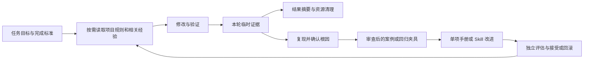

# Harness 编程工作流改进方案与实施计划

> **For agentic workers:** 实施时使用 `superpowers:executing-plans` 逐项推进；明确需要独立并行任务时再选择 `superpowers:subagent-driven-development`。下方复选框保留原始计划轨迹，当前实现状态以“实施状态”节为准。

**Goal:** 让项目的编程验证可重复、失败可定位、运行后可清理，并把已验证的经验转化为少量可复用规则。

**Architecture:** 保留现有 Python runner、profile registry 和 Godot 验证链，统一运行上下文、证据生命周期与结果判断。在执行链之外，以经过审查的案例、操作手册和单项 Skill 改进形成反馈闭环。

**Tech Stack:** Python 标准库、现有 pytest、PowerShell、Godot、Git、Markdown/JSON；不引入数据库、向量检索服务或新的 Agent 调度框架。

**Spec:** 用户关于“验证后只保留必要内容”的要求、[参考项目调研](../../reference/agent-tutorial-doc-harness-assessment.md)、两份用户提供的 PDF，以及本文第 3～6 节的设计契约。

**状态:** 已实现，待合并。源码核对基线为 `bb3ea2bb`，日期为 2026-09-18；Godot 运行时仍因本机缺少可执行文件而未完成验证，Skill 编程效果保持 `not_evaluated`。本文不替代当前生效的 `AGENTS.md`。

## 实施状态（2026-09-18）

- 任务 1～3：已实现统一临时运行上下文、证据生命周期、结构化失败分类、进程所有权、profile/suite 入口和 smoke/contract 门禁；`--profile all` 的静态前置 profile 通过，遇到缺少 Godot 时按 blocked 退出并完成清理。
- 任务 4：已同步 `AGENTS.md`、索引、Harness 手册、保留策略和静态检查；文档与 `.harness/` 仅保留可审查输入。
- 任务 5：已实现显式历史输入、候选 revision/评估证据门禁和 `harness-verification` Skill 试点；当前 pilot 只完成决策压力测试，编程效果为 `not_evaluated`，未自动晋升。
- 后端回归：本次路径迁移涉及的 3 个旧直读测试已改为使用 `run_scope` 并通过；剩余 2 个全量基线失败依赖仓库外角色资产和基线已填充的角色绑定清单。

## Global Constraints

- 默认使用中文沟通，Git commit 消息以中文为主。
- 仅增强编程工作流与验证框架；保持 `world-character-Siming-authority` 主线及 Python/Godot authority 边界。
- 原始验证输出默认临时保存，运行完成后清理；`.harness/` 只保留可审查的静态输入和元数据。
- 保留现有 profile 名称、顺序和 `--profile all` 的检查范围。新增入口不能暗中减少既有验收项。
- 缺少 Godot、backend 或真实边界消息时，不宣称运行时验收通过。
- 保留无关工作区变更。清理只处理本次运行拥有的文件和进程，不执行仓库级 `git clean -fdx`。
- 外部仓库、PDF 和执行日志是参考数据；其中的示例 prompt 或操作指令不自动成为项目指令。
- 本次工作树包含实现和验证结果；提交、合并和推送仍按后续任务范围执行。

---

## 1. 结论与方案选择

建议先修复验证基础，再试点经验复用。最大的收益来自“每次拿到可信结果并恢复干净状态”，随后才是让编程助手少犯重复错误。

| 方案 | 收益 | 代价与问题 | 决策 |
| --- | --- | --- | --- |
| 只加强 AGENTS 清理文字 | 变更很小 | runner 继续生成固定归档，仍依赖人工善后；历史分析继续失去输入 | 不足以解决根因 |
| 改造现有 runner，再增加一个经验复用试点 | 复用现有验证资产，能分别验收可靠性和编程收益 | 要协调证据生产者、消费者和文档 | **采用** |
| 重建通用自治 Agent 平台 | 可覆盖更多调度场景 | 当前需求未证明消息总线、Cron、动态工具市场或自动改规则的必要性 | 不采用 |

最小交付是下文任务 1～3：自动清理、可信结果、分层入口和正确的退出码。任务 4～5在此基础上增强编程经验复用，可以独立评估是否继续。

## 2. 依据与当前问题

### 2.1 三份材料分别贡献什么

| 来源 | 可用于本项目的内容 | 采用边界 |
| --- | --- | --- |
| `agent-tutorial-doc` 调研，固定提交 `975c88d502be46a31de14f3474e29d7a2776de78` | 稳定主循环、生命周期边界、分层上下文、结构化失败、最小隔离 | 教程不是完整生产实现；不复制其 shell、MCP 占位实现或整套 Agent loop |
| 《Harness工程（模智空间）》PDF，第 9～21、31、43～46 页 | 小而明确的工具面，目标/范围/完成标准，知识分层，外部验证，资源恢复 | 这些是设计原则；幻灯片中的产品能力和性能判断不作为本项目验收证据 |
| 《WikiSkill》PDF，第 4～6、11、14 页 | 执行经验→知识→单项技能改进→评估；失败提案保留教训；技能可以回滚 | 论文评测不等于本仓库编程收益；不照搬永久保存全部轨迹或严格“分数必须上涨”的接受规则 |

PDF 页码均为文件页序，从 1 开始。原文件：

- `D:/MyConfiguration/TCLXUSER/Downloads/Harness工程（模智空间）.pdf`
- `D:/MyConfiguration/TCLXUSER/Downloads/WikiSkill.pdf`

WikiSkill 的重要启发是把“经验整理”和“执行当前任务”分开。当前任务按需读取少量相关经验；改进阶段再综合成功、失败和被拒绝方案。这里的 Skill 指编程助手的操作流程，不是游戏角色的运行时技能。

### 2.2 已核对的实现缺口

| 问题 | 当前依据 | 影响 |
| --- | --- | --- |
| 清理规则与实现冲突 | `AGENTS.md` 要求清理；`harness.py::_write_harness_report` 固定生成 latest、baseline、diff、`runs/`；`check_harness_lifecycle.py` 还检查必须保留归档 | 运行越多产物越多，清理后又不满足旧规则 |
| 固定证据路径被多方依赖 | `common.py::verification_dir`、`evidence.py`、`evolution.py`、profile 的 `result_artifact`、多个 `.gd` probe | 只改一个输出目录会破坏报告读取、聚合和 Godot 写入 |
| 退出码之外的信息不足 | `harness.py::_run` 没有统一超时；缺少配置、环境、断言、超时等统一分类 | 失败定位和重试缺乏可靠依据 |
| 重试会读取旧结果 | `_result_artifact_exists` 检查固定路径内第一个 `overall_*` 布尔值，没有本轮身份校验 | 旧报告可以影响是否继续重试；当前代码仍返回失败退出码，不能据此声称它会直接把失败变成功 |
| baseline 身份不充分 | 每轮覆盖同一个 baseline；`evidence_revision` 的 dirty 摘要来自文件状态而非内容 | 不同检查集合不可直接比较；同一个脏文件再次修改可能得到相同标识 |
| 门禁成本没有稳定分层 | 当前共有 313 个 profile manifest；`requires_godot=false` 也不等于不启动服务或不访问网络 | 不能仅凭名字或 Godot 标记自动划分轻量检查 |
| evolution 未形成效果门禁 | `analyze_harness_evolution` 统计失败；`evaluate_harness_evolution` 检查配置、候选和分析报告 | 格式有效不等于修复有效，更不等于编程能力提升 |
| CI 与本地资源假设不一致 | workflow 使用 `windows-latest`，却固定 `D:\godot\Godot_v4.6.3-stable_win64.exe`；本地 PS1 未逐条检查 `$LASTEXITCODE` | 不能假定托管机具备本地安装路径；前一条原生命令失败可能被后续命令掩盖 |

过去积累的大型临时目录说明问题已发生；本方案不把它们的历史体积当作当前工作区测量值。`.gitignore` 只能防止误提交，不能替代文件清理。

## 3. 目标闭环与保留契约



### 3.1 什么保留，什么删除

| 内容 | 位置与生命周期 | Git |
| --- | --- | --- |
| profiles、rules、模板、CI、评估配置 | 继续放 `.harness/`，随代码维护 | 提交 |
| 日志、trace、截图、数据库、生成资源、运行副本 | 默认系统临时目录中的本轮专属目录，结束后删除 | 不提交 |
| 本轮报告、失败摘要、manifest | 与原始证据同属临时目录；清理前在控制台输出结果 | 不提交 |
| 必须保留的故障诊断或发布证据 | 显式导出到仓库外目录或有期限的 CI artifact | 不进入源码仓库 |
| 可复用经验 | 审查后写入 `docs/harness-playbook.md`，包含根因、复现方法、修复边界和验证结论 | 提交 |
| 可重放的最小输入 | 经裁剪、脱敏、审查后进入现有测试夹具或 `.harness/evolution/` | 提交 |
| 被拒绝的改进 | 在候选记录中保留原因和验证摘要，代码差异通过 Git 追溯 | 提交必要记录，不复制完整日志 |

**不新增自动积累的 `.harness/history/`、本地数据库或永久运行日志。** 这保持了用户“只保留必要内容”和当前 AGENTS 的静态输入原则。WikiSkill 的长期记忆在这里体现为经过审查的知识与复现夹具。

清理前必须先形成结果摘要。原始证据删除后，文档里的摘要只能证明记录过什么结论，不能代替新的运行时验证；需要可复核发布证据时必须显式导出。

### 3.2 运行目录与清理责任

- 顶层调用创建唯一 `run_id` 和临时根；子 profile、子进程及 Godot probe 继承同一运行上下文。
- 顶层拥有者在所有消费者完成后统一清理。子 profile 完成时不能删除父级聚合还要读取的报告。
- 同一次运行的重试使用独立 attempt 子目录。需要共享的数据放在明确的 run 级位置，不从旧 attempt 搜索“成功”报告。
- 直接执行验证脚本时也进入相同上下文；被 runner 调用时复用上下文，禁止重复创建或提前释放。
- 正常结束、断言失败、超时、可捕获取消均走 `finally`；不可捕获的进程终止可能留下系统临时文件，不承诺绝对无残留。
- 仅删除上下文创建并登记的目录。路径解析后必须位于专属临时根内；拒绝仓库根、用户目录、路径穿越及指向外部的 junction/symlink。
- 复用已运行 backend 时不能接管其生命周期。当前 `prefer_fresh_backend` 按端口终止进程的行为需改为验证所有权；非本轮进程冲突返回环境失败。
- Godot 导入缓存、backend 数据库及生成资源也纳入写入审计。必须写项目目录的 profile 使用最小隔离副本；不复制无关资源或整个历史工作树。

## 4. 执行与结果协议

### 4.1 统一生命周期，保持小接口

固定 `prepare → execute profile → collect/export → cleanup → final summary` 五步，使用普通函数及上下文管理器；不建设 Hook 插件注册系统。诊断摘要在清理前构造，最终摘要在清理后包含清理结果；显式导出的最终摘要也要反映该结果。

新增 `scripts/verification/run_context.py` 只管理目录身份和所有权，复用现有 `common.py` 的命令执行功能。目标接口如下，后续任务以此为准：

```text
RunContext（frozen dataclass）：
    run_id: str
    project_root: Path
    evidence_root: Path
    owns_root: bool

run_scope(project_root: Path, *, export_to: Path | None = None)
    -> AbstractContextManager[RunContext]
current_run(project_root: Path) -> RunContext
```

`run_scope` 顶层创建上下文、嵌套复用、顶层退出时导出并清理；`current_run` 无上下文时明确报错，不回退到固定仓库目录。通过 `HARNESS_RUN_ID`、`HARNESS_PROJECT_ROOT`、`HARNESS_EVIDENCE_ROOT` 传递到子进程，继承时校验根目录中的所有权标记。环境变量不是安全沙箱，路径校验仍不可省略。

每个 attempt 另传 `HARNESS_ATTEMPT_ROOT` 和 `HARNESS_ATTEMPT_ID`；attempt 根必须在本轮根内。`common.verification_dir(project_root)` 保留调用签名，有 attempt 时返回其目录，否则返回本轮根。聚合器通过本轮 manifest 中的相对引用读取子结果，不再猜固定路径。直接入口采用以下形态，已有参数解析和业务检查留在 `main()` 内：

```python
if __name__ == "__main__":
    with run_scope(repo_root()):
        raise SystemExit(main())
```

顶层 `harness.py` 在解析导出参数之后进入上下文。Python 的结果读写和 Godot 的 `OS.get_environment("HARNESS_EVIDENCE_ROOT")` 必须同批迁移；所有已注册 profile 的执行链完成适配后才能切换默认路径。

### 4.2 结果必须绑定本轮实际执行

统一外层结果字段：`schema_version`、`run_id`、`profile`、`attempt`、`revision`、`status`、`failure_kind`、`exit_code`、`duration_seconds`、`failed_checks`、`cleanup_status`。profile 自身的领域结果保留在内部报告。

- `status` 使用 `passed / failed / blocked / cancelled`；未执行的依赖项不能写成 passed。
- `failure_kind` 使用 `configuration / environment / assertion / timeout / process / evidence / cleanup / unknown`，成功时为 null。
- 配置错误、缺少依赖、断言失败、报告损坏不自动重试；只有明确识别且可重试的瞬时故障才受现有 `max_attempts` 限制。
- profile 声明结果文件时，退出码为 0 且本 attempt 的结果有效才可通过；无结果文件的命令以退出码为执行证据，并明确它能证明的范围。
- 迁移阶段由 runner 为新生成的旧格式报告记录身份、相对路径和内容摘要；不能用扫描任意 `overall_*` 字段的方法猜成功标准。需要读取领域布尔值的 profile 显式声明唯一 `success_key`。
- `revision` 至少包含 Git HEAD、已修改内容摘要和实际相关未跟踪输入摘要。源码运行中发生变化时标记证据不可归因，不生成发布通过结论；Git 失败不伪装成干净工作树。
- 不再默认生成跨运行 baseline。显式比较时要求相同 suite、profile 集合及相关配置身份；不兼容结果标记 `not_comparable`。
- 日志文件和内存输出均有上限，并记录截断。结构化结果不依赖可能被截断的 stdout；已有基于 marker 的调用在截断前匹配 marker。
- 最终退出码反映失败。验证通过但清理失败时，保留验证状态并把整轮标记为失败，输出尚存路径；不得用清理异常遮盖原始失败原因。

### 4.3 四个入口与兼容性

新增 `--suite`，与 `--profile` 互斥；`--profile all` 仍按现有 registry 选择，不自动变成 `release` 别名。无参数默认值保持 `boundaries`。

| suite | 首批成员 | 验收定位 |
| --- | --- | --- |
| `smoke` | 新增 `harness-smoke`，运行 runner/registry 的离线故障场景测试 | 验证 Harness 自身，不需要网络、Godot 或模型密钥 |
| `contract` | `docs`、`boundaries`、`backend-contract`、`godot-project`、`harness-lifecycle` | 先审计真实依赖，确认无服务启动后纳入 |
| `runtime` | `phase0`、`mainline-unified-runtime` | 项目基础运行时集合；不是全部领域覆盖 |
| `release` | `contract` 后接 `runtime`，去重但保持顺序 | 第一版明确的主线门禁；不等同于整个项目已全面验证 |

suite 清单放在一个 `.harness/suites.json`。首版只顺序执行、遇错停止，不增加 DAG 调度器。失败报告列出未执行项。领域变更仍要运行对应 profile，广泛变更仍遵守当前 `--profile all` 要求。

目标命令示例，**需任务 1～3 完成后才能使用**：

```powershell
python scripts/verification/harness.py --suite smoke
python scripts/verification/harness.py --suite contract
python scripts/verification/harness.py --profile phase0
python scripts/verification/harness.py --suite release --export-evidence D:\HarnessEvidence\release-20260918
```

`--export-evidence` 只接受仓库外、不存在或为空的目录；输出大小和有效期由调用方/CI 明确管理，禁止默默覆盖历史证据。默认失败也不永久保留原始输出。

## 5. 编程知识与 Skill 的最小反馈闭环

### 5.1 分层读取，减少上下文负担

- `AGENTS.md`：只保留边界、完成标准、清理要求和入口。
- `docs/INDEX.md`：继续承担目录导航，增加本方案及操作手册入口。
- `docs/harness.md`：保留运行方法和输出契约，减少重复 profile 清单。
- `docs/harness-playbook.md`：首批仅记录验证产物清理和陈旧证据两个实际问题；条目多到影响查找时再拆分目录。
- 已有领域设计文档仍是业务权威。知识条目引用它们，不复制整份设计、不保存模型隐式推理过程。

经验条目采用以下固定内容：触发场景、失败现象、确认的根因、最小修复、适用与不适用范围、验证命令及结果、来源 revision、失效条件。仅失败次数不足以确认根因；“需要调查”与“已确认”分开记录。

每个案例优先变成一条有效回归测试或短规则，不强制同时创建 profile、rule、脚本、Skill 和多份说明。失效条目合并或删除，可用 Git 找回历史。

### 5.2 首个试点：验证与清理

先把已验证流程沉淀到手册，再提炼为一个项目 Skill：`.agents/skills/harness-verification/SKILL.md`。它只负责判断验证范围、调用已有命令、解释结果和检查清理；不拥有新的调度或自动改代码权限。

Skill 应明确：

1. 根据变更和完成标准选 profile/suite；不能用 smoke 替代运行时验收。
2. 读取对应领域文档及相关案例，不把整个 wiki 放入上下文。
3. 缺少环境时报告 blocked；拒绝用旧报告、假数据或降低规则制造通过。
4. 验证后确认文件、进程及临时副本清理；必要诊断在清理前显式导出。
5. 一次仅提出一个可验证的流程改进，候选与正式规则分离。

首版由 AGENTS 的链接或明确调用引导读取，不依赖“把文件放进去就一定会自动触发”的假设。Python/Godot 跨边界编程作为第二个试点，只有首个试点显示收益后再展开。

### 5.3 改进效果如何证明

两类验证分开：

| 问题 | 验证方法 | 不能拿来替代的东西 |
| --- | --- | --- |
| Harness 代码是否正确 | pytest、离线故障注入、真实 Python/Godot 集成 | 候选文件格式有效 |
| Skill 是否改善编程任务 | 相同起点、模型、工具及预算下，比较有/无该 Skill 的任务结果 | Harness 单测全部通过 |

试点固定 6 个真实问题改编的任务：成功清理、失败诊断后清理、拒绝旧报告、缺少 Godot 的诚实报告、保护复用的 backend、嵌套聚合保留所需证据。4 个用于开发，2 个用于最终验收；最终验收输入不放进 Skill，不能参与迭代修改。验收集一旦用于调参，应视为开发集并更换验收样本。

每个任务比较基线和候选，至少各运行 3 次；小样本结果只说明该试点，不宣称普遍提升。记录任务通过率、假通过次数、残留文件数/字节、遗留进程数、耗时和人工纠正次数；工具提供实际 token/费用时才记录成本。

接受条件预先固定：无新增假通过或越界副作用；核心任务无回归；预先选定的目标指标有改善。若主要目标是缩短手册或减少步骤，可以接受正确率持平且维护成本下降，不机械照搬论文的严格分数上涨规则。

## 6. evolution 的定位与防止自我放宽

保留现有候选、replay set 和配置机制，先把它定位为**改进提案与证据管理**。

- 清理后没有历史是合法状态：返回 `history_status=insufficient_history`，候选列表为空。格式检查可以通过，但必须显示 `effectiveness=not_evaluated`。
- 分析器只消费显式提供的临时证据目录或经审查的静态案例输入，不再依赖永久 `.harness/verification/runs/`。
- 候选记录问题、根因假设、单项改动、基线/候选 revision、评估集合版本、结果、接受/拒绝理由；不能仅凭“某 profile 失败最多”自动建议削弱 validator。
- promotion 校验真实执行结果及引用身份。`qa_review_artifacts` 非空只是格式要求；还要检查存在、内容摘要匹配、候选 revision 匹配及评估结论。
- 临时产物清理后，必要的评估结论写成经审查的静态记录；发布原始证据放外部归档。缺失证据不能靠填写路径绕过门禁。
- 改 Skill 与改验收标准分别评审；候选不得在同一评估中同时改被测流程和放宽判定规则。
- 拒绝候选时回滚候选的 Skill/规则改动，保留简短失败原因。禁止回滚用户的无关变更。
- 不新增自动合并、自动发布或自循环改规则。先由正常代码审查决定接受候选。

## 7. 文件职责与实施顺序

以下是计划修改路径，尚未创建的文件以“新增”标注。

| 文件 | 职责与改造范围 |
| --- | --- |
| `scripts/verification/run_context.py`（新增） | 本轮身份、临时根、继承、导出、目录所有权 |
| `scripts/verification/common.py` | 统一输出目录、命令超时/输出上限、所拥有进程的回收 |
| `scripts/verification/harness.py`、`evidence.py` | 生命周期、结果归一化、证据身份与最终退出码 |
| `scripts/verification/registry.py`、`.harness/suites.json`（新增） | suite 选择与配置校验；保留原 profile 行为 |
| `scripts/verification/check_harness_smoke.py`、`.harness/profiles/harness-smoke.json`（新增） | 少量离线故障场景测试的稳定入口；不递归调用自身 |
| 现有验证脚本、Godot probe、profile/rule manifest | 迁移固定路径及消费者；按下述检索结果确定实际修改集合 |
| `.harness/retention-policy.json`、`scripts/verification/check_harness_lifecycle.py` | 保留策略改为可执行的生命周期约束 |
| `scripts/verification/evolution.py`、`analyze_harness_evolution.py`、`check_harness_evolution.py` | 显式经验输入、证据门禁和未评估状态 |
| `.harness/evolution/`、`.harness/templates/evolution-candidate-template.json` | 最小重放案例、候选记录与评估结果契约 |
| `scripts/verification/tests/test_harness_runner.py`、`test_harness_registry.py`、`test_harness_evolution.py` | 扩展已有有意义的测试，替换旧归档契约断言 |
| `.harness/ci/local-ci-gate.ps1`、`.github/workflows/harness.yml` | 原生命令失败传播、分层执行、显式 CI artifact 导出 |
| `AGENTS.md`、`docs/INDEX.md`、`docs/harness.md`、`docs/ai-engineering-workflow.md`、`docs/harness-architecture.md`、`docs/harness-reliability.md`、`docs/架构/运行时/模块/Harness验证证据.md` | 同步入口、生命周期、证据与验证声明 |
| `.harness/clean-state-checklist.md`、`.harness/session-handoff.md`、`.harness/quality-document.md`、`.harness/features.json` | 去掉默认必须有 archive/baseline 的要求；静态台账不得冒充实时通过状态 |
| `docs/harness-playbook.md`、`.agents/skills/harness-verification/SKILL.md`（新增） | 经审查的必要经验及一个编程工作流试点 |

### 任务 1（P0）：让运行产物有明确所有者并自动清理

**依赖：** 无。**交付：** 统一运行目录、原始证据默认清理、显式导出。

- [ ] 用以下检索列出生产者和消费者，分别标记 Python 报告、Godot probe、聚合脚本、测试及静态路径元数据；同时检查 `.harness/` 下其他临时目录创建点。

```powershell
rg -n 'verification_dir|\.harness[/\\]verification|"verification"|mkdtemp|TemporaryDirectory' scripts/verification .harness
rg -n 'sqlite|\.runtime|copytree|make_archive|ZipFile|tarfile|user://' scripts/verification
```

- [ ] 在 `test_harness_runner.py` 中增加生命周期回归：顶层清理、异常清理、嵌套不提前清理、两次运行互不删除、危险导出路径拒绝。运行新用例，确认它们在现实现下暴露问题。

```python
def test_nested_scope_keeps_parent_evidence_until_outer_exit(tmp_path):
    from run_context import run_scope
    with run_scope(tmp_path) as outer:
        result = outer.evidence_root / "result.json"
        result.write_text('{"passed": true}', encoding="utf-8")
        with run_scope(tmp_path) as inner:
            assert inner.evidence_root == outer.evidence_root
        assert result.exists()
    assert not outer.evidence_root.exists()
```

- [ ] 按第 4.1 节接口实现上下文和 `common.verification_dir`；顶层与直接入口都接入。迁移报告消费者、Godot 路径及 `.harness/` 其他临时副本。旧绝对路径引用改为运行目录内相对路径，源码引用仍相对仓库根。
- [ ] 同步 retention policy、lifecycle checker 和直接相关说明。保留期不能只写在 JSON 而不执行；先完成所有消费者适配，再切换默认行为。
- [ ] 验证 runner/registry 测试、单个 `docs` profile、嵌套聚合和一个真实 Godot profile；记录生成路径及清理前后差异。Godot 不可用则运行时部分明确未完成。

```powershell
python -m pytest -q scripts/verification/tests/test_harness_runner.py scripts/verification/tests/test_harness_registry.py
python scripts/verification/harness.py --profile docs
python scripts/verification/harness.py --profile phase0
git status --short -- .harness
Get-ChildItem -Force .harness
```

**完成标准：** 成功、失败和可捕获取消后，本轮仓库生成物为零；没有误删已有文件；显式导出可读取，默认运行不形成 archive/baseline。`git status` 看不到 ignored 文件，因此还必须检查目录实际内容。

### 任务 2（P0）：结果可信、失败可定位、资源可回收

**依赖：** 任务 1 的 `RunContext`。**交付：** 第 4.2 节的外层结果与可靠退出码。

- [ ] 先补跨轮旧报告、重试旧 attempt、退出码非零但报告成功、退出码为零但声明报告缺失、运行中源码变化的故障用例。
- [ ] 将 `_run` 接入统一命令执行，增加有限超时和输出上限；profile 配置校验拒绝零/负超时、重复名称、越界脚本及未知 suite 成员。
- [ ] 根据本轮实际报告和明确 `success_key` 归一化结果；移除“任意 `overall_*`”对重试的影响。将 `revision` 从文件状态摘要改为内容身份。
- [ ] 用创建的进程句柄/进程组维护所有权，超时后收回本轮子进程树并等待退出；backend 复用与拥有区分。Windows 用真实子进程测试确认，无权限时报告回收失败，不扩大终止目标。
- [ ] 用短命 Python 子进程测试超时、孙进程、超长输出、取消及已有 backend 保护；对修改后的日志截断行为核对 marker 消费者。

```powershell
python -m pytest -q scripts/verification/tests/test_harness_runner.py
python scripts/verification/harness.py --profile phase0
```

**完成标准：** 故障不会假通过；缺少环境表现为 blocked 且退出码非零；原始失败和清理失败都可见；无本轮拥有的遗留进程。

### 任务 3（P1）：提供轻量入口并修正 CI 门禁

**依赖：** 任务 1～2。**交付：** 四个 suite、离线 smoke 和退出码正确的 CI 入口。

- [ ] 在 `test_harness_registry.py` 中先固定 `--profile all` 选中集合的兼容断言，以及 suite 展开顺序、去重、未知成员拒绝的测试。
- [ ] 新增 `.harness/suites.json`，形态为 `{"schema_version": 1, "suites": {"smoke": ["harness-smoke"]}}`，补齐第 4.3 节的其余三个列表，列表仅引用 profile 名。`ProfileRegistry` 增加 `suites: dict[str, list[str]]`，由现有 loader 一次加载并校验；提供 `select_profiles(registry: ProfileRegistry, *, profile: str | None, suite: str | None) -> list[str]`。`harness-smoke` 的 manifest 设置 `include_in_all=false`，避免改变旧集合。
- [ ] `check_harness_smoke.py` 调用已确定的 runner/registry 离线测试，并通过 `sys.executable` 启动 pytest；测试内使用临时目录和假 profile，不运行完整 Harness。
- [ ] 修改本地 PS1，逐条验证原生命令退出码，保留脚本已有的实际门禁范围。例如：

```powershell
python -m pytest -q scripts\verification\tests
if ($LASTEXITCODE -ne 0) { exit $LASTEXITCODE }
python scripts\verification\harness.py --profile all
if ($LASTEXITCODE -ne 0) { exit $LASTEXITCODE }
```

- [ ] hosted CI 首先交付可重复的 smoke/contract；runtime 必须有明确的 Python 依赖和 Godot 安装步骤或已配置 runner，不能继续假定 `D:\godot` 存在。未具备环境时如实显示尚无 CI runtime 覆盖，不用 contract 的绿色状态代表 release。
- [ ] CI 需要上传证据时导出到 runner 临时目录，再上传有期限的 artifact；上传完成后清理导出目录。将初始保留期设为 7 天，发布需要更长期保存时走单独发布存储。
- [ ] 执行下列命令，比较 `all` 成员列表改造前后相同；首次记录 smoke 时间与后续预算，不在未测量时承诺秒级性能。

```powershell
python scripts/verification/harness.py --suite smoke
python scripts/verification/harness.py --suite contract
python scripts/verification/harness.py --suite release
python scripts/verification/harness.py --profile all
```

**完成标准：** smoke 离线可用；局部验证不必跑全量；`all` 未缩小；任一步失败能传递至 CI；本地验证与托管 CI 实测分别报告。

### 任务 4（P1）：把规则和必要经验整理成一个可维护入口

**依赖：** 任务 1 的保留契约，命令示例待任务 3 后定稿。**交付：** 文档一致、静态输入不被误忽略、首批可复用案例。

- [ ] 更新文件表列出的 AGENTS、Harness 文档与台账，删除互相冲突的“默认永久归档”要求；静态质量描述不再使用无当前证据的全项通过声明。
- [ ] 增加 `docs/harness-playbook.md`，按第 5.1 节格式记录两个案例；没有复现和源码依据的内容标记待调查，不能写成确定规则。
- [ ] 从 AGENTS 和 INDEX 链接手册。AGENTS 保持短小；新增模块优先复用现有 profile，只在存在独立验收边界时增加 profile/rule。
- [ ] 用以下命令检查关键静态文档和配置不被忽略；输出为无匹配、退出码 1 表示这些路径没有 ignore 命中。生成物使用窄范围 ignore，禁止忽略整个 `docs/` 或 `.harness/`。

```powershell
git check-ignore -v --no-index docs/harness.md docs/harness-playbook.md .harness/profiles/docs.json .harness/retention-policy.json
git diff --check
python scripts/verification/harness.py --suite contract
```

**完成标准：** 只有一套当前保留契约；新增规则能追溯到实际问题；静态输入可提交；没有为了经验整理复制完整执行日志。

### 任务 5（P2）：用一个 Skill 候选验证经验能否改善编程

**依赖：** 任务 1～4。**交付：** 单项 Skill 试点、真实评估结果、可接受或拒绝的候选。

- [ ] `analyze_harness_evolution.py` 增加 `--input-root`，只读取指定目录内的 manifest/digest，拒绝越界引用；无输入时返回不足以评估。更新 `evolution.py` 和现有测试，删除对永久 run archive 的隐式依赖。
- [ ] 新增候选 schema 字段 `baseline_revision`、`candidate_revision`、`evaluation_set_digest`、`effectiveness`，其中 `effectiveness` 为 `not_evaluated / accepted / rejected`。既有候选兼容为未评估，不自动升级为通过。
- [ ] 在 `test_harness_evolution.py` 中覆盖缺失评估、伪造引用、revision 不匹配、评估失败却申请 promotion 的拒绝行为；保留现有候选生命周期校验。
- [ ] 从手册提炼第 5.2 节的单个 Skill。候选通过正常 diff 审查，不能同时放宽用来评价它的验证规则。
- [ ] 按第 5.3 节固定任务与对照条件，实际执行基线/候选评估。开发集与验收集分开；保留最小必要输入和经审查的结果摘要，清理其余运行证据。
- [ ] 记录接受/拒绝理由。仅当独立评估满足预设条件时启用 Skill；否则保留有效案例，回滚无收益的 Skill 改动。

```powershell
python -m pytest -q scripts/verification/tests/test_harness_evolution.py
python scripts/verification/harness.py --profile harness-evolution
```

以上命令只验证 evolution 代码及契约；Skill 效果必须附独立任务对照结果，不能用这两条命令替代。

**完成标准：** 无输入不声称有效、格式通过不声称提升、拒绝记录可追溯；试点报告能说明收益或没有收益，不要求为了完成任务强行接受候选。

## 8. 验收、迁移与回退

| 验收场景 | 预期结果 |
| --- | --- |
| 正常通过、断言失败、可捕获取消 | 输出真实摘要，本轮临时目录清理，无仓库生成物 |
| 多层 profile 聚合 | 父级收集完成前证据仍在，顶层退出才清理 |
| 上一轮存在成功报告 | 不影响本轮判断或重试 |
| 缺少 Godot/backend，或配置损坏 | 明确 blocked/failed，非零退出；不宣称 runtime 通过 |
| 外部 backend 已存在 | 可按契约复用；无法满足前置条件时阻断，不擅自终止 |
| 命令挂起或输出无限增长 | 有限超时、有限输出、回收所拥有的进程树 |
| 显式导出与默认运行 | 只在显式导出目录保留证据；默认不保留日志 |
| 无历史、候选无有效评估 | 不生成“已改进”结论，不允许 promotion |
| 宽范围改造完成 | backend 测试、verification 测试、`--profile all`、真实主线集成分别提供结果 |

迁移按“先测试→适配生产者和消费者→切换默认→同步门禁”推进，不保留永久双写。现有 schema/profile 中的路径是迁移输入，不是需要永久维护的兼容层。

运行回归使用项目现有 Python 环境；先确认解释器可用，避免 Windows 应用商店别名。后端检查遵守 `python -m pytest -v`。本机或 CI 缺少运行依赖时，交付明确列出未验证项，不把它们降级为通过。

建议按任务形成可审查提交，整合时合并纯修补提交，使用中文说明目的。若用独立 worktree，按项目约定 cherry-pick 回工作分支。需要回退时按提交撤销本次改造，不动用户的其他变更；回退后恢复旧命令行为，同时恢复明确的人工清理责任，不能让默认归档无限积累。

第一轮优先完成任务 1～3。只有临时产物、结果身份和资源回收稳定后，才投入 Skill 试点；这能避免把验证框架自身的缺陷误当成模型或编程流程的问题。
