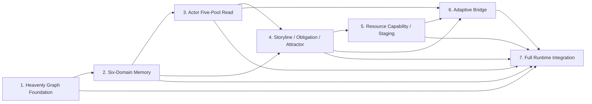

# Siming Heavenly Knowledge Graph Program Implementation Plan

> **For agentic workers:** REQUIRED SUB-SKILL: Use superpowers:subagent-driven-development (recommended) or superpowers:executing-plans to implement this plan task-by-task. Steps use checkbox (`- [ ]`) syntax for tracking.

**Goal:** Evolve Siming from a current-tick event responder into a heavenly runtime with canonical long-term graph memory, player-respecting story convergence, read-only actor-memory access, resource-aware story realization, and replayable outcome management.

**Architecture:** The program is split into seven dependency-ordered delivery phases. Each phase owns one independently testable contract and receives its own approved spec, executable implementation plan, focused tests, and Harness profile before the next phase may depend on it. `SimingRuntime.tick(...)` remains the only decision path; the graph becomes canonical memory while the state tree, read model, and checkpoints become projections.

**Tech Stack:** Python `>=3.11`, Pydantic v2, pytest, deterministic in-memory graph adapter, existing FastAPI backend and System L6 authority event bus, existing Harness Engineering profiles, production graph database selected only after contract benchmarking.

## Global Constraints

- The approved source design is `docs/superpowers/specs/current-project-intelligence-upgrade/2026-07-11-current-project-siming-heavenly-knowledge-graph-and-story-node-design.md`.
- Preserve `SimingRuntime.tick(inputs: list[SimingInput]) -> SimingTickResult` as the only runtime decision entry.
- Preserve System L6 as authority envelope, routing, replay, and audit-support infrastructure; L6 must not own graph semantics or story truth.
- Preserve L1/World/ESM as world-fact and settlement authority; graph writes may reference confirmed results but may not manufacture them.
- Preserve `CharacterAgentRuntime` as owner of actor cognition and five-pool writes; Siming receives structured read-only access only.
- Preserve Godot as local embodiment, presentation, preload, and realization host; Godot must not own story selection.
- LLMs may emit typed proposals only and may never execute graph-database writes directly.
- Graph memory is canonical. Compressed summaries, state-tree snapshots, read models, and prompts are disposable projections.
- The first version has activation and recall selection but no active forgetting engine and no physical deletion used to simulate forgetting.
- Authored story content and runtime story history remain separate; runtime outcomes never mutate authored blueprints.
- Player/actor authority choices may permanently close authored routes. No later phase may revive the same closed node instance.
- Resource capability and authored-story scores rank only candidates that already passed fact, autonomy, authority, feasibility, and safety gates.
- Raw multimodal artifacts, raw patch caches, inference history, hidden state, and chain-of-thought are excluded from the graph.
- Every graph mutation must carry branch scope, valid time, recorded time, immutable provenance, transaction identity, and idempotency identity.
- During migration, shadow writes and shadow reads are allowed, but one event family must have exactly one decision owner and one catalyst publisher.
- Every phase must complete `spec -> plan -> implementation -> focused tests -> dedicated Harness profile` before dependent implementation begins.
- Do not add a production graph-database dependency in Phase 1.
- Do not claim Godot verification unless Godot was actually run or inspected.

---

## Program Artifact and File Responsibility Map

### Program governance

- `docs/superpowers/plans/current-project-intelligence-upgrade/2026-07-11-current-project-siming-heavenly-knowledge-graph-program-plan.md`: dependency order, phase gates, cross-phase invariants, production-adapter selection gate, and final verification ladder.
- `docs/superpowers/plans/current-project-intelligence-upgrade/README.md`: discoverability and current execution status for this program.

### Phase 1: Heavenly Graph Foundation

- `backend/app/models/siming_heavenly_graph.py`: graph scope, bi-temporal validity, immutable provenance, node/relation revisions, queries, write batches, and checkpoint snapshots.
- `backend/app/services/siming_heavenly_graph_port.py`: stable storage port and graph-specific error contracts.
- `backend/app/services/in_memory_heavenly_graph.py`: deterministic transactional test/Harness adapter.
- `backend/tests/heavenly_graph_contract.py`: reusable adapter contract suite inherited by every concrete adapter.
- `backend/tests/test_siming_heavenly_graph_models.py`: Pydantic contract validation.
- `backend/tests/test_siming_heavenly_graph_contract.py`: in-memory adapter binding for the reusable contract suite.
- `scripts/verification/verify_siming_heavenly_graph_foundation.py`: focused proof and evidence report.
- `.harness/profiles/siming-heavenly-graph-foundation.json`: dedicated backend-only Harness profile.
- `docs/harness.md` and `docs/INDEX.md`: command and evidence documentation.

### Phase 2: Siming Six-Domain Memory

- `backend/app/models/siming_heavenly_memory.py`: typed schemas for world facts, causal timeline, actor cognition, storyline/obligation, intervention outcomes, and convergence strategy.
- `backend/app/services/siming_heavenly_memory.py`: validated domain writes and domain-scoped queries over `HeavenlyGraphPort`.
- `backend/app/services/siming_context_compiler.py`: deterministic relevant-subgraph activation for one tick.
- `backend/app/services/siming_story_projection.py`: state-tree, `NarrativeReadModel`, checkpoint, and debug projection from graph truth.
- `backend/tests/test_siming_six_domain_memory.py`: cross-domain separation, conflict preservation, and summary reconstruction tests.
- `.harness/profiles/siming-six-domain-memory.json`: six-domain memory and reconstruction proof.

### Phase 3: Actor Five-Pool Read Integration

- `backend/app/services/siming_actor_memory_gateway.py`: actor/time/branch/source-filtered read-only gateway over `CharacterAgentRuntime.get_memory_record_bundle(actor_id)`.
- `backend/app/models/siming_actor_memory_read.py`: memory revision vector, completeness state, structured five-pool read result, and private-artifact exclusions.
- `backend/app/character_agent/models/knowledge_memory.py`, `social_memory.py`, and `higher_order_memory.py`: stable graph-backed relationship contracts for heavy actors while retaining compatible light-actor representations.
- `backend/tests/test_siming_actor_memory_gateway.py`: read-only access, revision consistency, incomplete-surface behavior, and cross-actor isolation.
- `.harness/profiles/siming-actor-memory-read.json`: five-pool read-only and no-cross-role-leak proof.

### Phase 4: Storyline, Obligation, and Attractor Runtime

- `backend/app/models/siming_story_graph.py`: authored blueprints, runtime node instances, outcome ports, obligations, attractors, constraints, and lifecycle states.
- `backend/app/services/siming_story_graph_runtime.py`: authored/runtime separation, authority-confirmed outcome resolution, branch closure, and node lifecycle transitions.
- `backend/app/services/siming_story_obligation_runtime.py`: obligation pressure, transform, waive, contradict, and fulfill operations.
- `backend/app/services/siming_story_node_orchestrator.py`: hard-gate evaluation and narrative scoring without resource realization.
- `backend/tests/test_siming_story_graph_runtime.py`: node closure, no-resurrection, obligation transformation, and branch reachability.
- `.harness/profiles/siming-story-runtime.json`: player divergence and story-convergence proof.

### Phase 5: Resource Capability Graph and Node Staging

- `backend/app/models/siming_resource_capability.py`: capability packages, availability, load cost, cooldown, realization variants, and exact realization signatures.
- `backend/app/services/siming_resource_capability_registry.py`: capability lookup, coverage, reuse value, fatigue, and cooldown.
- `backend/app/services/siming_story_node_staging.py`: actor binding, authority/ESM/Godot feasibility, preload, cancellation, and `aborted_before_activation`.
- `backend/tests/test_siming_resource_staging.py`: causal hard gates, semantic reuse, signature fatigue, failed staging, and cancellation.
- `.harness/profiles/siming-resource-staging.json`: resource-aware staging proof.

### Phase 6: Adaptive Bridge Node Runtime

- `backend/app/models/siming_adaptive_bridge.py`: allowed bridge patterns and typed `AdaptiveBridgeNodeProposal`.
- `backend/app/services/siming_adaptive_bridge.py`: causal-gap detection, proposal validation, runtime-node commit, audit, and rejection.
- `backend/tests/test_siming_adaptive_bridge.py`: existing-fact-only, no-memory-write, no-node-resurrection, resource validation, and replayability.
- `.harness/profiles/siming-adaptive-bridge.json`: player-divergence bridge proof.

### Phase 7: Full Runtime Integration and Harness Proof

- `backend/app/services/siming_runtime.py`: consume compiled graph context and select story-node/no-action through the existing single tick path.
- `backend/app/services/siming_event_pipeline.py`: graph ingest, outcome writeback, audit linkage, and projection sequencing around `tick(...)`.
- `backend/app/main.py`: composition of the selected graph adapter, actor-memory gateway, context compiler, orchestrator, staging service, and projection builder.
- `backend/app/services/siming_state_tree.py` and `backend/app/services/siming_storyline.py`: compatibility projection only; no canonical long-term story ownership.
- `backend/app/services/siming_read_model.py` and `backend/app/services/siming_audit_writer.py`: graph transaction, node, staging, outcome, and checkpoint references.
- `docs/架构/运行时/模块/Siming.md`: update current runtime truth to allow structured five-pool reads while continuing to ban private caches and memory writes.
- `backend/tests/test_siming_heavenly_runtime_integration.py`: single-decision-owner, graph-degraded, in-flight recovery, and complete ledger-burning scenario.
- `.harness/profiles/siming-heavenly-runtime.json`: end-to-end graph-backed Siming proof.

---

## Dependency Graph



Phase 2 may start only after the Phase 1 port and adapter contract are stable. Phase 4 depends on both canonical domain memory and consistent actor-memory reads. Phase 6 depends on story, actor-memory, and resource validation contracts. Phase 7 is the only phase authorized to move the graph-backed path into production decision ownership.

---

## Phase Gates

| Phase | Independently testable deliverable | Required dedicated profile | Exit gate |
| --- | --- | --- | --- |
| 1 | Typed graph envelope, bi-temporal/branch semantics, port, deterministic adapter, stable checkpoints | `siming-heavenly-graph-foundation` | Contract suite passes; no `SimingRuntime` wiring exists |
| 2 | Six domain schemas, context compiler, graph-to-projection reconstruction | `siming-six-domain-memory` | Deleted summary can be rebuilt identically from graph state |
| 3 | Read-only five-pool gateway and consistent memory revision vector | `siming-actor-memory-read` | Missing memory is marked incomplete; no actor write API exists |
| 4 | Authored/runtime story graphs, node lifecycle, outcome ports, obligation transform, attractor reachability | `siming-story-runtime` | Authority-confirmed player choice closes a node permanently without resurrection |
| 5 | Resource capability registry, reuse/fatigue scoring, staging and cancellation | `siming-resource-staging` | Staging failure writes no false story outcome |
| 6 | Constrained bridge proposal, validation, audit, and runtime-node commit | `siming-adaptive-bridge` | Bridge uses existing facts/memory only and cannot restore a closed node |
| 7 | One graph-backed tick path, outcome writeback, projections, degradation, recovery, and end-to-end scenario | `siming-heavenly-runtime` | Legacy and graph decision owners are mutually exclusive; broad Harness passes |

---

### Task 1: Deliver Heavenly Graph Foundation

**Files:**
- Execute: `docs/superpowers/plans/current-project-intelligence-upgrade/2026-07-11-current-project-heavenly-graph-foundation-implementation-plan.md`
- Verify: `.harness/profiles/siming-heavenly-graph-foundation.json`

**Interfaces:**
- Produces: `HeavenlyGraphPort` and `InMemoryHeavenlyGraphAdapter`.
- Produces: reusable adapter contract tests.
- Does not consume or modify `SimingRuntime`, `CharacterAgentRuntime`, ESM, System L6, or Godot.

- [ ] Approve and execute the detailed Phase 1 plan task-by-task.
- [ ] Require focused model/adapter tests to pass.
- [ ] Require `python scripts/verification/harness.py --profile siming-heavenly-graph-foundation` to pass.
- [ ] Record the final Phase 1 contract signatures before authoring the Phase 2 implementation plan.

### Task 2: Deliver Siming Six-Domain Memory

**Files:**
- Create the Phase 2 design under `docs/superpowers/specs/current-project-intelligence-upgrade/` with the stable slug `current-project-siming-six-domain-memory`.
- Create the matching executable plan under `docs/superpowers/plans/current-project-intelligence-upgrade/`.
- Verify: `.harness/profiles/siming-six-domain-memory.json`.

**Interfaces:**
- Consumes: Phase 1 `HeavenlyGraphPort`, graph entities, queries, transactions, and checkpoints.
- Produces: six typed domain schemas, `SimingContextCompiler`, and `StoryProjectionBuilder`.

- [ ] Freeze domain node/relation types without changing the Phase 1 storage envelope.
- [ ] Prove world facts and actor beliefs cannot occupy the same semantic type.
- [ ] Prove conflicting claims remain separate revisions with provenance.
- [ ] Store only normalized `siming_mm:*` evidence refs and keep advisory evidence non-authoritative.
- [ ] Prove structured context is deterministic after deleting a cached summary.
- [ ] Keep all outputs advisory/offline; do not publish a second runtime decision path.

### Task 3: Deliver Actor Five-Pool Read Integration

**Files:**
- Create the Phase 3 design with slug `current-project-siming-actor-five-pool-read`.
- Create the matching executable plan.
- Verify: `.harness/profiles/siming-actor-memory-read.json`.

**Interfaces:**
- Consumes: `CharacterAgentRuntime.get_memory_record_bundle(actor_id) -> CharacterMemoryRecordBundle` and Phase 2 actor-cognition domain writes.
- Produces: `ActorMemoryReadGateway.read_memory_bundle(...)` and `MemoryRevisionVector`.

- [ ] Define one read request spanning actor, branch, valid time, and expected revisions.
- [ ] Return `memory_surface_incomplete` instead of converting missing data into “actor does not know.”
- [ ] Exclude raw private caches, raw patches, hidden state, inference history, and reasoning drafts.
- [ ] Prove the gateway exposes no write method and does not mutate actor stores.
- [ ] Prove two actors' beliefs remain isolated after context compilation.

### Task 4: Deliver Storyline, Obligation, and Attractor Runtime

**Files:**
- Create the Phase 4 design with slug `current-project-siming-storyline-obligation-attractor-runtime`.
- Create the matching executable plan.
- Verify: `.harness/profiles/siming-story-runtime.json`.

**Interfaces:**
- Consumes: Phase 2 story/causal domains and Phase 3 actor-memory read surface.
- Produces: authored/runtime story separation, typed node lifecycle, outcome-port resolution, obligation transformation, and attractor reachability.

- [ ] Encode the full `latent -> eligible -> selected -> staged -> active -> resolving -> resolved/failed/aborted -> cooldown` lifecycle.
- [ ] Resolve outcome ports only from authority-confirmed events.
- [ ] Preserve permanent player branch closure.
- [ ] Transform, waive, contradict, or fulfill obligations without manufacturing replacement props.
- [ ] Run in shadow mode until Phase 7 assigns decision ownership.

### Task 5: Deliver Resource Capability Graph and Node Staging

**Files:**
- Create the Phase 5 design with slug `current-project-siming-resource-capability-and-node-staging`.
- Create the matching executable plan.
- Verify: `.harness/profiles/siming-resource-staging.json`.

**Interfaces:**
- Consumes: eligible story-node candidates from Phase 4.
- Produces: resource capability coverage, realization variants, exact-signature fatigue, staging requests, cancellation, and staging results.

- [ ] Enforce fact/autonomy/authority/feasibility gates before resource scoring.
- [ ] Keep the resource capability graph separate from the six canonical heavenly-memory domains.
- [ ] Permit the same resource package to realize different semantic purposes.
- [ ] Penalize short-window repetition of the exact realization signature.
- [ ] Abort before activation when preload or feasibility fails.
- [ ] Write no fulfilled obligation or resolved story node from staging success alone.

### Task 6: Deliver Adaptive Bridge Node Runtime

**Files:**
- Create the Phase 6 design with slug `current-project-siming-adaptive-bridge-runtime`.
- Create the matching executable plan.
- Verify: `.harness/profiles/siming-adaptive-bridge.json`.

**Interfaces:**
- Consumes: authority-confirmed divergence, actor memory, open obligation, reachable attractors, and resource capabilities.
- Produces: validated short-lived runtime story nodes for one local causal gap.

- [ ] Restrict bridge patterns to `private_confrontation`, `consequence_reveal`, `relationship_shift`, `alternative_opportunity`, `delayed_payoff`, and `aftermath`.
- [ ] Reject proposals that invent facts, require unavailable capabilities, write actor memory, or restore a closed node.
- [ ] Record proposal basis, validation, realization mapping, rejection, activation, and result refs.
- [ ] Prove actor refusal or unavailable realization results in `aborted`.
- [ ] Keep bridge proposals outside runtime decision ownership until Phase 7.

### Task 7: Deliver Full Runtime Integration and Harness Proof

**Files:**
- Create the Phase 7 design with slug `current-project-siming-heavenly-runtime-integration`.
- Create the matching executable plan.
- Verify: `.harness/profiles/siming-heavenly-runtime.json`.

**Interfaces:**
- Consumes: all Phase 1-6 contracts.
- Produces: graph-backed `SimingRuntime.tick(...)`, outcome writeback, compatibility projections, graph degradation, in-flight recovery, and end-to-end evidence.

- [ ] Add a feature ownership matrix mapping each event family to exactly one legacy or graph-backed decision owner.
- [ ] Allow shadow ingest/projection without duplicate catalyst publication.
- [ ] Route compiled graph context into the existing tick entry.
- [ ] Write selected/staged/active/resolving/final outcomes only from validated transitions and real runtime feedback.
- [ ] Enter `graph_degraded` on graph unavailability and prohibit new graph-dependent activation.
- [ ] Recover selected/staged/active/resolving nodes by distinguishing unsent, sent-unconfirmed, and authority-confirmed work.
- [ ] Prove the ledger-burning scenario, player branch closure, obligation transformation, semantic resource reuse, bridge validation, and no node resurrection.
- [ ] Run the full verification ladder in this document.

---

## Production Graph Adapter Selection Gate

Phase 1 deliberately creates the production port without selecting a vendor. A concrete production adapter may begin only after an ADR compares candidate backends against all of these fixed criteria:

1. Atomic multi-node/relation transaction support.
2. Valid-time and recorded-time query semantics.
3. Strict world/session/story-branch isolation.
4. Immutable node/relation revision provenance.
5. Deterministic checkpoint export and replay.
6. Idempotency-key conflict detection.
7. Node/relation-level audit references.
8. Operational backup, restore, migration, and local-development support.
9. License and deployment compatibility with this repository.

The selected adapter must inherit the same `HeavenlyGraphContract` tests used by `InMemoryHeavenlyGraphAdapter`. Vendor-specific behavior cannot weaken the common contract. The production adapter is required before Phase 7 can claim production readiness, but it is not required for deterministic Phase 2-6 development and Harness proof.

---

## Migration and Single-Decision-Owner Gate

Migration has three modes:

| Mode | Graph writes | Graph reads | May publish catalyst |
| --- | --- | --- | --- |
| `off` | no | no | legacy path only |
| `shadow` | yes | yes, evidence only | legacy path only |
| `active` | yes | yes | graph path for event families assigned in the ownership matrix |

Rules:

- `shadow` may compare graph projections with legacy snapshots but may not change policy, feasibility, node selection, or output publication.
- Event ownership is assigned by event family, not by whichever path returns first.
- A correlation ID may produce at most one selected intervention decision and one dispatch family.
- Rollback from `active` to `shadow` stops new graph decisions but preserves graph history and real outcomes.
- State-tree and read-model projections never become fallback story truth.

---

## Program Verification Ladder

Each phase runs its focused tests and dedicated profile. Phase 7 additionally runs:

```powershell
python -m pytest -v
python scripts/verification/harness.py --profile siming-heavenly-graph-foundation
python scripts/verification/harness.py --profile siming-six-domain-memory
python scripts/verification/harness.py --profile siming-actor-memory-read
python scripts/verification/harness.py --profile siming-story-runtime
python scripts/verification/harness.py --profile siming-resource-staging
python scripts/verification/harness.py --profile siming-adaptive-bridge
python scripts/verification/harness.py --profile siming-heavenly-runtime
python scripts/verification/harness.py --profile mainline-unified-runtime
python scripts/verification/harness.py --profile all
```

Expected:

- Every command exits `0`.
- Every dedicated report's `overall_*_passed` field is `true`.
- No duplicate Siming dispatch exists for one correlation ID.
- No Godot claim is made unless the relevant Godot profile actually executed successfully.

---

## Program Self-Review

**Spec coverage:** The seven phases map exactly to design section 21. Cross-cutting constraints cover canonical graph memory, six domains, read-only five-pool access, authored/runtime separation, permanent player closure, obligations, attractors, resource reuse, bridge nodes, state-tree demotion, graph degradation, and adapter consistency.

**Intentional phase boundary:** Phase 1 creates no six-domain semantics, actor-memory gateway, story node, resource capability, bridge node, or `SimingRuntime` integration. Those are explicit phase deliverables, not omitted work.

**Production backend boundary:** The program freezes the adapter contract and vendor-selection criteria without inventing a database choice unsupported by the approved spec.

**Open-marker scan:** This program contains no open implementation markers. Future phases are identified by stable artifact slugs, concrete file ownership, exact output contracts, exact profile names, and exit gates; each receives its own executable plan before code changes.

**Type consistency:** `HeavenlyGraphPort` is introduced in Phase 1 and consumed unchanged by later phases. `ActorMemoryReadGateway` is introduced in Phase 3. `StoryNodeOrchestrator` is introduced in Phase 4. `ResourceCapabilityRegistry` and staging are introduced in Phase 5. `AdaptiveBridgeNodeProposal` is introduced in Phase 6. `SimingRuntime.tick(...)` integration occurs only in Phase 7.
