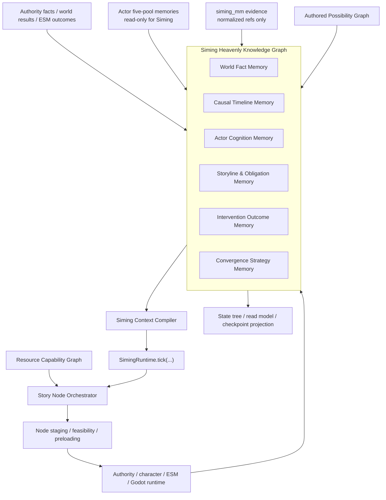

# 当前项目司命天道知识图谱与故事节点运行时设计

- 日期：`2026-07-11`
- 状态：`proposed`
- 设计范围：司命长期记忆、完整知识图谱、故事线/义务、玩家分支、美术资源能力复用、自适应桥接节点
- 替代规格：
  - [2026-07-08-current-project-siming-perspective-graph-design.md](2026-07-08-current-project-siming-perspective-graph-design.md)
- 上位规格：
  - [world-character-Siming-authority mainline master design](../world-character-siming-authority-mainline/2026-06-29-world-character-siming-authority-mainline-master-design.md)
  - [2026-07-02-current-project-siming-global-situation-layer-design.md](2026-07-02-current-project-siming-global-situation-layer-design.md)
  - [2026-07-05-current-project-multi-actor-private-perspective-reconciliation-design.md](2026-07-05-current-project-multi-actor-private-perspective-reconciliation-design.md)
  - [2026-07-07-current-project-siming-l6-boundary-hardening-design.md](2026-07-07-current-project-siming-l6-boundary-hardening-design.md)

## 1. 设计结论

司命不是角色认知的汇总读模型，也不是只维护当前 tick 的状态树控制器。

司命是拥有全局视野、独立长期记忆、故事线管理能力和高层收敛策略的天道智能体。完整接入知识图谱后：

1. `Siming Heavenly Knowledge Graph` 成为司命规范长期记忆。
2. `InMemorySimingStateTree` 降为当前 tick 的物化投影、checkpoint 和调试兼容面。
3. 司命可直接读取所有角色的五池结构化记忆，但只读，不得直接修改角色记忆。
4. 压缩摘要只是可丢弃、可重建的上下文投影，不得反向成为记忆真值。
5. 故事线从固定状态树升级为时态、版本化、可分支的运行时故事图。
6. 预设故事线是 `Authored Possibility Graph`，本局实际经历是 `Runtime Story Graph`。
7. 玩家权威选择可以永久关闭预设节点和预设结局；司命不得暗中恢复原路线。
8. 叙事义务是开放因果债务，不是固定剧情任务。
9. 美术资产通过独立 `Resource Capability Graph` 接入故事节点选择，不得反向制造不合因果的剧情。
10. 司命可以生成受约束的 `AdaptiveBridgeNode`，但不能创造新事实、直接写角色记忆或要求不存在的表现能力。
11. 生产环境允许专用图数据库；测试和 Harness 必须提供确定性的内存适配器。
12. `SimingRuntime.tick(...)` 继续是唯一运行时决策入口。

## 2. 当前问题

当前运行时已经有：

- `InMemorySimingStateTree`
- `InMemoryStorylineState`
- `InMemoryNarrativeObligationLedger`
- `NarrativeReadModel`
- `SimingGlobalSituationLayer`
- 角色五池记忆
- `siming_mm:*` 与 `character_mm:*` 多模态隔离上下文
- authority event、checkpoint、audit 和 replay 基础

这些结构可以证明当前 tick、最小故事阶段、最小义务和高层 catalyst，但不能单独承担：

- 司命跨长时间运行的长期记忆
- 多角色完整知识状态和高阶知情关系
- 玩家选择造成的永久分支与节点关闭
- 多条预设故事线之间的动态切换
- 故事义务的转化、豁免和跨分支延续
- 有限美术资源在不同叙事语义中的自然复用
- 上下文压缩后从规范记忆重新构造相关子图
- 运行时生成受约束桥接节点

继续把这些职责压入状态树，会让树同时承担运行状态、长期记忆、故事因果、角色认知、美术能力和分支历史，最终重新产生串记忆、不可回放和剧情硬拉回问题。

## 3. 总体架构



架构中心是司命天道图，不是角色图谱平台。角色五池、世界事实、多模态证据、预设故事线和资源能力都是司命决策的输入或执行依赖。

## 4. 六域天道记忆

### 4.1 世界事实域 `World Fact Memory`

保存：

- authority-confirmed facts
- L1/world/ESM result refs
- 对象、角色、环境和空间锚点
- 证据来源、冲突与可信等级
- 不可被司命或 LLM 改写的锁定事实

世界事实域不保存角色主观信念。

### 4.2 因果时间线域 `Causal Timeline Memory`

保存：

- 事件先后关系
- `CAUSED_BY / ENABLED_BY / PREVENTED_BY`
- `valid_time / recorded_time`
- `story_branch_id`
- 分支、修订、替代与反事实工作空间
- 玩家行为造成的永久路径关闭

第一版必须从数据模型层支持时态、版本和分支，不允许以后再补时间语义。

### 4.3 角色认知域 `Actor Cognition Memory`

司命直接读取所有角色的：

1. `Event Memory`
2. `Observation Memory`
3. `Knowledge Memory`
4. `Social Memory`
5. `Higher-Order Memory`

司命拥有结构化全知权，但没有角色记忆写权。

禁止读取或保存：

- 模型内部思维链
- 原始 patch cache
- 原始推理草稿
- 可复用的模型内部 hidden state

角色侧长期架构使用统一契约：

- 重角色拥有完整持久私有知识图。
- 轻量 NPC 使用稀疏或短期图。
- 角色戏份提升时可无损升级。
- `Event/Observation` 保留为证据记录。
- `Knowledge/Social/Higher-Order` 由角色私有知识图谱承担规范关系状态。

### 4.4 故事线与义务域 `Storyline & Obligation Memory`

保存：

- `Storyline / Arc`
- `StoryNodeBlueprint`
- `StoryNodeInstance`
- `StoryBeat`
- `NarrativeObligation`
- `NarrativeAttractor`
- `NarrativeConstraint`
- 节点依赖、阻塞、结果出口和跨故事线关系

它回答：

- 世界正在沿哪些故事轨迹演化
- 哪些节点已发生、活跃、阻塞或永久关闭
- 哪些因果已经产生但尚未获得有意义后果
- 玩家选择关闭原路线后，义务应如何转换
- 哪些故事吸引子仍然可达

### 4.5 干预结果域 `Intervention Outcome Memory`

保存：

- 司命提出过的候选
- 被拒绝、被过滤或被选中的路径
- staged/active/aborted/failed/resolved 结果
- 真实世界和角色反应
- 干预副作用
- 同类干预冷却
- 美术实现签名和重复疲劳

不得把“已发送干预”记成“干预成功”。结果必须来自真实运行时回写。

### 4.6 收敛策略域 `Convergence Strategy Memory`

保存：

- 可接受 `NarrativeAttractor` 集合
- 当前世界到各吸引子的差距
- 公平性和可玩性包络
- 当前候选路径和禁区
- 玩家已经永久关闭的路线
- 资源连续复用机会
- 下一步最小干预策略

收敛不是回到唯一剧本，而是让世界持续处于：

- 有意义
- 可行动
- 有因果后果
- 有多个可理解选择
- 不破坏玩家和角色自主性

的状态，并优先接近仍然可达的预设吸引子。

## 5. 记忆、压缩与遗忘

### 5.1 图谱是真值，摘要是投影

压缩摘要不得直接拼接长历史文本，也不得作为规范记忆回写。

每次上下文构造必须从天道图重新查询：

- 当前故事分支
- 相关角色
- 有效时间窗口
- 开放高压力义务
- 角色五池记忆
- 支撑事实和证据
- 最近干预结果
- 收敛差距

### 5.2 第一版不建设主动遗忘引擎

第一版只区分：

- 已持久保存
- 当前可召回
- 本 tick 已激活

压缩只改变本 tick 的激活集合，不删除图谱记忆。

以后需要角色自然遗忘时，再在角色侧增加召回衰减、清晰度下降和失真；不得用物理删除模拟遗忘。

### 5.3 冲突不覆盖

观察、传闻、推断、相信、否定和放弃必须分别版本化保存。

“当前相信什么”是可重建物化视图。冲突命题不得被 LLM 自动合并为单一真值。

## 6. 图谱写入权限

允许提交图谱变更的来源：

- 类型化 authority/world/ESM events
- 角色记忆沉淀器
- 司命图谱投影和义务推导服务
- 规则验证通过的节点状态转换
- 真实运行时结果写回

LLM 只能生成：

- `KnowledgeClaimProposal`
- `StoryNodeProposal`
- `AdaptiveBridgeNodeProposal`
- `RelationProposal`
- `InterventionCandidate`

所有 proposal 必须经过：

- 来源校验
- 权限校验
- 时态和分支校验
- 私有数据边界校验
- 冲突保留规则
- 世界可执行性校验
- 资源能力校验

LLM 不得直接执行图数据库写语句。

## 7. 存储和适配器

生产环境允许专用图数据库。具体产品选型不在本规格中提前冻结，但必须满足：

- 属性图或等价关系模型
- 时态和版本查询
- 分支作用域
- 事务写入
- 节点/关系级来源与审计
- 受控跨域读取
- 可回放快照

测试和 Harness 必须有确定性的 `InMemoryHeavenlyGraphAdapter`，并通过契约测试保证与生产适配器的核心语义一致。

图数据库不是新的世界 authority。世界事实仍由现有 authority/world/ESM 链确认。

## 8. 状态树的降位

知识图谱成为故事节点、因果关系、角色知情差异和叙事义务的规范真值。

状态树继续承担：

- 当前 tick 快照
- checkpoint 引用
- read model 兼容
- debug/workbench 展示
- 图数据库故障时的最后已知诊断面

状态树不得继续承担长期故事真值，也不得被单独用于恢复已被玩家关闭的节点。

## 9. 两类故事图

### 9.1 `Authored Possibility Graph`

由策划预设：

- 可用故事线
- 故事节点蓝图
- 合理前置条件
- 允许的结果出口
- 可接受吸引子
- 不可破坏约束
- 资源能力需求
- 可复用美术包映射

它是可能性空间，不是本局事实。

### 9.2 `Runtime Story Graph`

每局独立保存：

- 实际激活的节点实例
- 玩家和角色真实选择
- 已关闭、阻塞、失败和完成节点
- 运行时生成的桥接节点
- 义务转换
- 当前可达吸引子
- 资源使用和疲劳状态

运行时图不得反向修改预设模板。

## 10. StoryNode 模型

### 10.1 `StoryNodeBlueprint`

至少包含：

```yaml
node_id: string
storyline_refs: []
semantic_goal: []
world_preconditions: []
actor_memory_preconditions: []
obligation_preconditions: []
authority_constraints: []
resource_capability_requirements: []
optional_resource_capabilities: []
outcome_ports: {}
obligation_effects: {}
attractor_effects: {}
failure_transitions: {}
reuse_policy: {}
```

### 10.2 `StoryNodeInstance`

运行时实例至少包含：

- `node_instance_id`
- `blueprint_ref` 或 `bridge_proposal_ref`
- `story_branch_id`
- `status`
- `selected_actor_refs`
- `basis_fact_refs`
- `basis_memory_refs`
- `basis_obligation_refs`
- `realization_plan_ref`
- `activated_at / resolved_at`
- `outcome_port`
- `result_refs`

### 10.3 生命周期

```text
latent
  -> eligible
  -> selected
  -> staged
  -> active
  -> resolving
  -> resolved / failed / aborted
  -> cooldown
```

`staged` 阶段负责：

- 场景和资源预加载
- actor binding
- 角色位置与入口检查
- 动画、镜头和音频能力确认
- authority/ESM/Godot feasibility
- 当前场面到目标场面的自然过渡

staged 失败不得产生故事节点已发生的假结果。

## 11. Outcome Port 与玩家选择

节点不能只有一个 `next_node_id`。至少允许：

- 角色接受机会
- 角色拒绝机会
- 玩家绕过节点
- 玩家提前公开
- 玩家销毁目标
- 世界事件破坏目标
- 玩家产生未预设但 authority-confirmed 的行为

处理顺序固定为：

```text
Player/Actor Choice
-> Authority Result
-> Outcome Port Resolution
-> Runtime Story Graph Update
-> Obligation Transform
-> Attractor Recalculation
-> Candidate Node Re-evaluation
```

玩家权威选择可以永久关闭节点和结局。只有新的真实因果条件重新成立时，才允许创建语义相近的新节点；不得复活原节点实例。

## 12. Narrative Obligation

叙事义务表示已经产生但尚未获得有意义后果的因果债务。

它不是：

- 固定任务
- 必达剧情节点
- 强制真相公开
- 美术资源播放清单

至少包含：

```yaml
obligation_id: string
obligation_kind: string
story_branch_id: string
source_fact_refs: []
source_event_refs: []
source_memory_refs: []
actor_refs: []
status: open | pressured | partially_satisfied | fulfilled | transformed | waived | contradicted
pressure: number
satisfaction_conditions: []
blocker_refs: []
attractor_refs: []
valid_time: {}
provenance: {}
```

例如“钟楼时间矛盾必须公开”应改写为：

> 钟楼时间矛盾已经进入世界，必须对调查方向、人物关系或事实认知产生后果。

玩家烧毁账本后，原义务可以转换成“掩盖行为必须产生后果”，而不是不断生成替代账本把玩家拉回原路线。

## 13. Narrative Attractor 与可玩性包络

吸引子定义目标状态范围，不定义唯一过程。

最小吸引子字段：

- `attractor_id`
- `desired_state_predicates`
- `required_causal_conditions`
- `forbidden_state_predicates`
- `acceptable_outcomes`
- `reachability`
- `branch_scope`
- `fairness_bounds`

司命决策优先级固定为：

1. 已确认玩家行为和世界事实
2. 玩家与角色自主性
3. 世界可执行性和安全约束
4. 可玩性与公平性
5. 开放叙事义务
6. 可达预设吸引子
7. 美术资源复用

资源分和预设剧情分不得覆盖前五项。

## 14. Resource Capability Graph

美术资源作为独立能力图接入，不作为第七种天道记忆。

资源节点描述能力，而不只描述文件：

```yaml
resource_package_id: R-ClockTower
capabilities:
  - location.clock_tower
  - weather.rain
  - clock_face_animation
  - clock_chime
  - camera.closeup
supported_actor_count: [1, 4]
load_cost: medium
availability: ready
cooldown_group: clock_tower_event
```

故事节点和资源包是多对多关系：

- 一个资源包可实现多个语义不同的节点。
- 一个节点可以由多个不同资源包实现。
- 同一场景连续复用可以提高自然度和降低加载成本。
- 相同场景、相同机位、相同角色组合和相同语义目的的短期重复必须产生疲劳惩罚。

实现签名至少包含：

```text
asset_bundle
+ actor_binding
+ camera_pattern
+ semantic_purpose
+ location_state
```

美术资源存在不能成为激活剧情的理由。所有因果、角色和 authority 硬门禁必须先通过。

## 15. Story Node Orchestrator

节点选择分三层：

### 15.1 硬门禁

- 因果前置成立
- 玩家未永久关闭该节点
- 角色记忆和动机允许
- 角色位置和注意力允许
- authority/ESM/Godot 可执行
- 必需资源能力存在

### 15.2 叙事评分

- 义务压力
- 收敛贡献
- 公平性
- 玩家参与度
- 角色自主性
- 新分支价值
- 最近干预副作用

### 15.3 资源评分

- 能力覆盖
- 连续场景复用
- 新增道具或表现变化
- 预加载成本
- 精确实现签名疲劳
- 冷却

概念评分：

```text
NodeScore =
  obligation_pressure
  + convergence_contribution
  + playability_and_fairness
  + actor_motivation_fit
  + resource_capability_coverage
  + continuity_reuse_value
  - repetition_fatigue
  - autonomy_violation_risk
  - transition_and_load_cost
```

该公式只用于通过硬门禁后的候选排序。

## 16. AdaptiveBridgeNode

玩家或角色打断预设边后，司命可以生成短生命周期桥接节点。

第一版允许的模式：

- `private_confrontation`
- `consequence_reveal`
- `relationship_shift`
- `alternative_opportunity`
- `delayed_payoff`
- `aftermath`

生成流程：

```text
Authority-confirmed divergence
-> detect unresolved local causal gap
-> AdaptiveBridgeNodeProposal
-> fact/memory/obligation/resource validation
-> Runtime Story Graph commit
-> staged
-> active or aborted
```

硬限制：

1. 不创造新世界事实。
2. 不直接修改角色记忆。
3. 不要求不存在的资源或动作能力。
4. 不恢复玩家永久关闭的节点。
5. 一次只解决一个局部因果缺口。
6. 必须记录生成依据、资源映射和结果。
7. 角色拒绝或资源不可执行时直接 aborted。

## 17. 完整案例：账本被玩家烧毁

预设钟楼线：

```text
N1 血刀发现
-> N2 钟声异常
-> N3 维修记录机会
-> N4 钟楼对峙
-> N5 时间矛盾公开
```

玩家顾临在 `N3` 前拿走账本并投入壁炉。

### 17.1 世界事实与节点结果

```text
player_destroyed_ledger = authority_confirmed
N3 = resolved_with_divergence
N4_original_ledger_confrontation = closed_by_player_choice
N5_clock_truth_public = unreachable_by_ledger
```

司命不得恢复账本或生成等价副本。

### 17.2 义务转换

```text
O2_clock_contradiction_must_surface
-> transformed
-> O6_player_coverup_must_have_consequence
```

### 17.3 吸引子重算

原吸引子“钟楼时间矛盾公开”可达性下降，新的可接受吸引子包括：

- 玩家与沈砚形成秘密同盟
- 掩盖行为造成关系代价
- 错误时间线诱发错误调查

### 17.4 资源复用

原有：

- `R-ClockTower`
- `R-ConfrontCam`
- `R-TwoActorBlocking`
- `R-RainAudio`

可以从“调查对峙”重新实现为“沈砚私下试探玩家为何替自己销毁证据”。复用地点、站位和镜头能力，但改变角色动机、语义目的、对话和结果出口。

### 17.5 桥接节点

```yaml
bridge_node_id: runtime.private_loyalty_test.001
pattern: private_confrontation
basis:
  - player_destroyed_ledger
  - 沈砚观察到玩家行为
  - O6_player_coverup_must_have_consequence
outcomes:
  player_admits:
    opens: secret_alliance
  player_denies:
    opens: mutual_suspicion
  player_leaves:
    keeps: O6_player_coverup_must_have_consequence
```

如果沈砚没有实际观察到玩家烧账本，该桥接节点不得激活。

## 18. 运行时组件边界

### 18.1 `HeavenlyGraphPort`

负责：

- 时态节点和关系读写
- 分支作用域
- 来源和审计
- checkpoint snapshot refs

不负责：

- LLM 策略
- 世界结算
- 角色行动
- Godot 表现

### 18.2 `ActorMemoryReadGateway`

负责：

- 司命只读访问角色五池
- 角色、时间、分支和来源过滤
- 结构化查询

不得提供角色记忆写接口。

### 18.3 `SimingContextCompiler`

负责从图谱构造本 tick 结构化上下文，不拥有决策权。

### 18.4 `StoryNodeOrchestrator`

负责：

- 节点 eligibility
- 节点评分
- outcome port resolution
- adaptive bridge validation
- realization plan 请求

最终选择仍通过 `SimingRuntime.tick(...)`。

### 18.5 `ResourceCapabilityRegistry`

负责：

- 资源能力查询
- availability/cooldown/load cost
- realization variant
- exact realization signature fatigue

不拥有故事真值。

### 18.6 `StoryProjectionBuilder`

负责把图谱当前分支投影成：

- state tree snapshot
- NarrativeReadModel
- checkpoint
- debug/workbench surface

## 19. 失败与降级

### 19.1 图数据库不可用

- 不激活新的图谱依赖节点。
- 不用最后快照伪装最新故事真值。
- 世界和角色自治运行时可以继续。
- 司命进入 `graph_degraded`，只允许无图谱依赖的安全 no-op 或既有低风险路径。
- 记录故障并等待恢复或人工处理。

### 19.2 角色记忆读取不完整

- 标记 `memory_surface_incomplete`。
- 不把缺失解释为角色不知道。
- 禁止基于缺失记忆做定向揭示或高强度干预。

### 19.3 staged 资源失败

- 节点进入 `aborted_before_activation`。
- 不转换义务为已满足。
- 不写虚假的世界结果。
- 重新评估其他 realization variant 或候选节点。

### 19.4 玩家行为使 staged 节点失效

- 立即取消 staged plan。
- authority 行为优先写入运行时图。
- 原节点按 outcome port 关闭、转换或失败。

### 19.5 冲突证据

- 同时保留。
- 生成 unresolved conflict。
- advisory-only 证据不能直接激活 authority-dependent 节点。

### 19.6 Bridge proposal 校验失败

- proposal rejected and audited。
- 不自动降低硬约束。
- 允许下一 tick 生成不同 proposal。

## 20. Verification 要求

### 20.1 图谱和记忆

1. 司命可读取角色五池，但无法写入角色记忆。
2. 两个角色对同一事实形成不同认知，压缩后不串线。
3. 摘要删除后可从图谱重建相同结构化上下文。
4. 冲突命题同时存在，当前信念视图可重建。
5. 时间分支之间不泄漏节点状态。

### 20.2 故事节点与玩家选择

1. 玩家 authority 行为可永久关闭预设节点。
2. 被关闭节点不会因高吸引子分数自动复活。
3. 义务可以 transformed/waived/contradicted。
4. outcome port 结果来自真实 authority event。
5. state tree 只反映当前分支，不拥有长期真值。

### 20.3 资源复用

1. 资源存在但因果前置不成立时，节点不可激活。
2. 同一场景可被不同语义节点连续复用。
3. 精确实现签名短期重复产生疲劳惩罚。
4. staged 失败不产生节点已发生结果。
5. 玩家偏航后，已有美术资源可以通过不同语义 bridge node 复用。

### 20.4 AdaptiveBridgeNode

1. bridge 只引用已有事实和记忆。
2. bridge 不写角色记忆。
3. bridge 不恢复玩家关闭的节点。
4. bridge 缺少资源能力时 rejected 或 aborted。
5. bridge 所有依据和结果可 replay/audit。

### 20.5 适配器一致性

生产图数据库适配器和内存适配器必须通过相同契约测试：

- temporal query
- branch isolation
- immutable provenance
- node lifecycle
- obligation transform
- outcome port resolution
- checkpoint projection

后续实施必须新增独立 Harness profile，并同步 `.harness/profiles/`、验证脚本、测试和 `docs/harness.md`。

## 21. 实施分解

该范围不能放入一个 implementation plan。后续必须按以下子项目顺序设计和实施：

1. **Heavenly Graph Foundation**
   - typed graph model
   - temporal/branch semantics
   - production port + in-memory adapter
2. **Siming Six-Domain Memory**
   - six domain schemas
   - context compiler
   - state tree/read model projection
3. **Actor Five-Pool Read Integration**
   - read gateway
   - role graph migration for Knowledge/Social/Higher-Order
   - heavy/light actor tiers
4. **Storyline, Obligation and Attractor Runtime**
   - authored/runtime graph
   - node lifecycle
   - obligation transform
   - player branch closure
5. **Resource Capability Graph and Node Staging**
   - capability registry
   - reuse/fatigue
   - Godot/ESM feasibility and preload
6. **Adaptive Bridge Node Runtime**
   - proposal templates
   - validation
   - audit/replay
7. **Full Runtime Integration and Harness Proof**
   - `SimingRuntime.tick(...)` integration
   - end-to-end scenario
   - graph failure/degradation proof

每个子项目分别完成 `spec -> plan -> implementation -> harness`，不得用一个超大计划直接重写全部运行时。

## 22. 非目标

本规格不允许：

- 司命直接控制低层角色动作
- 司命直接修改角色五池记忆
- LLM 直接写图数据库
- 图数据库成为世界 authority
- 美术资源反向决定剧情必须发生
- 玩家选择被暗中回滚
- 把所有图谱历史塞入单次 LLM prompt
- 第一版建设主动遗忘系统
- 原始多模态制品和 patch cache 进入图数据库
- 一次性实施全部七个子项目

## 23. 一句话收束

司命天道知识图谱的目标，不是把预设剧情换成更复杂的状态机，而是让司命拥有可长期追踪的世界、角色、因果、义务、干预和收敛记忆：玩家可以真正改变路线，司命负责让改变产生后果；预制美术资源可以被自然复用，但永远不能压过事实、玩家选择、角色自主性和可玩性。
