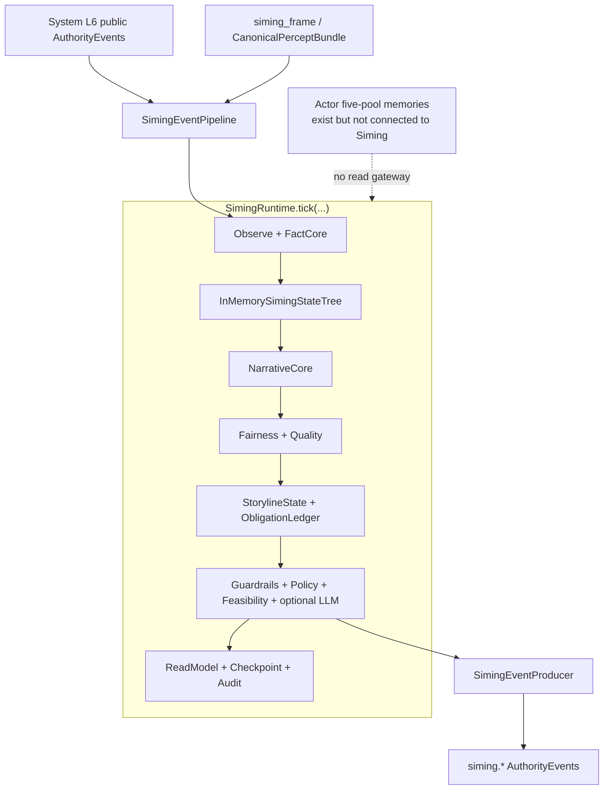
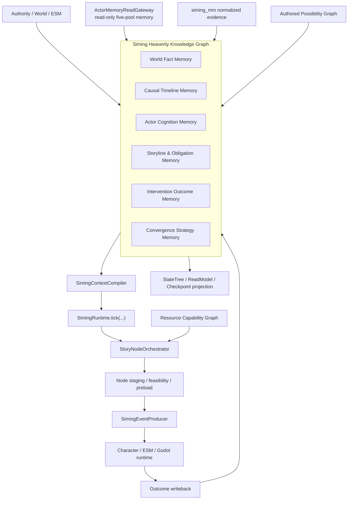

# 当前司命运行时与天道知识图谱目标架构演化分析

- 日期：`2026-07-11`
- 状态：`analysis-record`
- 分析对象：当前仓库真实运行时与目标规格落地后的结构差异
- 目标规格：
  - [2026-07-11-current-project-siming-heavenly-knowledge-graph-and-story-node-design.md](2026-07-11-current-project-siming-heavenly-knowledge-graph-and-story-node-design.md)
- 目标规格提交：`0e836d2 Design Siming heavenly knowledge graph runtime`

## 1. 文档定位

本文保存“当前司命与目标司命的架构变化推演过程”。

它不是新的实现规格，也不替代目标规格。它负责记录：

- 当前代码实际怎样组成和调用
- 当前模块文档与实际接线之间的差异
- 目标规格落地后哪些组件新增、保留、拆分或降位
- 一次 Siming tick 的前后变化
- 对角色智能体、L6、ESM、Godot 和 Harness 的影响
- 推演过程中发现的待补强设计点

当前事实以仓库代码为准；目标结构以 2026-07-11 目标规格为准。目标结构尚未实现。

## 2. 分析方法

本次推演按以下顺序进行：

1. 检查 `backend/app/main.py` 的 composition root。
2. 检查 `SimingEventPipeline` 的入口、审计和输出发布路径。
3. 检查 `SimingRuntime` 构造依赖和完整 `tick(...)` 主链。
4. 检查状态树、故事线、义务账本、NarrativeCore 和 ReadModel 的当前所有权。
5. 检查 `SimingGlobalSituationLayer` 是否进入实际主链。
6. 检查角色五池记忆是否已存在可读接口，以及司命是否实际调用。
7. 搜索目标规格中的图谱、节点、资源和桥接组件是否已有运行时代码。
8. 将当前组件映射到目标规格，判断保留、拆分、降位和新增关系。
9. 推演新旧 tick 数据流、失败模式和迁移阶段。

## 3. 核心结论

目标规格不是“给当前司命旁边增加一个知识图谱”。

它会把司命的运行中心从：

> 收到一个事件，对当前场面做一次公平性和高层干预判断。

迁移成：

> 持有长期世界、角色、因果、故事、义务和干预记忆；根据玩家真实选择与资源能力管理运行时故事图。

架构中心变化为：

```text
Current:
AuthorityEvent -> transient snapshots -> candidate/policy -> siming.*

Target:
Authority/Memory/Story/Resource inputs
-> Heavenly Knowledge Graph
-> Context Compiler
-> SimingRuntime.tick(...)
-> StoryNode staging
-> real outcome writeback
```

`SimingRuntime.tick(...)` 仍是唯一决策入口。System L6、L1/ESM、CharacterAgentRuntime 和 Godot 的权责不变。

## 4. 当前真实系统结构

### 4.1 Composition root

当前 `backend/app/main.py` 创建：

```text
InMemoryAuthorityEventBus
-> SimingEventPipeline
-> SimingRuntime
-> SimingEventProducer
-> AuthorityEventBus
```

并通过：

- `FrontendSimingCharacterDispatchAdapter`
- `FrontendAuthorityEventProjector`

把高层 catalyst 送向角色输入或前端投影。

主要证据：

- `backend/app/main.py`
- `backend/app/services/siming_event_pipeline.py`
- `backend/app/services/siming_event_consumer.py`
- `backend/app/services/siming_event_producer.py`

### 4.2 当前事件输入

`SimingEventConsumer` 当前允许：

- `world_fact_event`
- `visual_fact_event`
- `esm_result_event`
- `character_behavior_event`
- `conversation_resolution_event`
- `constraint_state_event`

`CanonicalPerceptBundle` 还有独立的 `ingest_canonical_percept_bundle(...)` 路径，但该路径主要生成 fairness output 和 bundle read model，不等价于完整长期态势和故事图。

### 4.3 当前 tick 主链

当前 `SimingRuntime.tick(...)` 的主要顺序：

```text
AuthorityEvent
-> fairness snapshot
-> SimingObservePipeline
-> SimingFactCore veto
-> InMemorySimingStateTree
-> SimingNarrativeCore
-> SimingQualityMonitor
-> InMemoryStorylineState
-> InMemoryNarrativeObligationLedger
-> StorylineProjectionPort
-> InterventionGuardrails
-> optional LLM candidates
-> Policy
-> Feasibility
-> SimingOutput
-> Checkpoint / NarrativeReadModel / Audit
```

当前 tick 仍然包含事件特判路径：

- light drop -> visual observability request
- environment attention -> character input path
- conversation candidate -> fact reveal
- constraint rejection -> no action

这意味着当前司命已经具备可验证的高层干预管线，但故事管理仍主要绑定具体事件家族和当前 tick。

### 4.4 当前状态和故事结构

`InMemorySimingStateTree` 当前包含：

- environment branch
- character branch
- storyline branch
- group simulation branch

storyline branch 主要保存 `active_phase`。

`InMemoryStorylineState` 从状态树派生 marker；`InMemoryNarrativeObligationLedger` 再从 marker 派生最小开放义务。

`SimingNarrativeCore` 可以按事件创建：

- narrative markers
- narrative threads
- obligations
- intervention seeds
- room-level pressure

但它当前没有：

- 时态图谱
- 玩家分支
- StoryNode Outcome Port
- 义务转化和豁免
- 资源能力
- AdaptiveBridgeNode

### 4.5 当前角色记忆关系

角色五池已经存在：

- Event Memory
- Observation Memory
- Knowledge Memory
- Social Memory
- Higher-Order Memory

`CharacterAgentRuntime` 已提供：

- `get_memory_bundle(actor_id)`
- `get_memory_record_bundle(actor_id)`

但当前司命运行时没有调用这些接口。

因此，当前角色五池是角色自己的运行时能力，不是司命实际决策上下文的一部分。

### 4.6 当前 GlobalSituation 状态

`SimingGlobalSituationLayer` 类和独立验证已经存在，当前模块文档也把它画在司命主链前方。

但实际 app composition root 和 `SimingRuntime` 构造依赖中没有发现该 layer 的注入或调用。

因此它当前是已实现、已验证的独立 seam，不是实际每次 tick 的统一长期态势 owner。

### 4.7 当前持久化和验证

Siming 当前主要依赖：

- in-memory state tree
- in-memory storyline state
- in-memory obligation ledger
- audit writer
- read model/checkpoint artifacts

当前已有 Harness profile：

- `siming-global-situation-layer`
- `siming-backend-chain`
- 相关 mainline/phase profiles

当前没有 heavenly graph、StoryNode 或资源能力图的 Harness profile。

## 5. 当前架构图



## 6. 目标系统结构

### 6.1 新的运行中心

目标规格增加 `Siming Heavenly Knowledge Graph`，以六个语义域承担司命规范长期记忆：

1. 世界事实域
2. 因果时间线域
3. 角色认知域
4. 故事线与义务域
5. 干预结果域
6. 收敛策略域

六域是同一图谱基础设施中的语义分区，不要求六个独立数据库。

### 6.2 新的核心组件

目标结构新增：

- `HeavenlyGraphPort`
- production graph adapter
- deterministic in-memory graph adapter
- `ActorMemoryReadGateway`
- `SimingContextCompiler`
- `StoryNodeOrchestrator`
- `ResourceCapabilityRegistry`
- `StoryProjectionBuilder`
- `AdaptiveBridgeNodeValidator`
- outcome writeback

### 6.3 目标架构图



## 7. 组件变化矩阵

| 当前组件 | 目标变化 | 最终职责 |
| --- | --- | --- |
| `SimingRuntime.tick(...)` | 保留并收窄 | 唯一决策入口 |
| `SimingEventPipeline` | 保留并扩展 | 事件入口、审计、发布、图谱接线 |
| `SimingEventConsumer` | 保留 | 类型化 authority 输入 |
| `SimingEventProducer` | 保留 | 仅发布高层 `siming.*` |
| `SimingFactCore` | 保留/扩展 | authority 和图谱 ingest 前事实门禁 |
| `SimingGlobalSituationLayer` | 接入主链或拆入 ingest | 世界态势输入，不拥有故事决策 |
| `InMemorySimingStateTree` | 降位 | 当前 branch 的物化投影 |
| `InMemoryStorylineState` | 降位/替换 | 兼容投影，不再拥有故事真值 |
| `InMemoryNarrativeObligationLedger` | 替换 | 由时态图谱义务模型承担规范真值 |
| `SimingNarrativeCore` | 拆分 | event ingest、义务推导、吸引子和节点候选服务 |
| `SimingReadModelBuilder` | 演化 | `StoryProjectionBuilder` 的一部分 |
| Policy/Feasibility/Guardrails | 保留并后移 | 在 context/node candidate 之后做硬验证 |
| `SimingAuditWriter` | 保留并扩展 | 关联 graph tx、node、staging 和 outcome |
| 角色五池 | 保持角色 owner | 通过只读 gateway 向司命开放 |

## 8. 一次 tick 的结构变化

### 8.1 当前 tick

```text
Event
-> Observe
-> Fact veto
-> StateTree
-> Narrative / Fairness
-> Storyline / Ledger
-> Policy / Feasibility
-> Output
-> ReadModel / Audit
```

特点：

- 事件批次中心
- 当前 tick 快照中心
- 角色五池不参与
- 没有长期 branch 查询
- 没有资源 staging

### 8.2 目标 tick

```text
1. 接收 authority/world/memory/resource delta
2. 幂等写入天道图
3. 获取相关角色五池 revision
4. 更新角色认知域
5. 推导义务、节点状态和可达吸引子
6. Context Compiler 查询相关子图
7. SimingRuntime.tick(...) 进入唯一决策路径
8. StoryNodeOrchestrator 生成和过滤节点候选
9. tick 选择节点或 no-action
10. ResourceCapabilityRegistry 生成 realization plan
11. staged 阶段预加载和验证
12. 发布高层 siming.*
13. Character/ESM/Godot 自主执行和结算
14. 真实 outcome 回写图谱
15. 义务 transform、节点关闭、吸引子重算
16. StateTree/ReadModel/Checkpoint 从图谱投影
```

特点：

- 长期图谱记忆中心
- 玩家分支是一等事实
- 角色五池进入只读上下文
- 节点和资源分离
- 真实 outcome 决定后续故事图

## 9. 对外围系统的影响

### 9.1 CharacterAgentRuntime

需要提供稳定只读接口：

```text
read_memory_bundle(
  actor_id,
  valid_at,
  branch_id,
  expected_revision
)
```

角色仍独立拥有：

- 感知
- 理解
- 信念更新
- 规划
- 五池写入

司命不得直接写角色记忆。

### 9.2 System L6

继续负责：

- 信封
- 路由
- 审计
- replay 辅助

可能新增事件族：

- graph ingestion refs
- story node selected/staged/aborted/resolved
- player branch closure
- resource staging result
- obligation transformed

L6 不保存故事图。

### 9.3 L1 / ESM / World Runtime

继续拥有世界事实和结算 authority。

目标系统只增加：

- node staging feasibility
- 资源和世界能力预检查
- outcome refs 回写

### 9.4 Godot

需要提供：

- 资源能力注册
- 场景/动画/镜头 availability
- preload/staging
- realization result
- cancellation

Godot 不拥有故事决策。

### 9.5 Harness

目标实现后需要新增独立 profile，覆盖：

- temporal graph
- branch isolation
- actor five-pool read-only access
- player node closure
- obligation transformation
- resource hard gate and fatigue
- AdaptiveBridgeNode
- graph degradation and active-node recovery

## 10. 运行时故障模式变化

### 10.1 图数据库不可用

- 不激活新的图谱依赖节点。
- 不用最后快照伪装最新真值。
- 世界和角色自治可以继续。
- 司命进入 `graph_degraded`。

### 10.2 角色记忆读取不完整

- 标记 `memory_surface_incomplete`。
- 缺失不能解释为角色不知道。
- 禁止基于缺失记忆做高强度定向干预。

### 10.3 staged 资源失败

- 节点进入 `aborted_before_activation`。
- 不写“节点已发生”。
- 不满足或转换义务。

### 10.4 玩家行为使 staged 节点失效

- authority-confirmed 玩家行为优先。
- 取消 staged plan。
- 原节点按 Outcome Port 关闭、失败或转换。

## 11. 迁移期结构

目标架构不能一次性替换当前 runtime。推荐顺序：

1. Heavenly Graph Foundation
2. Six-Domain Memory
3. Actor Five-Pool Read Integration
4. Storyline / Obligation / Attractor Runtime
5. Resource Capability Graph and staging
6. AdaptiveBridgeNode
7. Full Runtime Integration and Harness

迁移期必须使用 feature gate，保证每类事件只有一个决策 owner。

当前硬编码事件路径和新 StoryNode 路径不能同时发布干预，否则会形成双决策通道。

## 12. 推演发现的待补强点

### 12.1 `MemoryRevisionVector`

司命同时读取多个角色五池时，需要一致性 revision vector。

否则可能同时读取：

- 角色 A 的新记忆
- 角色 B 的旧记忆

并构造出从未同时存在过的故事状态。

### 12.2 图谱事务与事件幂等

AuthorityEvent、graph write、node transition 和 outcome writeback 必须共享明确的 idempotency key。

否则 replay 可能重复创建：

- 事实
- 义务
- StoryNode instance
- 资源使用记录

### 12.3 在途节点恢复

还需要明确服务崩溃时以下节点如何恢复：

- selected
- staged
- active
- resolving

恢复必须区分：

- 尚未向运行时发送
- 已发送但未确认
- 已产生真实世界结果

### 12.4 双轨迁移唯一决策权

当前 event-specific 分支与新 StoryNode 路径必须通过 feature ownership matrix 互斥。

不能让同一个 `visual_fact_event` 同时触发：

- 当前 `visual_fact_path`
- 新 StoryNode realization

### 12.5 图谱和当前运行时文档同步

当前 `docs/架构/运行时/模块/Siming.md` 明确写着司命不拥有、也不读取角色私有记忆。

目标规格允许司命直接只读角色五池。因此实现时必须同步更新当前运行时模块文档，明确区分：

- 结构化五池只读访问：允许
- 原始 private cache / inference history / patch cache：仍然禁止

## 13. 最终判断

这是一次“替换司命内部状态组织方式”的架构升级，不是简单增加数据库。

目标落地后：

- 司命从事件响应器升级为有长期记忆的故事运行时。
- 状态树从故事真值降为当前 tick 投影。
- 角色五池从不可见变成司命的只读认知来源。
- 预设剧情从固定路线变成可能性图。
- 玩家选择成为运行时图的一等分支事实。
- 美术资源成为表现能力约束，不是剧情驱动力。
- 当前 L6、角色自主性、ESM authority 和 Godot 表现边界继续保留。

该结论以目标规格为设计方向；在七个子项目完成并通过对应 Harness 前，不应把目标结构描述为当前已实现事实。
