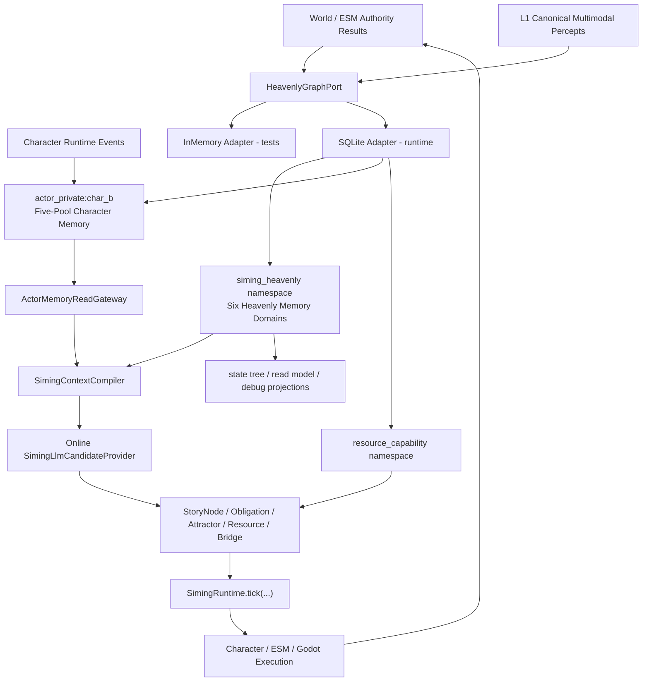

# 司命持久天道图谱、角色图谱记忆与 Phase 2-7 完整接入设计

- 状态：`user-approved`
- 日期：`2026-08-03`
- 当前分支：`graph_20260803`
- 实施方式：依赖门禁式连续交付
- 基础实现：现有 `HeavenlyGraphPort` 与 `InMemoryHeavenlyGraphAdapter`
- 运行时持久化：新增 `SQLiteHeavenlyGraphAdapter`
- 最终验收：真实在线 LLM + backend + graph + Authority + Godot

## 1. 设计结论

当前分支已经具备 Heavenly Graph 的类型、Port 和内存适配器，但它仍只是图谱存储内核。司命六域、角色五池只读、故事节点、义务、吸引子、资源能力、Adaptive Bridge 和 `SimingRuntime.tick(...)` 尚未完整运行在图谱上。

本设计按以下顺序补齐缺口：

1. 先增加 Phase 1.1，补齐图命名空间、所有者隔离、有界子图查询和 SQLite 持久适配器。
2. 再完成司命六域天道记忆，并把摘要和 state tree 降为可重建投影。
3. 将 `char_b` 作为首个重角色，真实运行在 actor-private 五池图谱记忆上；`char_a` 保持现有轻量存储。
4. 完成 StoryNode、NarrativeObligation、NarrativeAttractor、资源能力与 Adaptive Bridge。
5. 仅通过现有 `SimingRuntime.tick(...)` 进入 active 决策所有权。
6. 最终使用在线大模型、真实 Authority 结果和真实 Godot 场景证明完整链路。

本设计细化并更新以下既有文档：

- `2026-07-11-current-project-siming-heavenly-knowledge-graph-and-story-node-design.md`
- `2026-07-11-current-project-siming-heavenly-knowledge-graph-program-plan.md`

若旧 program plan 与本设计在以下事项上冲突，以本设计为准：

- Phase 1 不再停留在纯内存适配器；先完成 Phase 1.1 durable hardening。
- Phase 3 不再只有司命读取角色五池；`char_b` 必须真实使用私有图谱记忆。
- Phase 7 完整验收必须发生真实在线 LLM 调用。
- `siming-heavenly-runtime` 必须包含真实 Godot 自动化证据。

## 2. 当前基线与真实缺口

### 2.1 已存在

当前分支已有：

- `backend/app/models/siming_heavenly_graph.py`
  - graph scope
  - 节点和关系 revision
  - valid time / recorded time
  - provenance
  - write batch
  - checkpoint snapshot
- `backend/app/services/siming_heavenly_graph_port.py`
  - 写批
  - 节点和关系查询
  - checkpoint 创建与读取
- `backend/app/services/in_memory_heavenly_graph.py`
  - 原子测试语义
  - revision 与 idempotency 冲突
  - referential integrity
  - branch isolation
- `CharacterAgentRuntime.get_memory_record_bundle(actor_id)`
  - Event
  - Observation
  - Knowledge
  - Social
  - Higher-Order
- `SimingLlmCandidateProvider`
  - OpenAI Responses
  - DeepSeek / Seed / Qwen 兼容路由
  - provider router
- `SimingRuntime.tick(...)`
  - 当前唯一司命决策入口
- Godot `MainDemo.tscn`
  - `char_a`
  - `char_b`
  - 玩家 `char_c`
  - `obj_letter`
  - `env_lamp`
  - 现有对话、角色表现、player camera 与王座厅资源

### 2.2 必须补齐

当前实现还缺少：

- `HeavenlyGraphScope` 的图命名空间与角色记忆所有者
- 进程重启后仍存在的 durable graph adapter
- 有界相关子图遍历
- 六域 typed memory service
- 图谱上下文编译器
- `char_b` actor-private 图谱五池
- 司命角色记忆只读网关
- authored possibility graph / runtime story graph 分离
- StoryNode 生命周期和 outcome port
- NarrativeObligation 转换
- NarrativeAttractor 可达性
- Resource Capability Graph 与 staging
- Adaptive Bridge proposal 与 validator
- off / shadow / active 单一决策所有权
- 在线 LLM 的真实 proposal 审计
- Godot 的真实证据销毁和角色反应验收

### 2.3 当前基础为何不足以承担长期记忆

现有 `InMemoryHeavenlyGraphAdapter` 的节点、关系和 checkpoint 都只存在于进程内。进程重启后图谱消失，因此它不能独立承担：

- 司命长期天道记忆
- 角色长期私有记忆
- 跨会话故事节点恢复
- “压缩不等于遗忘”的持久证明

内存适配器继续用于单元和合同测试；运行时必须使用 SQLite 适配器。

## 3. 不可破坏的边界

### 3.1 记忆边界

- 图谱是真值，摘要是本 tick 的投影。
- 压缩只改变激活子图，不删除长期记忆。
- 第一版不建设主动遗忘引擎，也不以物理删除模拟遗忘。
- 冲突命题分别保存，不由 LLM 合并成单一真值。
- raw patch cache、hidden state、inference history、chain-of-thought 和私有推理草稿不得进入图谱。

### 3.2 Authority 边界

- 图谱不是世界 Authority。
- 司命只输出高层 story / catalyst proposal。
- ESM、World、L1 与真实运行时结果决定事实是否成立。
- Godot 不得仅凭本地表现把节点写成成功。
- staging 成功不等于节点 resolved，也不等于义务 fulfilled。

### 3.3 角色边界

- 角色私有图由角色自己的记忆写回路径拥有。
- 司命通过 `ActorMemoryReadGateway` 只读角色五池。
- 司命不能写角色图、修正角色信念或复制角色私有 hidden state。
- `char_a` 不能读取 `char_b` 私有图。
- 司命全知不等于角色知道；角色行为门禁必须使用角色自己的观察与信念证据。

### 3.4 决策边界

- `SimingRuntime.tick(...)` 是唯一司命决策入口。
- 一个 correlation ID 最多产生一个 selected decision 和一个 dispatch family。
- state tree、read model、checkpoint 和 debug summary 都是图谱投影，不是备用故事真值。
- 玩家永久关闭的节点实例不得复活。

### 3.5 LLM 边界

- Phase 7 完整验收必须调用在线大模型。
- 在线模型只产生 typed proposal。
- proposal 必须经过 schema、事实、角色所知、Authority、资源和自主性 validator。
- 在线模型不能直接写图、激活节点、发布 catalyst 或修改角色五池。
- live 验收不得在模型失败时静默回退 fake 或确定性候选。

## 4. 目标架构



## 5. Phase 1.1：持久图谱合同补全

### 5.1 Scope 扩展

`HeavenlyGraphScope` 增加：

```python
graph_namespace: Literal[
    "siming_heavenly",
    "actor_private",
    "resource_capability",
] = "siming_heavenly"
owner_actor_id: str | None = None
```

规则：

- `actor_private` 必须有 `owner_actor_id`。
- `siming_heavenly` 和 `resource_capability` 不允许角色所有者。
- 旧数据缺少新字段时默认进入 `siming_heavenly`。
- scope key 必须包含 world、session、story branch、room、scene、namespace 和 owner。
- 不允许跨 scope 关系；同一世界锚点在不同私有图内使用规范化 anchor ref 表达。
- `GraphProvenance.actor_id` 继续表示来源角色，不能替代所有者和访问边界。

### 5.2 Port 能力

在现有 Port 上补充一个有界子图查询合同，用于记忆召回和故事上下文编译：

```python
query_subgraph(
    *,
    scope,
    seed_node_ids,
    relation_types,
    direction,
    max_depth,
    valid_at,
    recorded_at,
    node_limit,
    relation_limit,
) -> HeavenlySubgraphResult
```

`HeavenlySubgraphResult` 只包含 query scope、查询时点、seed IDs、nodes、relations 和 `truncated`；它不是 checkpoint，也不能替代 `HeavenlyGraphSnapshot` 的持久快照语义。

硬限制：

- `max_depth`、node limit 和 relation limit 必须有上限。
- traversal 结果顺序必须确定性。
- traversal 必须遵守双时态和完整 scope。
- 不允许查询越过角色私有图边界。

### 5.3 SQLite 适配器

新增 `SQLiteHeavenlyGraphAdapter`，继续实现同一个 `HeavenlyGraphPort`：

- 使用 Python 标准库 `sqlite3`。
- 运行时数据库路径由 composition root 显式注入。
- 开启 foreign keys。
- 使用 WAL 模式。
- 一个 `HeavenlyGraphWriteBatch` 对应一个 SQLite transaction。
- 节点、关系、idempotency、transaction 和 checkpoint 均持久保存。
- revision conflict、idempotency conflict 和 referential integrity 的异常语义必须与内存适配器一致。
- 进程重启后可以读取相同节点、关系、revision、checkpoint 和审计引用。
- schema migration 必须版本化；不允许启动时静默重建并丢失历史。

SQLite 是当前运行时 durable adapter，不代表最终生产外部图数据库选型。只有真实规模证明 SQLite 在容量、并发或查询上不足时，才进入 Neo4j 等生产适配 ADR。

### 5.4 本项目所需的“功能完整性”

完整性以司命和角色记忆用途定义，必须同时具备：

- 原子事务
- 幂等写入
- revision 与冲突检测
- referential integrity
- valid time / recorded time
- namespace 和 owner 隔离
- 节点与关系查询
- 有界子图遍历
- checkpoint / snapshot / replay
- 进程重启恢复
- 不可变 provenance 和 audit refs
- 内存与 SQLite 适配器合同一致

首版不包括：

- 全文检索引擎
- 向量数据库
- 分布式图集群
- 跨机事务
- 物理删除式遗忘
- 外部图数据库驱动

## 6. 司命六域天道记忆

### 6.1 六域

1. `World Fact Memory`
   - Authority 确认的世界事实
   - 规范化多模态证据引用
   - 世界锚点与状态 revision
2. `Causal Timeline Memory`
   - `CAUSED_BY / ENABLED_BY / PREVENTED_BY`
   - branch、valid time、recorded time
   - 玩家行为造成的永久路径关闭
3. `Actor Cognition Memory`
   - 司命对角色五池的只读结构化投影
   - 每个角色的 revision vector 和 completeness
4. `Storyline & Obligation Memory`
   - Storyline、StoryNode、Outcome Port
   - NarrativeObligation、NarrativeAttractor、NarrativeConstraint
5. `Intervention Outcome Memory`
   - proposal、selection、staging、dispatch 和真实结果
   - 资源实现签名与疲劳
6. `Convergence Strategy Memory`
   - 可达吸引子
   - 公平、可玩性和开放义务
   - 已永久关闭路径
   - 下一步最小干预

### 6.2 压缩与召回

`SimingContextCompiler` 每个 tick 从图谱重新构造相关上下文：

- 当前 world/session/branch
- 当前时间窗口
- 相关角色
- 开放高压力义务
- 支撑事实和证据
- 最近真实干预结果
- 可达吸引子与资源能力

删除缓存摘要后，编译结果仍必须从图谱确定性重建。摘要不得回写为规范记忆。

## 7. `char_b` 角色私有图谱记忆

### 7.1 迁移范围

- `char_b` 是本轮首个 graph-backed heavy actor。
- `char_a` 保持现有 `CharacterAgentMemoryStore` 轻量路径。
- 角色名单通过显式 heavy-actor allowlist 配置，初始仅包含 `char_b`。
- 新重角色加入 allowlist 后使用同一合同，无需新建角色专用图谱实现。

### 7.2 `CharacterGraphMemoryStore`

新增角色侧 adapter，保持现有角色运行时调用面：

- `write_event(...)`
- `retrieval_bundle(actor_id)`
- `retrieval_record_bundle(actor_id)`
- `working_memory_state(...)`

长期五池写入 `actor_private:<actor_id>`；working memory 继续是短期运行态，不作为长期图真值。

五池映射：

| 五池 | 图谱表达 |
| --- | --- |
| Event | event node、source event、causal relation |
| Observation | observation node、observed target、evidence refs |
| Knowledge | proposition node、BELIEVES、CONTRADICTS、revision |
| Social | actor subject node、TRUSTS、FEARS、OWES 等 typed relation |
| Higher-Order | BELIEVES_THAT 与 subject actor / proposition |

角色记忆的写入仍由现有 output validator 和 writeback policy 控制。LLM 输出不能绕过 typed cognition delta 直接写图。

### 7.3 角色召回

角色召回从当前注意目标和世界锚点开始：

1. 查询相关 seed nodes。
2. 执行有界子图遍历。
3. 按证据、时态、相关性和显著度排序。
4. 投影为现有 `CharacterMemoryRecordBundle`。
5. 进入现有 L2 / L3 上下文。

召回选择不删除图中未激活记忆。

### 7.4 司命只读访问

`ActorMemoryReadGateway`：

- 接受 actor、branch、valid time 和 expected revision vector。
- 通过 `CharacterAgentRuntime.get_memory_record_bundle(actor_id)` 读取。
- 返回五池 typed result 和 completeness state。
- 缺失数据返回 `memory_surface_incomplete`，不能解释为“角色不知道”。
- 不暴露 write 方法。
- 不允许读取 raw patch、private cache、hidden state 或 reasoning draft。

## 8. 故事节点、义务与吸引子

### 8.1 两类图

- `Authored Possibility Graph` 保存作者预设的可能性，不代表已经发生。
- `Runtime Story Graph` 保存本世界、本会话、本分支的真实节点实例和结果。

### 8.2 StoryNode 生命周期

```text
latent
-> eligible
-> selected
-> staged
-> active
-> resolving
-> resolved | failed | aborted
-> cooldown
```

永久关闭使用终局字段表达：

```text
lifecycle = aborted
closure_reason = closed_by_player_choice
terminal = true
reopen_policy = never
```

相似语义若以后重新成立，必须创建新节点 ID，并携带新的因果依据；不得复活旧节点实例。

### 8.3 Narrative Obligation

义务是已经产生但尚未获得有意义后果的因果债务，不是固定任务或必达剧情。

义务支持：

- open
- pressured
- partially_satisfied
- fulfilled
- transformed
- waived
- contradicted

资源存在不能成为义务或节点激活理由。

### 8.4 Narrative Attractor

吸引子定义目标状态范围，而不是唯一过程。决策优先级固定为：

1. 已确认玩家行为和世界事实
2. 玩家与角色自主性
3. 世界可执行性和安全约束
4. 可玩性与公平性
5. 开放义务
6. 可达预设吸引子
7. 资源复用

## 9. 标准案例：玩家销毁 `obj_letter`

预设路径：

```text
N1 血刀发现
-> N2 钟声异常
-> N3 维修记录机会
-> N4 原证据对峙
-> N5 时间矛盾公开
```

玩家提交结构化 destroy intent 后，只有 ESM / World Authority 确认 `obj_letter = removed_from_surface`，Godot 才隐藏现有证据物，图谱才处理节点结果。

结果：

```text
N3.lifecycle = resolved
N3.outcome_port = player_destroyed_evidence
N3.outcome_semantic = resolved_with_divergence

N4.lifecycle = aborted
N4.closure_reason = closed_by_player_choice
N4.terminal = true

N5.reachability = unreachable_by_ledger
```

义务转换：

```text
O2 时间矛盾必须产生后果
-> transformed
O6 玩家掩盖行为必须产生后果
```

`private_confrontation` bridge 的角色门禁：

- `char_b` 的 Event / Observation 图中必须存在真实观察到销毁的证据。
- 若 `char_b` 未观察到，proposal 直接 rejected。
- 司命不能用天道全知替代 `char_b` 所知。

## 10. 资源能力、复用与 staging

### 10.1 现有资源包

标准案例复用：

- `scenes/phase0/MainDemo.tscn`
- `assets/environment/throne_room_existing/Demo.gltf`
- `char_b + char_c`
- `InteractiveObject / obj_letter`
- `env_lamp`
- 现有对话与 voice/stub 路径
- `CharacterReplica`
- player camera
- `look_at_target`、`focus_attention` 等 realization keys

本轮不新增美术，不假设不存在的壁炉、账本模型或过场镜头。

### 10.2 复用现有合同

- Resource Capability Graph 索引场景、角色数、对象、环境、加载状态和语义能力。
- Character skill `realization_keys` 提供动作需求。
- `CharacterEmbodimentAssetRegistry` 继续负责已登记动作资源的本地可实现性。
- Godot / Character / ESM 返回真实 feasibility ack。
- 不建设第二套 Godot 资产注册表。

### 10.3 评分顺序

1. 事实、角色所知、自主性、Authority、ESM 与安全硬门禁
2. 义务、吸引子、公平和可玩性叙事评分
3. 资源覆盖、复用、加载成本、冷却和疲劳评分

资源分只能在已通过前两层的候选间排序。

### 10.4 实现签名与疲劳

实现签名：

```text
asset_bundle
+ actor_binding
+ camera_pattern
+ semantic_purpose
+ location_state
```

只有完整签名在短窗口重复才施加重罚。相同场景和角色绑定、但语义目的与场景状态改变，属于自然复用。

### 10.5 staging

```text
selected
-> staging request
-> Godot / Character / ESM feasibility ack
-> staged
-> active
```

预加载成功仍不是故事结果。若资源失败、角色拒绝或玩家再次偏航，节点进入 `aborted_before_activation` 或 `aborted`，义务保持开放。

## 11. Adaptive Bridge 与在线大模型

### 11.1 Bridge 限制

允许的 bridge pattern：

- private_confrontation
- consequence_reveal
- relationship_shift
- alternative_opportunity
- delayed_payoff
- aftermath

Bridge 每次只补一个局部因果缺口，不能：

- 制造新世界事实
- 恢复永久关闭节点
- 写角色记忆
- 要求不存在的资源
- 越过角色拒绝

### 11.2 在线模型路径

复用现有：

- `SIMING_LLM_MODE=http`
- `SIMING_LLM_API_KEY`
- `SIMING_LLM_ENDPOINT`
- `SIMING_LLM_MODEL`
- `SIMING_LLM_PROVIDER_ORDER`
- `SIMING_LLM_ROUTES_JSON`
- `SimingLlmCandidateProvider`

完整路径：

```text
compiled graph context
-> real online Siming LLM request
-> typed StoryNodeProposal / AdaptiveBridgeNodeProposal
-> deterministic validators
-> StoryNodeOrchestrator
-> SimingRuntime.tick(...)
-> staging and single dispatch
```

在线路由之间可以 failover，但 live profile 不允许 disabled/fake 路由。

审计至少记录：

- provider
- route ID
- model
- request ID
- correlation ID
- latency
- response artifact hash 或安全引用
- proposal ID
- schema / policy validation result
- graph transaction ref
- selected node ref

不得保存 API key、chain-of-thought、hidden state 或原始私有 cache。

## 12. 迁移模式与单一决策所有权

| Mode | Graph reads/writes | Story selection owner | Catalyst publisher |
| --- | --- | --- | --- |
| off | no | legacy | existing tick pipeline |
| shadow | yes, evidence only | legacy | existing tick pipeline |
| active | yes | graph-backed `SimingRuntime.tick(...)` | same tick pipeline |

规则：

- shadow 图谱结果不得影响 policy、feasibility、selection 或 publication。
- active 按事件族移交所有权，不按哪条路径先返回决定。
- rollback 到 shadow 停止新图谱决策，但保留已写历史和真实结果。
- state tree 不得成为图谱故障时的备用故事真值。

## 13. 失败与恢复

### 13.1 图谱不可用

- active 进入 `graph_degraded`。
- 禁止激活新图谱依赖节点。
- 允许不属于该故事事件族的其他既有 Authority 流继续运行。
- 不从 state tree 推断长期故事真值。

### 13.2 在线 LLM 不可用或输出无效

- 写 `llm_unavailable` 或 `proposal_rejected` 审计。
- 当前故事决策 no-action。
- 不回退 fake 后继续声明 live 验收通过。
- `siming-heavenly-runtime` 直接失败。

### 13.3 角色记忆不完整

- 返回 `memory_surface_incomplete`。
- 依赖角色知识的候选保持不可选。
- 不把缺失解释为角色不知道。

### 13.4 staging 和角色拒绝

- staging 失败：`aborted_before_activation`。
- 玩家再次偏航：取消 staged 节点并重算。
- 角色拒绝：bridge aborted，义务继续开放。
- 任何上述结果都不能写成义务 fulfilled。

### 13.5 崩溃恢复

| 状态 | 恢复方式 |
| --- | --- |
| unsent | 重读当前图谱后重新评估，不盲目续跑 |
| sent-unconfirmed | 用 correlation ID 查询 Authority / audit，确认前不重发 |
| authority-confirmed | 幂等写回真实结果，永不再次 dispatch |

## 14. 分阶段交付

### Phase 1.1：Durable Graph Hardening

- scope namespace / owner
- bounded subgraph query
- SQLite adapter
- restart persistence
- 两适配器共用合同测试
- 扩展 `siming-heavenly-graph-foundation` Harness

### Phase 2：Six-Domain Memory

- 六域 typed schema 和 service
- context compiler
- story / state-tree projection
- 摘要删除后重建
- `siming-six-domain-memory`

### Phase 3：Actor Five-Pool Graph Memory

- `CharacterGraphMemoryStore`
- `char_b` heavy-actor routing
- `ActorMemoryReadGateway`
- revision / completeness / isolation
- restart recall
- `siming-actor-memory-read`

### Phase 4：Storyline / Obligation / Attractor

- authored / runtime graph 分离
- node lifecycle
- outcome ports
- obligation transform
- attractor reachability
- `siming-story-runtime`

### Phase 5：Resource Capability / Staging

- capability registry
- reuse and fatigue
- staging handshake and cancellation
- `siming-resource-staging`

### Phase 6：Adaptive Bridge

- typed proposal
- validators
- runtime node commit
- no resurrection / no memory write
- `siming-adaptive-bridge`

### Phase 7：Full Runtime Integration

- graph composition in `backend/app/main.py`
- graph context into existing tick
- off / shadow / active ownership
- online LLM required
- outcome writeback and recovery
- state tree demotion
- real Godot evidence-destruction scenario
- `siming-heavenly-runtime`

每阶段必须完成：

```text
spec
-> plan
-> implementation
-> focused tests
-> dedicated Harness
```

前一阶段未通过，不进入依赖阶段。

## 15. 最终真实验收

### 15.1 `char_b` 角色记忆证明

1. `char_b` 的真实感知证明观察到 `obj_letter` 被销毁。
2. Event + Observation 写入 `actor_private:char_b`。
3. backend 重启。
4. SQLite 恢复相同 revision、证据和五池 bundle。
5. `char_a` 查询不能看到 `char_b` 私有记忆。
6. 司命只读召回该观察。
7. 删除缓存摘要后仍可从图重建。

### 15.2 故事与 Godot 证明

1. 启动 backend 和 `MainDemo.tscn`。
2. preflight 确认 Godot 和在线 Siming LLM 配置可用。
3. `obj_letter` 使用现有占位资源在销毁前可见。
4. 玩家提交 destroy intent。
5. Authority 返回 `removed_from_surface`。
6. Godot 中证据物真实消失。
7. N3 以偏航出口 resolved。
8. N4 永久关闭，N5 当前路径不可达。
9. O2 转换为 O6。
10. 在线模型真实生成 `private_confrontation` proposal。
11. validator 证明 `char_b` 目击、O6 开放和资源可执行。
12. staging 完成后 tick 只发布一次。
13. `char_b` 在 Godot 中产生可见反应和对话。
14. 真实结果写回六域。

### 15.3 证据

归档 evidence 必须包含：

- 销毁前截图
- 销毁后截图
- `char_b` 反应截图或可核对运行日志
- 在线模型 route / model / request 审计
- proposal 和 validator 结果
- graph transaction refs
- N3 / N4 / N5 终局
- O2 -> O6 转换
- realization signature
- 单次 dispatch correlation
- backend 重启后的角色记忆恢复证明
- matching run ID / suite ID / archived manifest

截图为空、对象未消失、角色未反应、在线模型未调用、角色记忆重启后丢失、跨角色泄漏或双发布，均判失败。

## 16. 验证阶梯

```powershell
python -m pytest -v
python scripts/verification/harness.py --profile siming-heavenly-graph-foundation
python scripts/verification/harness.py --profile siming-six-domain-memory
python scripts/verification/harness.py --profile siming-actor-memory-read
python scripts/verification/harness.py --profile siming-story-runtime
python scripts/verification/harness.py --profile siming-resource-staging
python scripts/verification/harness.py --profile siming-adaptive-bridge
python scripts/verification/harness.py --profile siming-heavenly-runtime
python scripts/verification/harness.py --profile mainline-unified-runtime
python scripts/verification/harness.py --profile all
```

`siming-heavenly-runtime` 和 local full completion 需要：

- `GODOT_EXE`
- `SIMING_LLM_MODE=http`
- 可用在线 route
- 有效 API key
- 非空 Godot 截图
- 完整 archived evidence

托管 `ci-non-godot` 只能提供非 Godot 回归证据，不能单独证明本设计完成。

## 17. 完成定义

只有全部满足时，才能声明 Phase 2-7 完整接入：

- SQLite 与内存适配器通过同一图谱合同
- 图谱进程重启后不丢失 revision、checkpoint 和角色记忆
- 六域可从图谱重建上下文
- `char_b` 真实使用 actor-private 五池图
- 角色间零泄漏，司命只读
- 玩家关闭节点永不复活
- 义务和吸引子基于真实结果转换
- 资源复用不能覆盖事实和自主性门禁
- bridge 只补局部因果缺口
- active 模式只有一个决策所有者和发布者
- 真实在线 LLM 参与 proposal 生成
- 真实 Godot 场景完成证据销毁与角色反应
- 全部 focused tests、dedicated profiles 和 local full Harness 通过

## 18. 非目标

本轮不做：

- 迁移所有角色到图谱记忆
- 外部生产图数据库选型
- 分布式图存储
- 向量检索或全文检索
- 主动遗忘引擎
- 新美术制作
- 司命直接控制低层角色动作
- 司命直接覆盖世界事实
- LLM 直接写图或直接发布 catalyst

## 19. 一句话收束

完成后，司命拥有可持久、可重建、不会因摘要压缩而遗忘的六域天道记忆；`char_b` 拥有与司命严格隔离但可被司命只读的私有五池图谱记忆；故事节点、义务、资源复用和玩家偏航只通过在线模型 proposal、确定性 validator、单一 `SimingRuntime.tick(...)`、真实 Authority 和 Godot 结果闭环运行。
