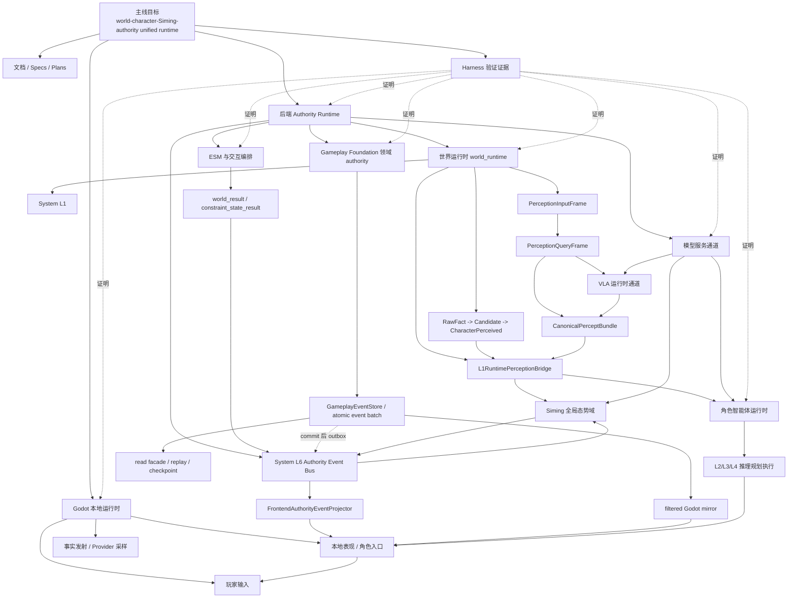
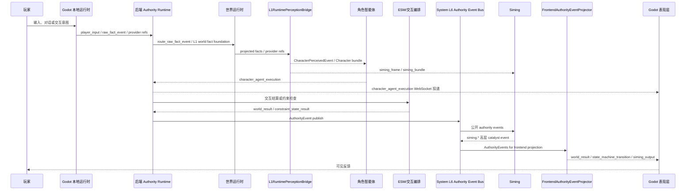
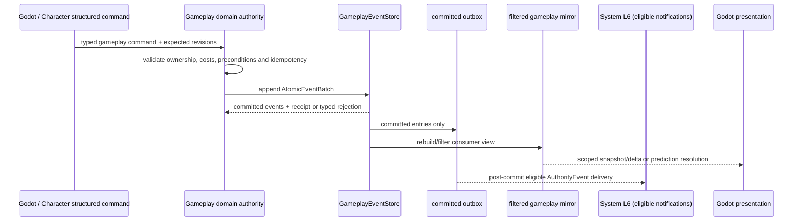

# 整体架构

状态：`current-code mainline baseline; synchronized with Gameplay Foundation evidence`

本文是仓库级整体架构入口，覆盖当前 `world-character-Siming-authority unified runtime`
主线的系统分层、核心数据流、运行时责任边界和文档索引。

如果只看一个文档，应先看本文；如果要看运行时细节，再进入
`docs/架构/运行时/运行时总览.md` 和各局部模块文档。

## 文档边界

本文记录当前主线已存在的运行时 owner。其 Gameplay Foundation 结论来自
`backend/app/gameplay/`、对应正式 spec/plan 与 Harness 报告，详见
[Gameplay Foundation 与领域结算](运行时/模块/GameplayFoundation与领域结算.md)。

[全域架构](../8月分析/全域架构/README.md) 和
[架构审计](../8月分析/架构审计/README.md) 在这份基线上叠加 8 月的增量设计、缺口和
backlog；它们不是新的 runtime，也不比正式 spec/plan、代码和 Harness 证据更高。

## 整体架构图

下面这张图是手绘式总图，用来先看边界和主链路。后面的 Mermaid 图只作为可编辑的
技术补充，不作为第一阅读入口。

```text
                                   ┌──────────────────────────────────────┐
                                   │  验证与支撑面                        │
                                   │  Specs / Plans / Harness             │
                                   │  证明，不替代运行时行为              │
                                   └──────────────────────────────────────┘

                             上层：Godot 本地确定性空间与表现层

              玩家交互面
Player -> 玩家控制角色 -> move / interact / focus
              │
              └──── player_input / interact_intent / move_intent ─────────────┐
                                                                              │
┌─────────────────────────────── Godot 确定性空间层 ───────────────────────────────┐
│                                                                                 │
│  这是 Godot 本地负责“空间、环境、观察事实和多模态采样输出”的底座。               │
│                                                                                 │
│  ┌────────────────────────── 空间拓扑与实体落位 ─────────────────────────────┐   │
│  │ scene / room / zone                                                       │   │
│  │ actor position / object position                                          │   │
│  │ 角色智能体控制角色 与 玩家控制角色 共用同一 scene substrate                │   │
│  └──────────────────────────────┬───────────────────────────────────────────┘   │
│                                 │                                               │
│  ┌────────────────────────── 空间约束与环境场 ───────────────────────────────┐   │
│  │ occupancy / passability / navigation state                                │   │
│  │ environment field / hazard / light / smoke                                │   │
│  │ LOS / occlusion / reachability                                            │   │
│  └──────────────────────────────┬───────────────────────────────────────────┘   │
│                                 │                                               │
│  ┌────────────────────────── 观察窗口与视角框架 ─────────────────────────────┐   │
│  │ local observation windows                                                 │   │
│  │ body state                                                                │   │
│  │ camera frame / listener frame                                             │   │
│  │ 不同 actor 从同一空间底座切出各自私有视角                                 │   │
│  └──────────────────────────────┬───────────────────────────────────────────┘   │
│                                 │                                               │
│                ┌────────────────┴────────────────┐                              │
│                v                                 v                              │
│      ┌────────────────────────┐       ┌────────────────────────┐                │
│      │ 事实上抛器              │       │ provider 采样器        │                │
│      │ 从底座抽取确定结论      │       │ 从底座抽取 patch/ref   │                │
│      │ raw_fact_event family   │       │ visual/spatial/...     │                │
│      └────────────┬───────────┘       └────────────┬───────────┘                │
│                   │                                │                            │
│                   └──── raw_fact_event ────────────┼──────────┐                 │
│                                                    └ provider refs              │
│                                                                                 │
│  ┌────────────────────── 角色入口与本地表现承接链（接后端投递） ─────────────┐   │
│  │ character_agent_execution -> BackendBridge -> LocalPresentationBus       │   │
│  │ -> CharacterReplica -> CharacterRuntimeState -> 角色建模皮肤             │   │
│  │                                                                          │   │
│  │ world_result / state_machine_transition / siming_output                  │   │
│  │ -> BackendBridge -> LocalPresentationBus -> voice stub / visible feedback│   │
│  └───────────────────────────────────────────────────────────────────────────┘   │
│                                                                                 │
│  说明：                                                                        │
│  - 玩家交互面不属于确定性空间层；它只负责控制这个底座里的“玩家控制角色”与局部变化 │
│  - 玩家控制角色 与 角色智能体控制角色 共享 actor substrate，但控制源不同          │
│  - 事实上抛器和 provider 采样器都不是“这一层本身”，而是从确定性空间层提取信息的工具│
│  - 事实上抛器走 fact/event 语义链；采样器走 provider/PQF 多模态链                │
└─────────────────────────────────────────────────────────────────────────────────┘

                    下行输入：raw_fact_event / provider refs / player_input
                    上行回程：character_agent_execution / world_result /
                             state_machine_transition / siming_output

                              中层：Godot -> Backend 跨边界连接层

┌──────────────────────────── Godot -> Backend 跨边界连接主线 ───────────────────────┐
│                                                                                 │
│  确定性空间层本身不过边界；过边界的是从其中抽取出来的结构化 envelope。            │
│                                                                                 │
│  raw_fact_event / provider refs / player_input                                  │
│            │                                                                    │
│            v                                                                    │
│  事实上抛器 / provider 采样器 / 玩家输入适配                                    │
│            │                                                                    │
│            v                                                                    │
│  FactEnvelopeBuilder.gd / 结构化消息组装                                         │
│            │                                                                    │
│            v                                                                    │
│  BackendBridge.gd  ==WebSocket /ws==>  backend/app/main.py                      │
│            │                                      │                             │
│            │                                      ├── route_raw_fact_event      │
│            │                                      └── L1RuntimePerceptionBridge │
│            │                                                                    │
│            └──── 后端返回：character_agent_execution / world_result /          │
│                         state_machine_transition / siming_output -> Godot        │
│                                                                                 │
└─────────────────────────────────────────────────────────────────────────────────┘

                 下行输入：BackendBridge.gd ==WebSocket /ws==> backend/app/main.py
                 后端入口：route_raw_fact_event -> L1 world fact foundation ->
                          _messages_from_projected_l1_facts -> L1RuntimePerceptionBridge /
                          ESM or Gameplay authority (by fact owner)
                 上行回程：backend/app/main.py -> BackendBridge.gd -> Godot

                                 下层：后端统一运行时主体

┌────────────────────────────── 后端 Authority Runtime ───────────────────────────┐
│                                                                                 │
│  后端入口 backend/app/main.py                                                   │
│                                                                                 │
│  左侧：跨层公共系统              中央：主运行时主体与感知桥              右侧：跨层依赖 │
│                                                                                 │
│  ┌──────────────────────────┐   ┌──────────────────────────────┐   ┌──────────────────────────┐ │
│  │ World/interaction 结算域 │   │ 世界侧运行时域 world_runtime │   │ 模型依赖摘要             │ │
│  │ 玩家意图 -> ESM ->       │   │                              │   │ Character / Siming / VLA │ │
│  │ world/constraint result  │   │ ① L1 foundation             │   │ provider readiness       │ │
│  │ -> AuthorityEvent -> L6  │   │ ② 事实上抛链路              │   │ adapter / fallback /     │ │
│  └──────────────┬───────────┘   │    RawFactEvent ->          │   │ proof                     │ │
│                 │               │    CharacterPerceivedEvent  │   │ 详见下方模型服务侧栏      │ │
│                 │ public        │ ③ 多模态链路                │   └──────────────────────────┘ │
│                 │ AuthorityEvents│    provider refs ->        │                                      │
│                 v               │    PerceptionInputFrame ->  │                                      │
│  ┌──────────────────────────┐   │    PerceptionQueryFrame ->  │                                      │
│  │ System L6 事件总线       │   │    base Canonical bundle   │                                      │
│  │ public authority bus     │   │ ④ VLA 慢路径增强支链       │                                      │
│  │ route / audit / observe  │   │    PQF -> VLA request ->   │                                      │
│  │ frontend projection tap  │   │    VLA result -> merge back│                                      │
│  └──────────────┬───────────┘   │ ⑤ readiness / evidence     │                                      │
│                 │               └───────┬──────────────────────────────┘                           │
│  ┌──────────────────────────┐           │                                                          │
│  │ Gameplay Foundation 域   │           │                                                          │
│  │ typed command -> domain  │           │                                                          │
│  │ authority -> EventStore  │           │                                                          │
│  │ -> replay/mirror/outbox  │           │                                                          │
│  │ (commit 后可通知 L6)     │           │                                                          │
│  └──────────────────────────┘           │                                                          │
│                 │                       │                                                          │
│                 │                       v                                                          │
│                 │      ┌──────────────────────────────────────────────────────────────┐            │
│                 │      │ L1RuntimePerceptionBridge（私有/全局感知桥）                 │            │
│                 │      │ projected facts / provider refs -> character_frame/bundle   │            │
│                 │      │                                    + siming_frame/bundle    │            │
│                 │      └──────────────┬──────────────────────────────┬────────────────┘            │
│                 │                     │                              │                             │
│                 │                     │ CharacterPerceivedEvent      │ siming_frame / siming_bundle│
│                 │                     │ CanonicalPerceptBundle       │ public world refs           │
│                 │                     v                              v                             │
│                 │          ┌──────────────────────────────┐  ┌──────────────────────────────┐    │
│                 │          │ 角色侧运行时域               │  │ Siming 全局态势域             │    │
│                 │          │ CharacterAgentRuntime        │  │ SimingGlobalSituationLayer    │ │
│                 │          │                              │  │ -> SimingRuntime              │ │
│                 │          │ 输入：                       │  │                              │ │
│                 │          │ - CharacterPerceivedEvent    │  │ 输入：                       │ │
│                 │          │ - CanonicalPerceptBundle     │  │ - System L6 public          │ │
│                 │          │ - SelfBody / settlement /    │  │   AuthorityEvents           │ │
│                 │          │   Siming catalyst            │  │ - siming_frame / siming_    │ │
│                 │          │                              │  │   bundle                    │ │
│                 │          │ 内部：L1 -> memory/timeline  │  │ - public world refs /       │ │
│                 │          │ -> L2 -> L3 -> L4            │  │   evidence refs             │ │
│                 │          │ 输出：                       │  │ 输出：siming.*              │ │
│                 │          │ - character_agent_execution  │  └──────────────┬──────────────┘ │
│                 │          │ - suggestion packets         │                 │ siming.*       │
│                 │          │ - actor-private writeback    │                 │                │
│                 │          └────────────┬─────────────────┘                 │                │
│                 │                       │                                   │                │
│                 │                       ├── character_agent_execution ───┐  │                │
│                 │                       └── private writeback（不出私域） │  │                │
│                 │                                                         │  │                │
│  ┌──────────────────────────┐                                            │  │                │
│  │ Frontend Projection 域   │<───────────────────────────────────────────┘  └────────────────┘
│  │ L6 / siming.* ->         │                                                             │
│  │ FrontendAuthorityProjector│                                                             │
│  └──────────────┬───────────┘                                                             │
│                 │                                                                         │
│                 ├──── world_result / state_machine_transition                             │
│                 ├──── siming_output                                                       │
│                 └──── frontend delivery -> BackendBridge                                  │
└─────────────────────────────────────────────────────────────────────────────────┘

┌────────────────────────────── 模型服务依赖侧栏 ─────────────────────────────┐
│ Character text model / Siming candidate model / VLA provider / production │
│ provider readiness / adapter / fallback / real-call proof                 │
│ 不直接写 world truth，不直接触发 ESM settlement，不直接控制角色动作        │
└────────────────────────────────────────────────────────────────────────────┘
```

读图顺序：

1. `Godot` 确定性空间层要拆成三层看：空间拓扑与实体落位、空间约束与环境场、观察窗口与视角框架；玩家交互面、事实上抛器、provider 采样器都只是围绕这个底座进行控制或提取并跨层输出。
2. 玩家控制链和角色智能体执行链必须分开看：玩家控制角色的 control source 首先是玩家；角色智能体控制角色的执行 payload 则来自后端角色智能体。
3. 先看三层之间的接口条：上层给中层的是 `raw_fact_event / provider refs / player_input`，中层给下层的是 `BackendBridge.gd ==WebSocket /ws==> backend/app/main.py`，下层回给上层的是 `character_agent_execution / world_result / state_machine_transition / siming_output`。
4. `Godot` 和后端之间应单独看“跨边界连接主线”：确定性空间层本身不过边界，真正过边界的是 `raw_fact_event`、`provider refs` 和 `player_input` 这类结构化 envelope；它们经 `BackendBridge.gd` 发到后端 `/ws`，由 `backend/app/main.py` 先进入 `route_raw_fact_event` 与 L1 world fact foundation，再在 `_messages_from_projected_l1_facts(...)` 里进入 `L1RuntimePerceptionBridge`。
5. 后端总图应该按“左侧跨层公共系统 / 中央主运行时主体与感知桥 / 右侧跨层依赖系统”来读：事件总线放左侧，多模态主干和 `L1RuntimePerceptionBridge` 留在中央，模型依赖留在右侧，这样不会把多模态链和事件总线误读成同一侧链路。
6. `world_runtime` 是中央主运行时主体的世界侧基础设施大类，内部同时承接事实上抛链和 provider/PQF 多模态链，并用显式 `PerceptionInputFrame` 做输入对齐。
7. `L1RuntimePerceptionBridge` 必须被看作主要桥组件，而不只是一个实现细节：它把 `projected facts / provider refs` 桥接成 `character_frame / bundle` 和 `siming_frame / bundle`，分别送往角色侧运行时域和 Siming 全局态势域。
8. `System L6` 与 `L1RuntimePerceptionBridge` 都是关键桥，但桥接的对象不同：`L1RuntimePerceptionBridge` 是感知桥，桥接的是私有/全局 percept 消费；`System L6` 是公共事件桥，桥接的是 authority event、Siming 回写和前端投影。
9. `VLA` 不是与多模态链路并列的第二条主链，而是挂在 `PerceptionQueryFrame` 后面的慢速增强支链；它的结果只能通过 `VLA percept bridge` 回灌到 `CanonicalPerceptBundle`。
10. 角色侧运行时域和 Siming 全局态势域应处于水平并列层次：前者消费 actor-private `CharacterPerceivedEvent` 和角色 bundle，后者消费 `System L6` 公开事件，以及来自 `L1RuntimePerceptionBridge` 汇总出的 `siming_frame / siming_bundle / public refs`。
11. 角色侧运行时要拆成输入层、内部链、输出层来看：输入是 `CharacterPerceivedEvent`、`CanonicalPerceptBundle`、`SelfBodyPerceivedEvent`、settlement summaries 和 `Siming catalyst`；内部经过 `L1 -> memory/timeline -> L2 -> L3 -> L4`；输出是 `character_agent_execution`、特定控制模式下的 `suggestion packets`，以及 actor-private writeback。
12. Siming 是独立的全局态势域，不应和 authority 结算或 frontend projection 混成一个盒子；它回写 `siming.*`，再由左侧跨层系统负责分发和投影。
13. Godot 侧也要分两类承接：`character_agent_execution` 进入 `CharacterReplica -> CharacterRuntimeState -> 角色建模皮肤`；`world_result / state_machine_transition / siming_output` 则进入 `LocalPresentationBus` 的公共表现分发，再落到语音桩和可见反馈。
14. `ESM` 负责当前主线的对象、环境和物理交互 authority settlement；它不是账户、背包、装备、产权、债务或合同的通用 owner。
15. Gameplay Foundation 的领域 authority 通过 `GameplayEventStore.append_batch` 提交玩法事实；该 store 是 canonical committed-event/replay 来源，`CharacterGameRuntimeState` 只是读 facade。
16. `System L6` 承载公共 `AuthorityEvent` 路由；它不取代 Gameplay event store。`FrontendAuthorityEventProjector` 只负责前端投影，不拥有 Siming、ESM 或玩法领域事实。
17. Godot 侧的 `CharacterReplica / CharacterRuntimeState / KnightRoleSkin` 不是一个东西，而是一条承接链：角色入口、状态承接、本地表现。
18. 模型服务侧栏是后端依赖能力，不是与 Godot/Backend 并列的第三运行层。
19. Harness 只证明实现、文档和集成状态，不替代运行时行为。

## 总体目标

当前仓库的主线目标不是单独的 Phase 0 demo，而是最小可验证的
`world-character-Siming-authority unified runtime`：

1. Godot 3D 场景承载本地输入、表现和具身运行。
2. 后端承接 authority、世界运行时、角色智能体、ESM、Gameplay Foundation、Siming 和模型服务边界。
3. System L1 把事实、provider refs、PQF 和 percept bundle 连接到角色和 Siming。
4. 角色智能体以 L1/L2/L3/L4 链路产出 `character_agent_execution`。
5. ESM 与交互编排结算成功、失败、约束和降级结果。
6. Gameplay Foundation 以领域 authority、原子事件批次、replay、outbox 和受限镜像承接可回放玩法事实。
7. System L6 承载 authority event bus、跨层路由、回放和审计辅助边界；前端投影由 `FrontendAuthorityEventProjector` 适配。
8. VLA 作为已实现的视觉/空间慢路径运行时通道参与感知增强。
9. 模型服务通道记录 provider readiness、adapter、降级和真实调用证明。
10. Harness 负责把文档、静态边界、后端、Godot 和集成 proof 变成可重复证据。

## 架构分层



## 运行时主链路

本节首先展示对象/环境交互路径。Gameplay domain command 的不同提交路径见下一节，
二者按被修改事实的 owner 分流，而不是同时经过 ESM。



## Gameplay 领域结算支线



`GameplayEventStore` 不由 ESM 或 L6 替代。当前已验证的是资源/状态、背包/装备、
产权/固定交易/赠与/债务/受限合同、Patch 生命周期和 `adventure-basic` 的有界组合，
不是完整市场或组织/政府模拟。

## 数据主流向

```mermaid
flowchart LR
    GodotFacts[Godot facts / provider refs] --> Backend[后端 Authority Runtime]
    PlayerInput[player_input / interact_intent] --> Backend[后端 Authority Runtime]

    Backend --> FactRoute[route_raw_fact_event]
    Backend --> WorldRuntime[世界运行时]
    WorldRuntime --> InputFrame[PerceptionInputFrame]
    InputFrame --> PQF[PerceptionQueryFrame]
    PQF --> Bundle[CanonicalPerceptBundle]
    PQF --> VLA[VLAProviderResult / 参考性 metadata]
    VLA --> Bundle
    FactRoute --> ProjectedFacts[projected facts]
    ProjectedFacts --> L1Bridge[L1RuntimePerceptionBridge]
    Bundle --> L1Bridge
    L1Bridge --> CharacterPercept[CharacterPerceivedEvent]
    L1Bridge --> CharacterBundle[character bundle]
    L1Bridge --> SimingBundle[siming_frame / siming_bundle]

    CharacterPercept --> Character[角色智能体]
    CharacterBundle --> Character
    SimingBundle --> Siming[Siming]

    Character --> Exec[character_agent_execution]
    Exec --> Delivery[后端 WebSocket 投递]
    Backend --> ESM[ESM 与交互编排]
    ESM --> WorldResult[world_result / constraint_state_result]
    Backend --> Gameplay[Gameplay domain authorities]
    Gameplay --> GameplayStore[GameplayEventStore]
    GameplayStore --> GameplayMirror[filtered gameplay mirror]
    GameplayStore -. committed outbox .-> L6
    Backend --> L6[System L6 AuthorityEventBus]
    WorldResult --> L6
    L6 --> Siming
    Siming --> SimingEvent[siming.*]
    SimingEvent --> L6
    L6 --> Projector[FrontendAuthorityEventProjector]
    Projector --> ProjectedSiming[投影后的 siming_output]
    Projector --> WorldProjection[world_result / state_machine_transition]

    Delivery --> GodotPresentation[Godot 表现层]
    WorldProjection --> GodotPresentation
    ProjectedSiming --> GodotPresentation
    GameplayMirror --> GodotPresentation
```



## 模块文档入口

| 模块 | 文档 |
| --- | --- |
| 整体运行时 | `docs/架构/运行时/运行时总览.md` |
| 覆盖矩阵 | `docs/架构/运行时/运行时覆盖矩阵.md` |
| 世界运行时 | `docs/架构/运行时/模块/世界运行时.md` |
| System L1 | `docs/架构/运行时/模块/SystemL1.md` |
| System L6 事件总线 | `docs/架构/运行时/模块/SystemL6事件总线.md` |
| Siming | `docs/架构/运行时/模块/Siming.md` |
| 角色智能体 | `docs/架构/运行时/模块/角色智能体.md` |
| ESM 与交互编排 | `docs/架构/运行时/模块/ESM与交互编排.md` |
| Gameplay Foundation 与领域结算 | `docs/架构/运行时/模块/GameplayFoundation与领域结算.md` |
| Godot 表现与角色入口 | `docs/架构/运行时/模块/Godot表现与角色入口.md` |
| VLA 运行时 | `docs/架构/运行时/模块/VLA运行时通道.md` |
| 模型服务 | `docs/架构/运行时/模块/模型服务通道.md` |
| Harness 证据 | `docs/架构/运行时/模块/Harness验证证据.md` |
| 运行时时序 | `docs/架构/运行时/图表/整体运行时时序图.md` |
| 运行时数据流 | `docs/架构/运行时/图表/整体运行时数据流图.md` |

## 非运行时支撑面

| 支撑面 | 作用 | 主要入口 |
| --- | --- | --- |
| Specs / Plans | 设计真相、实施计划、历史决策 | `docs/superpowers/specs/`, `docs/superpowers/plans/` |
| Harness | 验证 profile、报告、证据归档 | `docs/harness.md`, `.harness/verification/` |
| 8 月增量指导/审计 | 基于当前基线的 future owner、backlog 与风险检查 | `docs/8月分析/全域架构/`, `docs/8月分析/架构审计/` |
| 非运行时生产管线 | scene semantic extraction、spatial baking、review gating、approved artifacts | `tools/production/*`, `non-runtime-production-pipeline` profile |
| 参考资料 | Phase1 参考设计，不是当前实现事实 | `docs/reference/` |

## 总体边界

- Godot 是本地输入、表现和高频具身 host，不是 world truth authority。
- Backend Authority Runtime 是跨边界消息、authority settlement、角色智能体、Siming 和 projection 的后端主承载。
- 世界运行时是后端世界侧基础设施大类，承接 L1、PQF、VLA、provider readiness、调度和 continuity。
- System L1 是世界运行时下的事实、provider、PQF 和投影边界。
- `L1RuntimePerceptionBridge` 是世界运行时到角色/Siming 消费面的主要感知桥；它不做 authority publish，但负责把 projected facts 和 provider refs 装配成可消费的 frame / bundle。
- System L6 是跨层基础设施层，承载 authority event bus、路由、回放和审计辅助边界；前端投影由 `FrontendAuthorityEventProjector` 承接。
- Siming 是独立的全局态势与高层催化层；它消费公开 authority events，也消费来自事实上抛链和多模态链的全局感知上下文，只输出高层 catalyst 和 `siming.*`。
- 角色智能体拥有私有感知、记忆、解释、规划和执行语义，不拥有世界真相。
- ESM 与交互编排负责对象/环境/物理交互 authority 结算和结果合并，不负责角色认知或 Gameplay 的通用领域事实。
- Gameplay Foundation 由各领域 authority 和 `GameplayEventStore` 承接可回放玩法事实；它不是新的 runtime host，且其 read facade、镜像和 checkpoint 不可反写 event history。
- System L6 只承接公共 event envelope、路由与投影；它不能作为 Gameplay canonical event store、账户账本或 replay owner。
- VLA 已实现为视觉/空间慢路径运行时通道；输出没有 authority 直接写权限。
- 模型服务通道记录 provider readiness 和真实调用证明，不直接改变世界或角色动作。
- Siming 不直接控制低层动作、覆盖 world truth 或生成 `character_agent_execution`。
- Harness 证明实现和文档状态，不替代运行时行为。

## 验证入口

- `python scripts/verification/harness.py --profile docs`
- `python scripts/verification/harness.py --profile mainline-unified-runtime`
- `python scripts/verification/harness.py --profile gameplay-foundation-all`
- `python scripts/verification/harness.py --profile adventure-basic`
- `python scripts/verification/harness.py --profile phase0`
- `python scripts/verification/harness.py --profile all`
