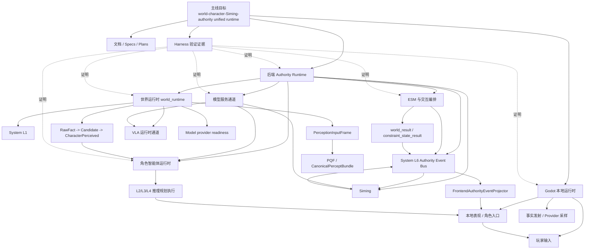
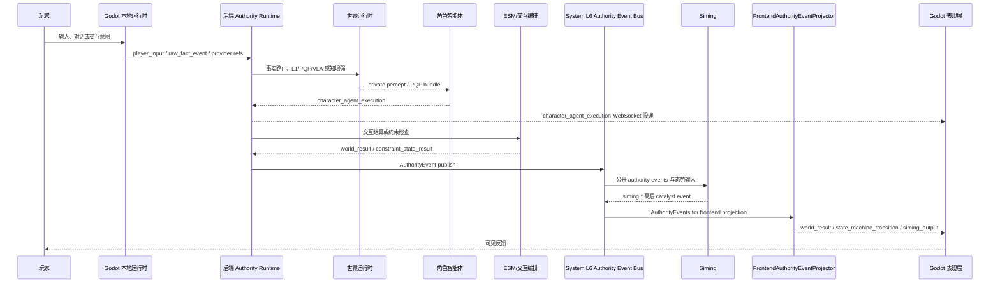
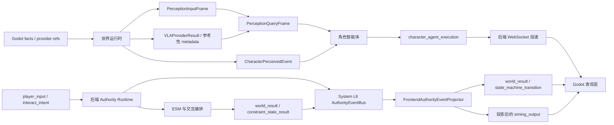

# 整体架构

状态：当前主线总纲文档

本文是仓库级整体架构入口，覆盖当前 `world-character-Siming-authority unified runtime`
主线的系统分层、核心数据流、运行时责任边界和文档索引。

如果只看一个文档，应先看本文；如果要看运行时细节，再进入
`docs/架构/运行时/运行时总览.md` 和各局部模块文档。

## 整体架构图

下面这张图是手绘式总图，用来先看边界和主链路。后面的 Mermaid 图只作为可编辑的
技术补充，不作为第一阅读入口。

```text
                                      ┌──────────────────────────────────────┐
                                      │  验证与支撑面                        │
                                      │  Specs / Plans / Harness             │
                                      │  证明，不替代运行时行为              │
                                      └──────────────────────────────────────┘

┌─────────────────────────────── Godot 本地交互域 ───────────────────────────────┐
│                                                                                 │
│  玩家输入链                                                                     │
│  Player -> PlayerCharacter / char_c substrate -> move / interact / focus        │
│                │                                                                │
│                └──── player_input / interact_intent / move_intent ───────────┐  │
│                                                                               │  │
│  感知输出链                                                                   │  │
│  ┌────────────────────┐                          ┌──────────────────────────┐ │  │
│  │ 事实上抛器         │                          │ provider 采样器          │ │  │
│  │ raw_fact / visual  │                          │ visual / spatial /       │ │  │
│  │ auditory / ...     │                          │ auditory / embodied /    │ │  │
│  └──────────┬─────────┘                          │ skeletal / environment   │ │  │
│             └──── raw_fact_event ───────────────>│ refs                     │ │  │
│                                                   └──────────┬──────────────┘ │  │
│                                                              └── provider refs ┘  │
│                                                                                 │
│  Godot 角色入口链                                                              │
│  BackendBridge -> LocalPresentationBus -> CharacterReplica ->                  │
│  CharacterRuntimeState -> KnightRoleSkin / voice stub / visible feedback       │
│                                                                                 │
│  说明：                                                                        │
│  - `char_c` 与 `char_a/char_b` 共享 actor substrate，但控制源不同               │
│  - 事实上抛器和采样器都起源于 Godot，本质上是跨层感知输出，不是玩家输入        │
└─────────────────────────────────────────────────────────────────────────────────┘

┌────────────────────────────── 后端 Authority Runtime ───────────────────────────┐
│                                                                                 │
│  后端入口 backend/app/main.py                                                   │
│        │                                                                        │
│        ├──────── 玩家意图 ───────────────┐                                      │
│        ├──────── raw_fact_event ───────┐ │                                      │
│        └──────── provider refs ───────┐│ │                                      │
│                                       ││ │                                      │
│  ┌────────────────────────────── 世界侧运行时域 ──────────────────────────────┐  │
│  │ world_runtime                                                            │  │
│  │                                                                          │  │
│  │ 事实上抛链路：                                                           │  │
│  │ RawFactEvent -> fact_router -> CandidatePerceptEvent ->                  │  │
│  │ CharacterPerceivedEvent                                                  │  │
│  │                                                                          │  │
│  │ 多模态链路：                                                             │  │
│  │ provider refs -> PerceptionInputFrame -> PerceptionQueryFrame ->         │  │
│  │ CanonicalPerceptBundle -> optional VLA advisory                          │  │
│  └──────────────┬───────────────────────────────────────────┬───────────────┘  │
│                 │                                           │                  │
│                 │ CharacterPerceivedEvent                   │ Canonical bundle │
│                 v                                           v                  │
│  ┌────────────────────────────── 角色侧运行时域 ──────────────────────────────┐  │
│  │ CharacterAgentRuntime                                                     │  │
│  │                                                                          │  │
│  │ 输入：CharacterPerceivedEvent + CanonicalPerceptBundle + SelfBody +      │  │
│  │       Siming catalyst                                                    │  │
│  │                                                                          │  │
│  │ L1 private perception -> L2 interpretation -> L3 planning ->             │  │
│  │ L4 execution semantics -> character_agent_execution                      │  │
│  └──────────────────────────────┬───────────────────────────────────────────┘  │
│                                 │                                              │
│                                 └──── character_agent_execution WebSocket ───┐ │
│                                                                              │ │
│  ┌────────────────────── Authority / Siming / Projection 域 ───────────────┐ │ │
│  │                                                                        │ │ │
│  │ 玩家意图 -> ESM / Interaction Orchestration -> settlement result       │ │ │
│  │ settlement result -> AuthorityEvent Adapter -> System L6               │ │ │
│  │ System L6 -> Siming -> siming.* -> System L6                           │ │ │
│  │ System L6 -> FrontendAuthorityEventProjector                           │ │ │
│  └──────────────────────────────┬─────────────────────────────────────────┘ │ │
│                                 │                                           │ │
│                                 ├──── world_result / state_machine_transition│ │
│                                 ├──── siming_output                         │ │
│                                 └──── character_agent_execution delivery ───┘ │
└─────────────────────────────────────────────────────────────────────────────────┘

┌────────────────────────────── 模型服务依赖侧栏 ─────────────────────────────┐
│ Character text model / Siming candidate model / VLA provider / production │
│ provider readiness / adapter / fallback / real-call proof                 │
│ 不直接写 world truth，不直接触发 ESM settlement，不直接控制角色动作        │
└────────────────────────────────────────────────────────────────────────────┘
```

读图顺序：

1. `Godot` 本地交互域里有三类输入源：玩家输入、事实上抛器、provider 采样器，它们都通过 WebSocket 结构化进入后端。
2. 玩家控制链和角色智能体执行链必须分开看：`char_c` 的 control source 首先是玩家；`char_a/char_b` 的执行 payload 则来自后端角色智能体。
3. `world_runtime` 是世界侧基础设施大类，内部同时承接事实上抛链和 provider/PQF 多模态链，并用显式 `PerceptionInputFrame` 做输入对齐。
4. 角色侧运行时消费两种输入：`CharacterPerceivedEvent` 和 `CanonicalPerceptBundle`；两者共享同一 capture/object identity 契约。
5. `ESM` 负责 authority settlement；结果先适配成 `AuthorityEvent`，再进入 `System L6`。
6. `System L6` 承载 authority event bus；`Siming` 消费公开 authority events 并回写 `siming.*`，`FrontendAuthorityEventProjector` 只负责前端投影。
7. Godot 侧的 `CharacterReplica / CharacterRuntimeState / KnightRoleSkin` 不是一个东西，而是一条承接链：角色入口、状态承接、本地表现。
8. 模型服务侧栏是后端依赖能力，不是与 Godot/Backend 并列的第三运行层。
9. Harness 只证明实现、文档和集成状态，不替代运行时行为。

## 总体目标

当前仓库的主线目标不是单独的 Phase 0 demo，而是最小可验证的
`world-character-Siming-authority unified runtime`：

1. Godot 3D 场景承载本地输入、表现和具身运行。
2. 后端承接 authority、世界运行时、角色智能体、ESM、Siming 和模型服务边界。
3. System L1 把事实、provider refs、PQF 和 percept bundle 连接到角色和 Siming。
4. 角色智能体以 L1/L2/L3/L4 链路产出 `character_agent_execution`。
5. ESM 与交互编排结算成功、失败、约束和降级结果。
6. System L6 承载 authority event bus、跨层路由、回放和审计辅助边界；前端投影由 `FrontendAuthorityEventProjector` 适配。
7. VLA 作为已实现的视觉/空间慢路径运行时通道参与感知增强。
8. 模型服务通道记录 provider readiness、adapter、降级和真实调用证明。
9. Harness 负责把文档、静态边界、后端、Godot 和集成 proof 变成可重复证据。

## 架构分层



## 运行时主链路



## 数据主流向



## 模块文档入口

| 模块 | 文档 |
| --- | --- |
| 整体运行时 | `docs/架构/运行时/运行时总览.md` |
| 覆盖矩阵 | `docs/架构/运行时/运行时覆盖矩阵.md` |
| 世界运行时 | `docs/架构/运行时/模块/世界运行时.md` |
| System L1 | `docs/架构/运行时/模块/SystemL1.md` |
| System L6 事件总线 | `docs/架构/运行时/模块/SystemL6事件总线.md` |
| Siming | `docs/架构/运行时/模块/Siming.md` |
| 角色智能体 | `docs/架构/运行时/模块/角色智能体.md` |
| ESM 与交互编排 | `docs/架构/运行时/模块/ESM与交互编排.md` |
| Godot 表现与角色入口 | `docs/架构/运行时/模块/Godot表现与角色入口.md` |
| VLA 运行时 | `docs/架构/运行时/模块/VLA运行时通道.md` |
| 模型服务 | `docs/架构/运行时/模块/模型服务通道.md` |
| Harness 证据 | `docs/架构/运行时/模块/Harness验证证据.md` |
| 运行时时序 | `docs/架构/运行时/图表/整体运行时时序图.md` |
| 运行时数据流 | `docs/架构/运行时/图表/整体运行时数据流图.md` |

## 非运行时支撑面

| 支撑面 | 作用 | 主要入口 |
| --- | --- | --- |
| Specs / Plans | 设计真相、实施计划、历史决策 | `docs/superpowers/specs/`, `docs/superpowers/plans/` |
| Harness | 验证 profile、报告、证据归档 | `docs/harness.md`, `.harness/verification/` |
| 非运行时生产管线 | scene semantic extraction、spatial baking、review gating、approved artifacts | `tools/production/*`, `non-runtime-production-pipeline` profile |
| 参考资料 | Phase1 参考设计，不是当前实现事实 | `docs/reference/` |

## 总体边界

- Godot 是本地输入、表现和高频具身 host，不是 world truth authority。
- Backend Authority Runtime 是跨边界消息、authority settlement、角色智能体、Siming 和 projection 的后端主承载。
- 世界运行时是后端世界侧基础设施大类，承接 L1、PQF、VLA、provider readiness、调度和 continuity。
- System L1 是世界运行时下的事实、provider、PQF 和投影边界。
- System L6 是跨层基础设施层，承载 authority event bus、路由、回放和审计辅助边界；前端投影由 `FrontendAuthorityEventProjector` 承接。
- Siming 消费公开 authority events 和全局态势输入，只输出高层 catalyst；进入 Godot 必须经过 `FrontendAuthorityEventProjector`，进入角色只能作为 catalyst input。
- 角色智能体拥有私有感知、记忆、解释、规划和执行语义，不拥有世界真相。
- ESM 与交互编排负责 authority 结算和结果合并，不负责角色认知。
- VLA 已实现为视觉/空间慢路径运行时通道；输出没有 authority 直接写权限。
- 模型服务通道记录 provider readiness 和真实调用证明，不直接改变世界或角色动作。
- Siming 不直接控制低层动作、覆盖 world truth 或生成 `character_agent_execution`。
- Harness 证明实现和文档状态，不替代运行时行为。

## 验证入口

- `python scripts/verification/harness.py --profile docs`
- `python scripts/verification/harness.py --profile mainline-unified-runtime`
- `python scripts/verification/harness.py --profile phase0`
- `python scripts/verification/harness.py --profile all`
