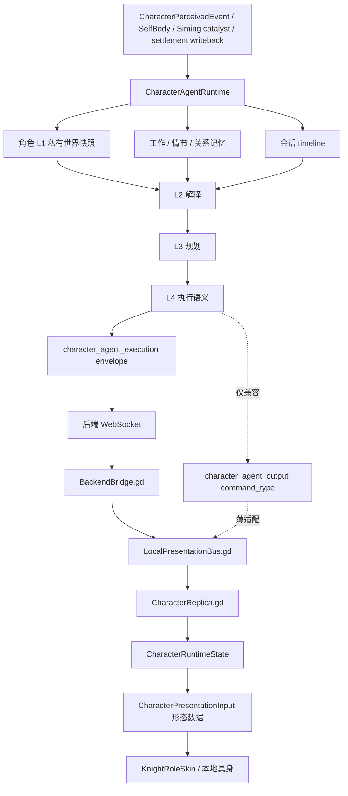
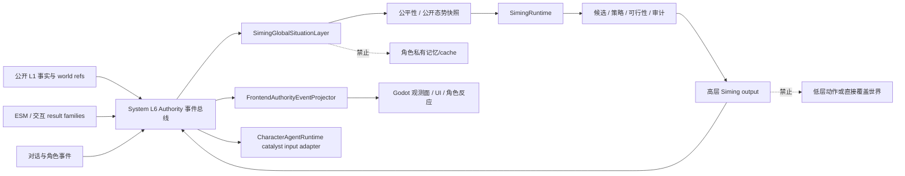
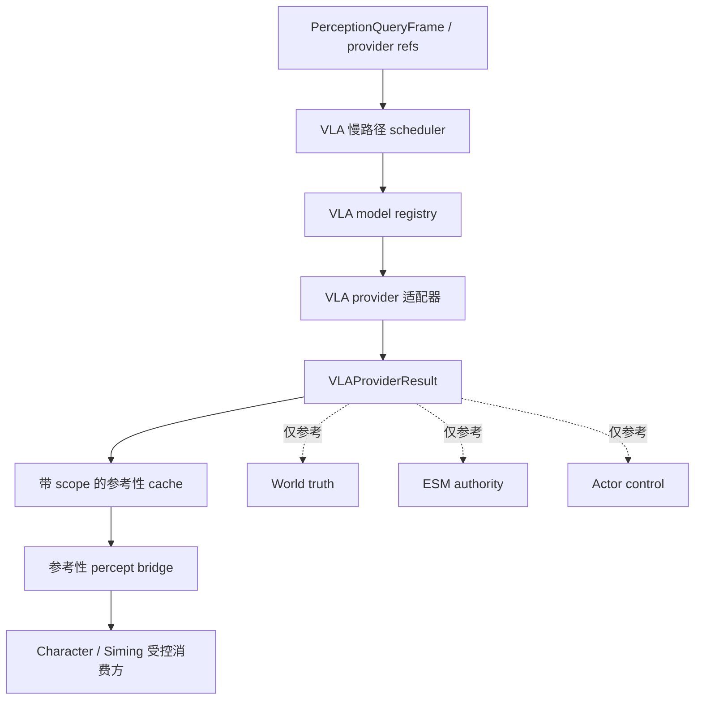
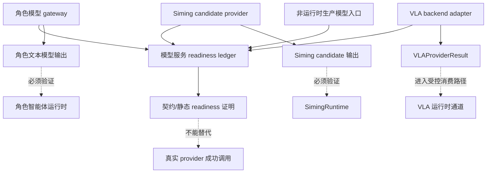
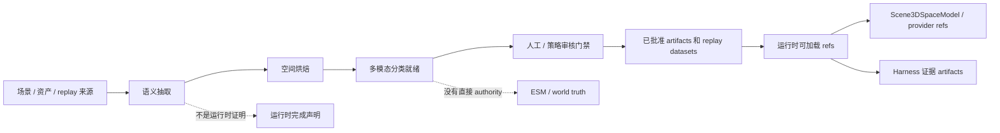

# 运行时数据流图

状态：当前运行时图表文档

这些图描述当前仓库的数据流转。它们是面向维护者的已实现/面向运行时
路径地图，不是产品理想态架构图。

配合下面文档使用：

- `docs/架构/运行时/模块/SystemL1.md`
- `docs/架构/运行时/模块/角色智能体.md`
- `docs/架构/运行时/图表/整体运行时时序图.md`
- `docs/架构/运行时/运行时覆盖矩阵.md`

## L1 事实与 Provider 到 PQF 消费方

```mermaid
flowchart TD
    GodotScene[Godot 场景节点] --> RawEmitters[原始事实发射器]
    GodotScene --> Providers[采样 provider]
    GodotScene --> PlayerIntent[玩家 / 交互意图]

    RawEmitters --> RawFact[raw_fact_event]
    Providers --> ProviderRefs[visual / spatial / auditory / body / skeletal / environment refs]
    PlayerIntent --> IntentEnvelope[player_input / interact_intent]

    RawFact --> BackendMain[backend/app/main.py]
    ProviderRefs --> BackendMain
    IntentEnvelope --> BackendMain

    BackendMain --> FactRouter[事实路由与处理器]
    FactRouter --> Candidate[CandidatePerceptEvent]
    Candidate --> PrivateFilter[逐角色感知过滤器]
    PrivateFilter --> CharacterPerceived[CharacterPerceivedEvent]

    BackendMain --> L1Bridge[L1RuntimePerceptionBridge]
    L1Bridge --> PQF[PerceptionQueryFrame]
    PQF --> CanonicalBundle[CanonicalPerceptBundle]

    CharacterPerceived --> CharacterL1[角色 L1 私有快照]
    CanonicalBundle --> CharacterL1
    CanonicalBundle --> SimingPublic[Siming 公开态势输入]

    CharacterL1 -. 禁止 .-> WorldTruth[世界真相变更]
    SimingPublic -. 禁止 .-> PrivateCache[角色私有 cache]
```

边界说明：

- L1 是事实、provider、投影边界，不是独立 brain 或 authority host。
- Provider refs 是采样输入，不能直接结算 world truth。
- `CharacterPerceivedEvent` 和 PQF 派生 bundle 必须保持 actor/private scope 隔离。

验证：

- `python scripts/verification/harness.py --profile l1-world-fact-runtime`
- `python scripts/verification/harness.py --profile godot-sampling-production-grade-providers`
- `python scripts/verification/harness.py --profile actor-scene-knowledge-lifecycle`

## 交互编排与 ESM 结果合并

```mermaid
flowchart LR
    GodotIntent[Godot interact_intent] --> Main[backend/app/main.py]
    Main --> Orchestrator[InteractionOrchestrationService]

    Orchestrator --> Policy[策略 / 通道选择]
    Policy --> Semantic[语义交互请求]
    Policy --> Physical[物理交互 refs]

    Semantic --> ESM[ESMService authority 结算]
    Physical --> PhysicalChannel[PhysicalInteractionChannel]
    PhysicalChannel --> ESM

    ESM --> Success[成功 result family]
    ESM --> Constraint[constraint_state_result]
    ESM --> Degraded[降级 / 拒绝 result]

    Success --> Merge[统一编排结果合并]
    Constraint --> Merge
    Degraded --> Merge

    Merge --> AuthorityEvents[System L6 Authority 事件总线]
    AuthorityEvents --> Projection[FrontendAuthorityEventProjector]
    Projection --> GodotResult[Godot world_result / 对象状态 / UI 反馈]
    AuthorityEvents --> Siming[SimingRuntime / 全局态势]
    AuthorityEvents --> CharacterWriteback[角色 timeline 回写]
```

边界说明：

- ESM 仍是结算结果的 authority。
- 交互编排负责选择和合并路径；它不是新的 cognition layer。
- Godot 展示投影结果，但不能本地伪造成功的 authority outcome。

验证：

- `python scripts/verification/harness.py --profile interaction-orchestration-service`
- `python scripts/verification/harness.py --profile esm-physical-channel-world-actuation`
- `python scripts/verification/harness.py --profile phase0`

## 角色智能体 L1/L2/L3/L4 到 Godot Ingress

边界说明：

- Mind core 运行时路径真实存在且已验证。
- 最终单一路径 `L4 -> CharacterActor` 收敛仍是已知缺口。
- Godot actor ingress 负责实现表现，不成为语义 owner。

验证：

- `python scripts/verification/harness.py --profile character-agent-execution`
- `python scripts/verification/harness.py --profile mainline-unified-runtime`
- `python -m pytest -q backend/tests`

## System L6、Siming 与前端投影

边界说明：

- Siming 消费公开 world/evidence/参考性 refs，并输出高层 catalysts。
- Siming 不能读取 actor-private cache，也不能直接写低层动作。
- Projection 是面向 Godot 与 debug observability 的兼容表面。
- `Authority -> CharacterRuntime` 只表示高层 catalyst input 适配，不是 `character_agent_execution` 投递路径。

验证：

- `python scripts/verification/harness.py --profile siming-global-situation-layer`
- `python scripts/verification/harness.py --profile mainline-unified-runtime`
- `python scripts/verification/harness.py --profile phase0`

## VLA 运行时通道

边界说明：

- VLA 慢路径已经实现；其输出必须经过受控消费路径，不能直接写世界真相、ESM authority 或 actor control。
- VLA 的真实 provider 是否可用，由 `docs/架构/运行时/模块/模型服务通道.md` 记录。

验证：

- `python scripts/verification/harness.py --profile vla-provider-backend`

## 模型服务通道

边界说明：

- 模型服务通道记录不同模型入口的 provider readiness、配置、降级和真实调用证明。
- 它不等于 VLA 运行时通道；VLA 运行时通道只关心视觉/空间理解结果如何进入运行时并被安全消费。
- 没有凭证和成功 adapter 调用时，只能宣称 readiness 或契约证明，不能宣称真实 provider 已验证。

验证：

- `python scripts/verification/harness.py --profile model-provider-readiness`

## 非运行时生产管线边界

边界说明：

- Production pipeline outputs 可以准备已审核 artifacts 和 replay data。
- 它们不是运行时完成证明，直到被运行时 verifier 消费。

验证：

- `python scripts/verification/harness.py --profile non-runtime-production-pipeline`
- `python scripts/verification/harness.py --profile docs`
