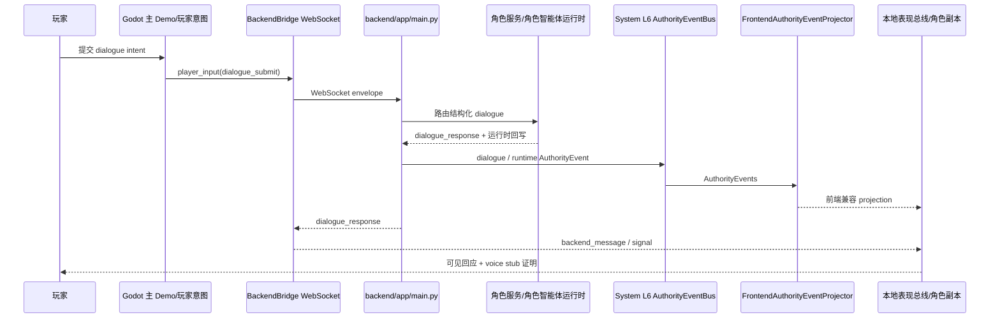
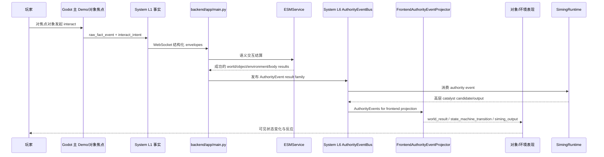
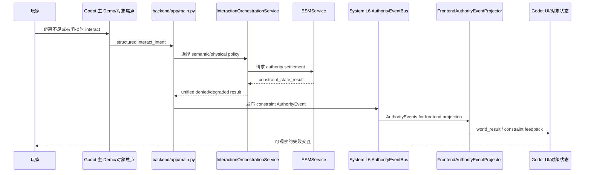
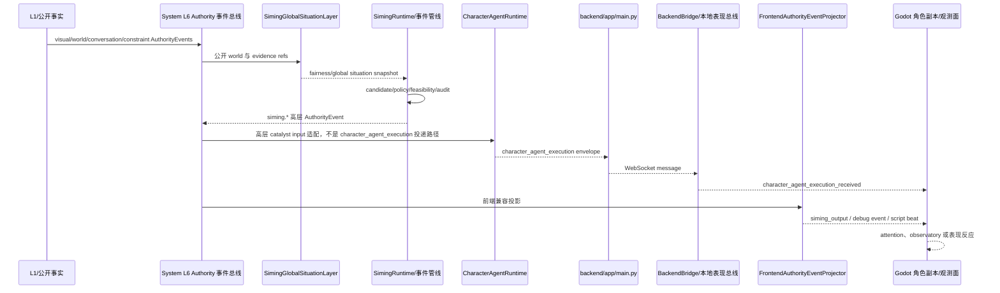
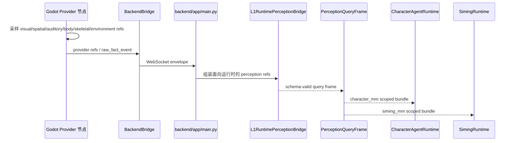

# 运行时时序图

状态：当前运行时图表文档

这些图描述当前已验证的运行时路径，不是未来产品理想态。配合下面文档使用：

- `docs/架构/运行时/模块/SystemL1.md`
- `docs/架构/运行时/模块/角色智能体.md`
- `docs/架构/运行时/运行时覆盖矩阵.md`

## 对话循环



验证：

- `python scripts/verification/harness.py --profile phase0`

## 交互成功



验证：

- `python scripts/verification/harness.py --profile phase0`
- `python scripts/verification/harness.py --profile interaction-orchestration-service`

## 交互失败 / 约束



验证：

- `python scripts/verification/harness.py --profile phase0`
- `python scripts/verification/harness.py --profile esm-physical-channel-world-actuation`

## Siming 催化反应



说明：`Authority -> Character` 只表示 `siming.*` 高层事件被适配为角色可消费的 catalyst input。
`character_agent_execution` 仍由 `CharacterAgentRuntime -> backend/app/main.py -> BackendBridge -> Godot` 投递，不走 L6。

验证：

- `python scripts/verification/harness.py --profile phase0`
- `python scripts/verification/harness.py --profile siming-global-situation-layer`

## 角色智能体执行投递

```mermaid
sequenceDiagram
    participant L1 as CharacterPerceived/SelfBody/Siming 输入
    participant Runtime as CharacterAgentRuntime
    participant L2 as L2 推理器
    participant L3 as L3 规划器
    participant L4 as L4Executor
    participant Main as backend/app/main.py
    participant Bridge as BackendBridge/本地表现总线
    participant Actor as 角色副本/运行时状态
    participant Skin as KnightRoleSkin

    L1->>Runtime: actor-private input
    Runtime->>Runtime: timeline + memory 回写
    Runtime->>L2: private snapshot + memory state
    L2-->>Runtime: interpretation
    Runtime->>L3: interpreted reality + goal/control mode
    L3-->>Runtime: selected intent / suggestions
    Runtime->>L4: execution request
    L4-->>Runtime: 五通道 execution plan
    Runtime-->>Main: character_agent_execution envelope
    Main-->>Bridge: WebSocket message
    Bridge-->>Actor: character_agent_execution_received
    Actor->>Actor: AgentControllerAdapter + CharacterRuntimeState
    Actor->>Skin: CharacterPresentationInput-shaped data
    Skin-->>Actor: 本地 embodiment/presentation
```

验证：

- `python scripts/verification/harness.py --profile character-agent-execution`
- `python scripts/verification/harness.py --profile phase0`

## Godot Provider 到 PQF



验证：

- `python scripts/verification/harness.py --profile godot-sampling-production-grade-providers`
- `python scripts/verification/harness.py --profile l1-world-fact-runtime`
