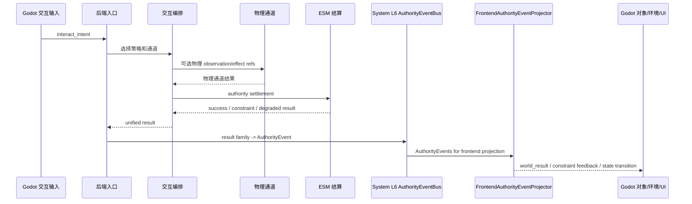

# ESM 与交互编排

状态：当前运行时模块文档

本文记录 ESM、交互编排和物理通道在当前运行时中的责任边界。

## 责任边界

ESM 与交互编排拥有：

- 结构化交互请求的策略选择
- semantic / physical 通道选择
- ESM authority settlement
- 成功、失败、降级和约束结果合并
- 输出可适配为 `AuthorityEvent` 的 `world_result` 与 `constraint_state_result`

它们不拥有：

- 角色认知
- Siming 全局判断
- Godot 本地伪造成功
- VLA 或模型输出直接改写世界
- System L6 authority event bus
- FrontendAuthorityEventProjector

## 可视化架构图

```text
┌──────────────────────────── ESM 与交互编排 ────────────────────────────┐
│                                                                         │
│ 输入                                                                     │
│  Godot interact_intent / actor action request / projected facts / context│
│        │                                                                │
│        v                                                                │
│  ┌──────────────────────────────────┐                                   │
│  │ InteractionOrchestrationService   │                                   │
│  │ policy selection / channel choice │                                   │
│  └───────────────┬──────────────────┘                                   │
│                  │                                                       │
│       ┌──────────┴──────────┐                                            │
│       v                     v                                            │
│  ┌──────────────┐     ┌──────────────────────────────┐                  │
│  │ semantic path │     │ physical channel             │                  │
│  │ intent/result │     │ contact/body/object/env refs │                  │
│  └──────┬───────┘     └──────────────┬───────────────┘                  │
│         │                            │                                  │
│         └──────────────┬─────────────┘                                  │
│                        v                                                │
│  ┌──────────────────────────────────┐                                   │
│  │ ESMService authority settlement   │                                   │
│  │ success / denied / constraint     │                                   │
│  └───────────────┬──────────────────┘                                   │
│                  │                                                       │
│                  v                                                       │
│  ┌──────────────────────────────────┐                                   │
│  │ unified result merge              │                                   │
│  │ world_result / constraint_state   │                                   │
│  └───────────────┬──────────────────┘                                   │
│                  │ AuthorityEvent                                       │
│                  v                                                       │
│  ┌──────────────────────────────────┐                                   │
│  │ System L6 AuthorityEventBus       │                                   │
│  │ route / replay / audit helper     │                                   │
│  └───────────────┬──────────────────┘                                   │
│                  │ AuthorityEvents                                       │
│                  v                                                       │
│  ┌──────────────────────────────────┐                                   │
│  │ FrontendAuthorityEventProjector   │───> Godot 可见对象/环境/UI 反馈   │
│  └──────────────────────────────────┘                                   │
│                                                                         │
│ 禁止：成为角色 cognition、让 VLA/模型直写世界、让 Godot 本地伪造成功      │
└─────────────────────────────────────────────────────────────────────────┘
```

## 主要文件与归属

| 区域 | 文件 | 归属 |
| --- | --- | --- |
| ESM 结算 | `backend/app/services/esm_service.py` | ESM |
| 交互编排 | `backend/app/services/interaction_orchestration_service.py` | ESM/交互编排 |
| 物理通道 | `backend/app/services/physical_interaction_channel.py` | ESM/交互编排 |
| L6 authority event 适配 | `backend/app/services/phase0_authority_event_adapter.py`, `backend/app/services/authority_event_bus.py` | 下游 L6 依赖，非 ESM owner |
| L6 下游前端投影适配器 | `backend/app/services/frontend_authority_event_projection.py` | 下游投影依赖，非 ESM owner |
| Godot 物理交互适配 | `scripts/interaction/*` | Godot/交互适配 |

## 数据契约

| 契约 | 说明 |
| --- | --- |
| `interact_intent` | Godot 发起的结构化交互意图 |
| `world_result` | authority 结算后的世界/对象/环境结果 |
| `constraint_state_result` | 失败或约束结果 |
| physical effect refs | 物理通道的受控观察/效果引用 |

## 时序



## 验证

- `python scripts/verification/harness.py --profile interaction-orchestration-service`
- `python scripts/verification/harness.py --profile esm-physical-channel-world-actuation`
- `python scripts/verification/harness.py --profile backend-contract`
- `python scripts/verification/harness.py --profile phase0`
