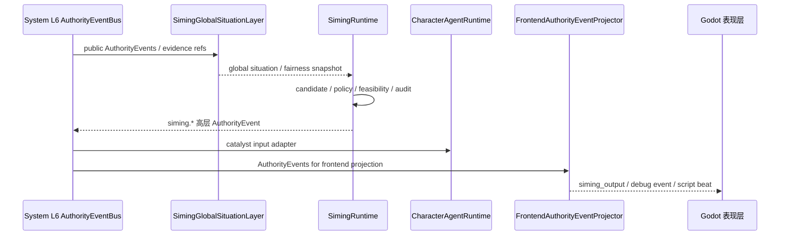

# Siming

状态：当前运行时模块文档

本文记录当前仓库中 `Siming` 的运行时边界。Siming 是全局态势与高层催化层，
不是角色脑、不是 ESM authority、不是 Godot 本地表现层，也不是低层动作控制器。

## 责任边界

Siming 拥有：

- 公开 authority events 的消费
- 全局态势与公平性快照
- 高层 catalyst candidate / policy / feasibility / audit
- `siming.*` authority event 的生产
- 面向角色智能体的高层 catalyst input

Siming 不拥有：

- 角色私有记忆、actor-private cache 或私有感知
- `character_agent_execution` 的生成或投递
- ESM world truth / authority settlement
- Godot 本地表现或低层动作控制
- 绕过 `FrontendAuthorityEventProjector` 直写 Godot 的能力

## 可视化架构图

```text
┌──────────────────────────────────── Siming ────────────────────────────────────┐
│                                                                                 │
│  输入                                                                           │
│   System L6 公开 AuthorityEvents / public world refs / evidence refs / PQF scope │
│        │                                                                        │
│        v                                                                        │
│  ┌──────────────────────────────────┐                                          │
│  │ SimingGlobalSituationLayer        │                                          │
│  │ global situation / fairness       │                                          │
│  └───────────────┬──────────────────┘                                          │
│                  │                                                             │
│                  v                                                             │
│  ┌──────────────────────────────────┐                                          │
│  │ SimingRuntime / candidate policy  │                                          │
│  │ feasibility / audit               │                                          │
│  └───────────────┬──────────────────┘                                          │
│                  │ 高层 catalyst                                               │
│                  v                                                             │
│  ┌──────────────────────────────────┐                                          │
│  │ SimingEventProducer               │                                          │
│  │ siming.* AuthorityEvent           │                                          │
│  └───────────────┬──────────────────┘                                          │
│                  │                                                             │
│                  v                                                             │
│  System L6 AuthorityEventBus ──> FrontendAuthorityEventProjector ──> Godot       │
│                  │                                                             │
│                  └──> Character catalyst input adapter                          │
│                                                                                 │
│  禁止：读取角色私有 cache、直接生成 character_agent_execution、直接写 world truth │
└─────────────────────────────────────────────────────────────────────────────────┘
```

## 主要 owner

| 区域 | 文件 |
| --- | --- |
| 全局态势层 | `backend/app/services/siming_global_situation.py` |
| Siming runtime | `backend/app/services/siming_runtime.py` |
| L6 event consumer | `backend/app/services/siming_event_consumer.py` |
| L6 event producer | `backend/app/services/siming_event_producer.py` |
| 审计输出 | `backend/app/services/siming_audit_writer.py` |
| 模型 provider | `backend/app/services/siming_llm_provider.py` |

## 数据契约

| 契约 | 说明 |
| --- | --- |
| 公开 `AuthorityEvent` | Siming 可以消费的公开事件输入 |
| `SimingGlobalSituationSnapshot` | 全局态势和公平性快照 |
| catalyst candidate | 高层催化候选，不是低层动作命令 |
| `siming.*` AuthorityEvent | 回写 L6 的高层事件 |
| `siming_output` | 由 `FrontendAuthorityEventProjector` 投影出的 Godot/debug 可消费消息 |

## 时序



说明：`L6 -> Character` 只表示高层 catalyst input 适配。角色执行仍由
`CharacterAgentRuntime -> backend/app/main.py -> BackendBridge.gd -> LocalPresentationBus.gd -> CharacterReplica.gd`
投递 `character_agent_execution`，不走 L6。

## 验证

- `python scripts/verification/harness.py --profile siming-global-situation-layer`
- `python scripts/verification/harness.py --profile siming-backend-chain`
- `python scripts/verification/harness.py --profile phase0`

说明：`siming-backend-chain` 需要 live model-provider credentials，不包含在默认 `all` profile 中。
