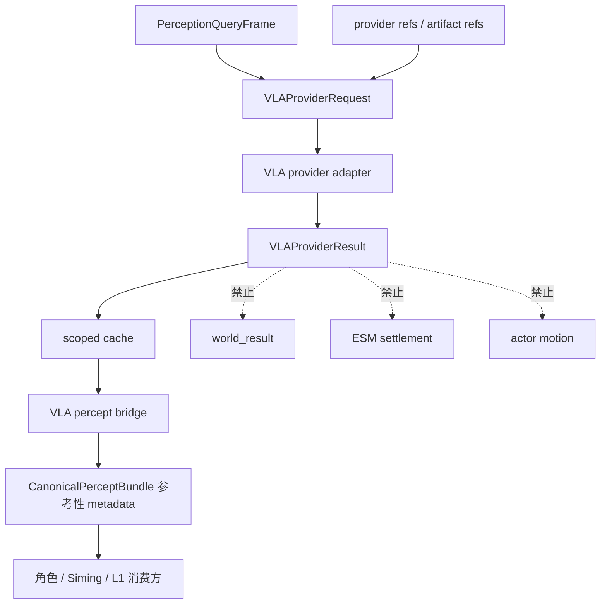

# VLA 运行时通道

状态：当前运行时模块文档

本文记录已经实现的 VLA 运行时慢路径：它从 PQF、provider refs、artifact refs
和 structured fact refs 生成视觉/空间理解结果，并通过受控 bridge 回到运行时感知链路。

这里的“无直接 authority 写权限边界”不是说 VLA 没实现，而是说 VLA 结果必须经过受控消费路径。
VLA 可以提供视觉/空间理解结果，但不能绕过 L1、ESM、角色智能体或 Siming 的契约边界。

## 已实现范围

当前仓库已经实现并验证的 VLA 范围：

- `PerceptionQueryFrame` 到 `VLAProviderRequest` 的转换
- `VLAProviderResult` 契约
- model registry
- slow path scheduler
- scoped cache
- percept bridge
- runtime consumption
- 与 L1 projected fact 冲突时的冲突记录，不覆盖 L1/world truth

## 可视化架构图

```text
┌────────────────────────────── VLA 运行时通道 ───────────────────────────────┐
│                                                                              │
│ 输入                                                                          │
│  PQF / provider refs / artifact refs / structured fact refs                   │
│        │                                                                     │
│        v                                                                     │
│  ┌──────────────────────────────┐                                            │
│  │ VLA slow path scheduler       │                                            │
│  │ 节流、去重、调度、scope 管理  │                                            │
│  └──────────────┬───────────────┘                                            │
│                 │                                                            │
│                 v                                                            │
│  ┌──────────────────────────────┐       ┌────────────────────────────────┐   │
│  │ VLA model registry            │──────>│ VLA provider adapter            │   │
│  │ model route / readiness refs  │       │ 输出 VLAProviderResult          │   │
│  └──────────────────────────────┘       └──────────────┬─────────────────┘   │
│                                                        │                      │
│                                                        v                      │
│  ┌──────────────────────────────┐       ┌────────────────────────────────┐   │
│  │ scoped cache                  │<──────│ conflict / uncertainty record   │   │
│  │ actor/session/scene isolation │       │ 不覆盖 L1 projected fact        │   │
│  └──────────────┬───────────────┘       └────────────────────────────────┘   │
│                 │                                                            │
│                 v                                                            │
│  ┌──────────────────────────────┐                                            │
│  │ VLA percept bridge            │                                            │
│  │ 参考性 metadata -> bundle     │                                            │
│  └──────────────┬───────────────┘                                            │
│                 │                                                            │
│                 v                                                            │
│  Character / Siming / L1 consumers 只在各自边界内参考，不获得 authority 写权  │
│                                                                              │
│ 禁止：world_result / ESM settlement / actor motion / world truth overwrite    │
└──────────────────────────────────────────────────────────────────────────────┘
```

## 受控消费边界

VLA 输出可以：

- 作为视觉/空间理解结果进入 percept bridge
- 增强 `CanonicalPerceptBundle` 的参考性 metadata
- 供角色智能体、Siming 或 L1 消费方在各自边界内参考
- 记录与 L1 projected fact 的冲突或不确定性

VLA 输出不能：

- 直接写 `world_result`
- 直接驱动 ESM settlement
- 直接控制 actor motion
- 直接覆盖 L1 projected fact 或 world truth

## 主要 owner

| 区域 | 文件 |
| --- | --- |
| VLA request/result 契约 | `backend/app/world_runtime/vla_provider.py` |
| VLA model registry | `backend/app/world_runtime/vla_model_registry.py` |
| VLA slow path scheduler | `backend/app/world_runtime/vla_slow_path_scheduler.py` |
| VLA cache | `backend/app/world_runtime/vla_cache.py` |
| VLA percept bridge | `backend/app/world_runtime/vla_percept_bridge.py` |
| Runtime consumption | `backend/app/world_runtime/intelligence_upgrade.py` |

## 数据流



## 与模型服务通道的区别

| 项 | VLA 运行时通道 | 模型服务通道 |
| --- | --- | --- |
| 关注点 | VLA 视觉/空间结果如何进入运行时并被安全消费 | provider readiness、凭证、adapter、真实调用证明 |
| 主要输出 | `VLAProviderResult` 和参考性 metadata | readiness ledger、provider status、validated model output |
| authority | 无 world truth authority | 无 world truth authority |
| 验证 | `vla-provider-backend` | `model-provider-readiness` |

## 验证

- `python scripts/verification/harness.py --profile vla-provider-backend`
- `python scripts/verification/harness.py --profile mainline-unified-runtime`
