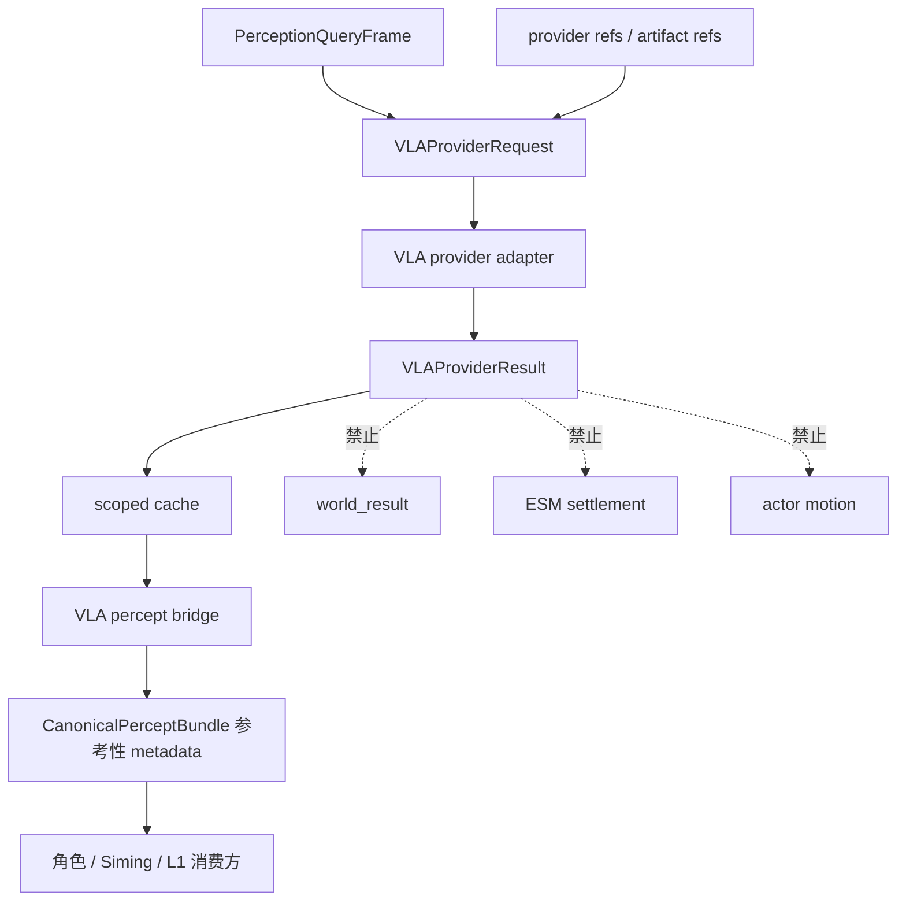

# VLA 运行时通道

状态：当前运行时模块文档

本文记录已经实现的 VLA 运行时慢路径：它从 PQF、provider refs、artifact refs
和 structured fact refs 生成视觉/空间理解结果，并通过受控 bridge 回到运行时感知链路。

这里的“无直接 authority 写权限边界”不是说 VLA 没实现，而是说 VLA 结果必须经过受控消费路径。
VLA 可以提供视觉/空间理解结果，但不能绕过 L1、ESM、角色智能体或 Siming 的契约边界。

## 已实现范围

当前仓库已经实现并验证的 VLA 范围：

- `PerceptionQueryFrame` 到 `VLAProviderRequest` 的转换
- `VLAProviderResult` 契约
- model registry
- slow path scheduler
- scoped cache
- percept bridge
- runtime consumption
- 与 L1 projected fact 冲突时的冲突记录，不覆盖 L1/world truth
- PQF-inherited grounding catalog：known scene entity / collider / anchor /
  affordance refs 仅作为模型可引用的受控目录；adapter 丢弃目录外 candidate refs，且目录
  命中不构成 world truth 或视觉评分证据
- OpenAI-compatible HTTP adapter：从 PQF visual `stable_source_ref` 中只传送显式 `https://` 或 `data:image/` artifact，使用非流式 JSON advisory response
- advisory router：生产环境只调度 `advisory-fast` (`qwen3.7-flash`, 12s，`enable_thinking=false`)。PQF 高不确定性/冲突与 fast 低置信度会保留不确定性/冲突 metadata，但不会自动升级。`advisory-deep` (`qwen3.7-plus`, 20s) 仅保留为显式 re-admission benchmark candidate，默认 `VLA_ADVISORY_DEEP_ENABLED=false`。
- route/model-aware cache key、scheduler fingerprint 和 bridge metadata；timeout/error 只产生 late advisory 降级，不会递归升级或阻塞当前 tick
- `VLASlowPath` 将 router、per-owner scheduler、scoped cache 与 provider adapter 组成可执行慢路径；它按调用方/PQF 的同一 clock domain 判断过期，仍不接触 bridge 之外的 authority

## 可视化架构图

```text
┌────────────────────────────── VLA 运行时通道 ───────────────────────────────┐
│                                                                              │
│ 输入                                                                          │
│  PQF / provider refs / artifact refs / structured fact refs / grounding catalog│
│        │                                                                     │
│        v                                                                     │
│  ┌──────────────────────────────┐                                            │
│  │ VLA slow path scheduler       │                                            │
│  │ 节流、去重、调度、scope 管理  │                                            │
│  └──────────────┬───────────────┘                                            │
│                 │                                                            │
│                 v                                                            │
│  ┌──────────────────────────────┐       ┌────────────────────────────────┐   │
│  │ VLA model registry            │──────>│ VLA provider adapter            │   │
│  │ model route / readiness refs  │       │ 输出 VLAProviderResult          │   │
│  └──────────────────────────────┘       └──────────────┬─────────────────┘   │
│                                                        │                      │
│                                                        v                      │
│  ┌──────────────────────────────┐       ┌────────────────────────────────┐   │
│  │ scoped cache                  │<──────│ conflict / uncertainty record   │   │
│  │ actor/session/scene isolation │       │ 不覆盖 L1 projected fact        │   │
│  └──────────────┬───────────────┘       └────────────────────────────────┘   │
│                 │                                                            │
│                 v                                                            │
│  ┌──────────────────────────────┐                                            │
│  │ VLA percept bridge            │                                            │
│  │ 参考性 metadata -> bundle     │                                            │
│  └──────────────┬───────────────┘                                            │
│                 │                                                            │
│                 v                                                            │
│  Character / Siming / L1 consumers 只在各自边界内参考，不获得 authority 写权  │
│                                                                              │
│ 禁止：world_result / ESM settlement / actor motion / world truth overwrite    │
└──────────────────────────────────────────────────────────────────────────────┘
```

## 受控消费边界

VLA 输出可以：

- 作为视觉/空间理解结果进入 percept bridge
- 增强 `CanonicalPerceptBundle` 的参考性 metadata
- 供角色智能体、Siming 或 L1 消费方在各自边界内参考
- 记录与 L1 projected fact 的冲突或不确定性

VLA 输出不能：

- 直接写 `world_result`
- 直接驱动 ESM settlement
- 直接控制 actor motion
- 直接覆盖 L1 projected fact 或 world truth

正式 route、timeout、cache、冲突和 TTS 收口见
`docs/superpowers/specs/current-project-intelligence-upgrade/2026-07-30-advisory-vla-routing-and-tts-convergence-design.md`。

## 真实 Provider 与 Live Proof

HTTP adapter 的第一实现面是 OpenAI-compatible `chat/completions`。它把 PQF
identity、artifact refs、structured fact refs 与 scene-truth-precedence policy
以及 PQF 继承的实体/collider/anchor/affordance grounding catalog 发给模型；provider 只能在
该目录内返回 candidate refs，目录外引用会被丢弃。目录用于把 advisory 结果关联到既有
scene truth，不是对模型视觉判断的背书。模型输出会被投影到受控 advisory finding 字段。任何 action、world
state、physics、transform、bone、authority 或 actor-control 字段都会被丢弃。

opaque artifact ref 不会被猜测为 URL，也不会触发 Godot scene 读取；没有可传输
visual artifact 时，adapter 返回 `blocked_missing_artifacts`。

配置：`VLA_PROVIDER_MODE=http`、`VLA_PROVIDER_KIND=openai_compatible`、
`VLA_PROVIDER_ENDPOINT`、`VLA_PROVIDER_API_KEY`、`VLA_PROVIDER_MODEL`、
`VLA_PROVIDER_MODEL_VERSION`。`VLA_PROVIDER_JSON_MODE_ENABLED` 默认 `false`；只有目标
provider 明确支持 OpenAI `response_format=json_object` 时才设为 `true`。无论该开关如何，
adapter 都要求并验证 JSON advisory schema。key 不得进入版本库或验证报告。

真实调用证明必须显式执行：

```powershell
python scripts/verification/verify_vla_provider_live.py --allow-live-call
python scripts/verification/verify_godot_sampling_production_grade_providers.py --godot-exe <Godot-console-exe>
python scripts/verification/verify_vla_provider_live.py --allow-live-call --use-godot-runtime-capture
```

默认命令要求 `VLA_LIVE_PROOF_IMAGE_URL` 或 repository-relative
`VLA_LIVE_PROOF_IMAGE_PATH`，以及非空 `VLA_PROVIDER_LIVE_PROOF_RUN_ID`。Godot runtime
proof 应先运行 sampling verifier；`--use-godot-runtime-capture` 只接受其不超过五分钟、
与 runtime report 中 visual provider ref 完全匹配的 viewport PNG。它不会接受普通仓库
纹理冒充 runtime capture。readiness 只在 run ID、provider/model、endpoint
host、runtime artifact marker 与 bridge evidence 匹配时提升为
`real_provider_verified`；credentials/artifact 缺失仍只是 blocked 状态。
生产验证只要求 fast proof。deep 命令只用于在独立 re-admission 方案已批准后收集实验
证据，不能通过配置或 benchmark 结果自动恢复为 production route。

## 主要 owner

| 区域 | 文件 |
| --- | --- |
| VLA request/result 契约 | `backend/app/world_runtime/vla_provider.py` |
| VLA model registry | `backend/app/world_runtime/vla_model_registry.py` |
| VLA slow path scheduler | `backend/app/world_runtime/vla_slow_path_scheduler.py` |
| VLA cache | `backend/app/world_runtime/vla_cache.py` |
| VLA percept bridge | `backend/app/world_runtime/vla_percept_bridge.py` |
| Runtime consumption | `backend/app/world_runtime/intelligence_upgrade.py` |

## 数据流



## 与模型服务通道的区别

| 项 | VLA 运行时通道 | 模型服务通道 |
| --- | --- | --- |
| 关注点 | VLA 视觉/空间结果如何进入运行时并被安全消费 | provider readiness、凭证、adapter、真实调用证明 |
| 主要输出 | `VLAProviderResult` 和参考性 metadata | readiness ledger、provider status、validated model output |
| authority | 无 world truth authority | 无 world truth authority |
| 验证 | `vla-provider-backend` | `model-provider-readiness` |

## 验证

- `python scripts/verification/harness.py --profile vla-provider-backend`
- `python scripts/verification/harness.py --profile mainline-unified-runtime`
