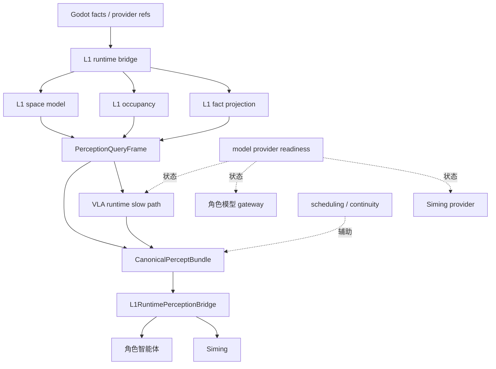

# 世界运行时

状态：当前运行时模块文档

本文把 `backend/app/world_runtime/` 作为一个大类来说明。它不是单个 feature，
而是当前仓库承接世界侧运行时基础设施的模块群：System L1、PQF、投影、VLA 慢路径、
模型 provider readiness、调度和 continuity 都在这个大类下。

## 定位

`world_runtime` 是后端内部的世界运行时基础设施层。

它负责：

- 接收和组织来自 Godot 的事实、provider refs 和结构化感知输入
- 维护 L1 空间、occupancy 和 fact projection 能力
- 生成 `PerceptionQueryFrame`
- 组装 `CanonicalPerceptBundle`
- 通过 `L1RuntimePerceptionBridge` 把 projected facts / provider refs 桥接到角色与司命消费面
- 承接 VLA 慢路径运行时通道
- 记录 model provider readiness
- 提供运行时 scheduling / continuity 辅助能力

它不负责：

- ESM authority settlement
- 角色私有认知
- Siming 全局判断
- Godot 本地表现
- 模型 provider 的真实凭证管理本身

## 可视化架构图

```text
┌────────────────────────────── 世界运行时 world_runtime ──────────────────────────────┐
│                                                                                      │
│ 输入来源                                                                              │
│  Godot raw_fact_event / provider refs / artifact refs / structured perception refs   │
│        │                                                                             │
│        v                                                                             │
│  ┌──────────────────────────────┐                                                    │
│  │ L1 runtime bridge             │                                                    │
│  │ 规范化 Godot 输入和采样 refs  │                                                    │
│  └──────────────┬───────────────┘                                                    │
│                 │                                                                    │
│                 v                                                                    │
│  ┌───────────────────────────────────────────────────────────────────────────────┐   │
│  │ System L1 子域                                                               │   │
│  │ L1 space model / occupancy / fact projection / perception frame              │   │
│  │ 输出 projected facts、CandidatePerceptEvent、PerceptionQueryFrame            │   │
│  └──────────────┬────────────────────────────────────────────────────────────────┘   │
│                 │                                                                    │
│                 v                                                                    │
│  ┌──────────────────────────────┐        ┌──────────────────────────────────────┐    │
│  │ PQF / Canonical bundle        │───────>│ VLA 慢路径                           │    │
│  │ consumer-facing percept refs  │        │ scheduler / registry / provider      │    │
│  └──────────────┬───────────────┘        │ scoped cache / percept bridge         │    │
│                 │                        └──────────────┬───────────────────────┘    │
│                 │                                       │ 参考性 metadata             │
│                 v                                       v                            │
│  ┌──────────────────────────────┐        ┌──────────────────────────────────────┐    │
│  │ L1RuntimePerceptionBridge     │<───────│ model provider readiness refs        │    │
│  │ character_frame / bundle      │        │ 只记录 readiness，不证明真实成功调用 │    │
│  │ siming_frame / bundle         │        └──────────────────────────────────────┘    │
│  └──────────────┬───────────────┘                                                    │
│                 │                                                                    │
│                 v                                                                    │
│  角色智能体 / Siming 消费方 只消费，不获得 world truth                               │
│                 │                                                                    │
│                 v                                                                    │
│  System L6 / ESM / Godot 投影只接收受控结果；world_runtime 不直接做 authority 结算。 │
│                                                                                      │
└──────────────────────────────────────────────────────────────────────────────────────┘
```

## 子域划分

| 子域 | 主要文件 | 模块文档 |
| --- | --- | --- |
| L1 空间模型 | `backend/app/world_runtime/l1_space_model.py` | `docs/架构/运行时/模块/SystemL1.md` |
| L1 occupancy | `backend/app/world_runtime/l1_occupancy.py` | `docs/架构/运行时/模块/SystemL1.md` |
| L1 fact projection | `backend/app/world_runtime/l1_fact_projection.py` | `docs/架构/运行时/模块/SystemL1.md` |
| L1 perception frame | `backend/app/world_runtime/l1_perception_frame.py` | `docs/架构/运行时/模块/SystemL1.md` |
| L1 runtime bridge | `backend/app/world_runtime/l1_runtime_perception_bridge.py` | `docs/架构/运行时/模块/SystemL1.md` |
| Intelligence upgrade | `backend/app/world_runtime/intelligence_upgrade.py` | `docs/架构/运行时/模块/SystemL1.md` |
| VLA runtime | `backend/app/world_runtime/vla_*.py` | `docs/架构/运行时/模块/VLA运行时通道.md` |
| Model provider readiness | `backend/app/world_runtime/model_provider_readiness.py` | `docs/架构/运行时/模块/模型服务通道.md` |
| Scheduling / continuity | `backend/app/world_runtime/scheduling.py`, `backend/app/world_runtime/continuity.py` | `docs/架构/运行时/运行时总览.md` |
| Projection / registry helpers | `backend/app/world_runtime/projection.py`, `backend/app/world_runtime/fact_registry.py`, `backend/app/world_runtime/models.py` | `docs/架构/运行时/运行时覆盖矩阵.md` |

## 关系图



## 与其它模块的边界

| 相邻模块 | world_runtime 输出什么 | 不做什么 |
| --- | --- | --- |
| Godot 表现与角色入口 | provider refs、事实处理后的运行时感知输入 | 不直接控制 Godot 表现 |
| System L6 事件总线 | 可进入 authority event 的事实引用、投影上下文和 evidence refs | 不拥有 publish/subscribe 路由，不做前端投影 |
| 角色智能体 | `CharacterPerceivedEvent`、经 `L1RuntimePerceptionBridge` 送入的 character bundle、参考性 metadata | 不写角色私有记忆，不选择角色 intent |
| ESM 与交互编排 | projected facts、空间/可达性相关上下文 | 不做 authority settlement |
| VLA 运行时通道 | PQF 和 provider refs，经 bridge 回灌 bundle | 不让 VLA 直接覆盖 world truth |
| 模型服务通道 | readiness ledger 的 world_runtime 部分 | 不把 readiness 当作真实 provider 成功调用 |
| Harness 验证证据 | profile 可证明的 world runtime 行为 | 不替代运行时行为本身 |

## 验证

- `python scripts/verification/harness.py --profile l1-world-fact-runtime`
- `python scripts/verification/harness.py --profile godot-sampling-production-grade-providers`
- `python scripts/verification/harness.py --profile vla-provider-backend`
- `python scripts/verification/harness.py --profile model-provider-readiness`
- `python scripts/verification/harness.py --profile mainline-unified-runtime`
