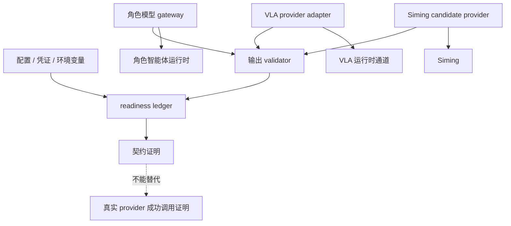

# 模型服务通道

状态：当前运行时模块文档

模型服务通道记录当前仓库所有模型 provider 入口的 readiness、配置、降级策略和真实调用证明。
它与 VLA 运行时通道分开：VLA 运行时通道关心 VLA 结果如何进入运行时并被安全消费；模型服务通道关心
provider 是否可用、是否通过契约验证、是否完成真实调用证明。

## 当前模型入口

| 入口 | 主要文件 | 输出 |
| --- | --- | --- |
| 角色文本模型 | `backend/app/character_agent/gateway/*` | 结构化角色解释/规划辅助输出 |
| Siming candidate provider | `backend/app/services/siming_llm_provider.py` | Siming candidate 或降级候选 |
| VLA provider backend adapter | `backend/app/world_runtime/vla_provider.py` | `VLAProviderResult` |
| 非运行时生产模型入口 | `tools/production/*` | review/approved artifacts 和 replay dataset refs |
| readiness ledger | `backend/app/world_runtime/model_provider_readiness.py` | 脱敏 provider readiness 状态 |

## 可视化架构图

```text
┌────────────────────────────── 模型服务通道 ──────────────────────────────┐
│                                                                           │
│  配置 / 凭证 / endpoint / timeout / enabled state                         │
│        │                                                                  │
│        v                                                                  │
│  ┌──────────────────────────────────┐                                     │
│  │ model_provider_readiness ledger   │                                     │
│  │ 脱敏记录 provider status          │                                     │
│  └───────────────┬──────────────────┘                                     │
│                  │                                                        │
│      ┌───────────┼───────────┬──────────────────────┐                    │
│      v           v           v                      v                    │
│  ┌─────────┐ ┌──────────┐ ┌──────────────┐ ┌─────────────────────────┐   │
│  │ 角色文本│ │ Siming   │ │ VLA provider │ │ 非运行时 production model│   │
│  │ gateway │ │ candidate│ │ adapter      │ │ review / approved refs   │   │
│  └────┬────┘ └────┬─────┘ └──────┬───────┘ └──────────┬──────────────┘   │
│       │           │              │                    │                  │
│       v           v              v                    v                  │
│  structured   Siming        VLAProviderResult     production artifacts    │
│  model output candidate     进入 VLA 运行时通道    进入离线/审核管线       │
│       │           │              │                                       │
│       └───────────┴──────────────┴──────────────┐                        │
│                                                  v                        │
│  各运行时 owner 负责消费；模型服务通道不直接写 world truth / ESM / actor  │
│                                                                           │
│  readiness 或契约证明 != 真实 provider 成功调用证明                       │
└───────────────────────────────────────────────────────────────────────────┘
```

## 边界

模型服务通道可以证明：

- 配置存在且已脱敏记录
- adapter 契约可构造
- 输出 validator 可执行
- fallback 路径清晰
- readiness ledger 可生成

模型服务通道不能单独证明：

- 真实 provider 已成功调用
- 模型输出可以直接写 world truth
- 模型输出可以直接触发 ESM settlement
- 模型输出可以直接控制角色动作

真实 provider 证明必须包含凭证、成功 adapter 调用和可接受产物；没有这些时，只能称为
readiness 或契约证明。

## 数据流



## 验证

- `python scripts/verification/harness.py --profile model-provider-readiness`
- `python scripts/verification/harness.py --profile vla-provider-backend`
- `python scripts/verification/harness.py --profile siming-backend-chain`

说明：`siming-backend-chain` 需要 live model-provider credentials，不包含在默认 `all` profile 中。
