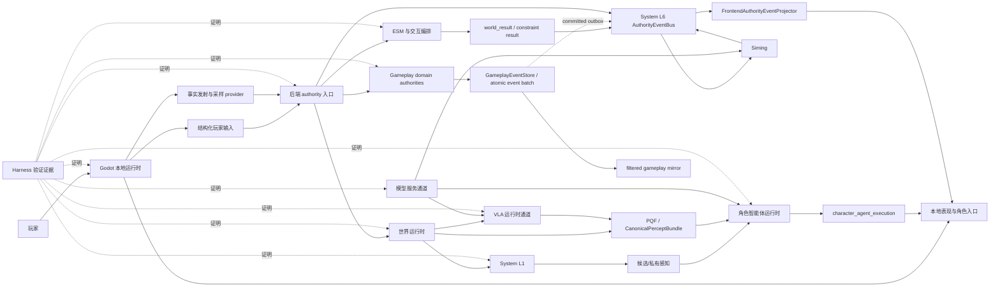
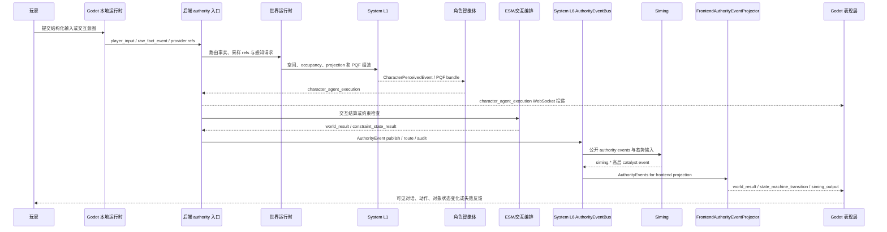
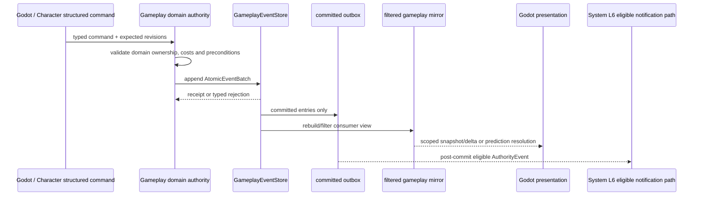
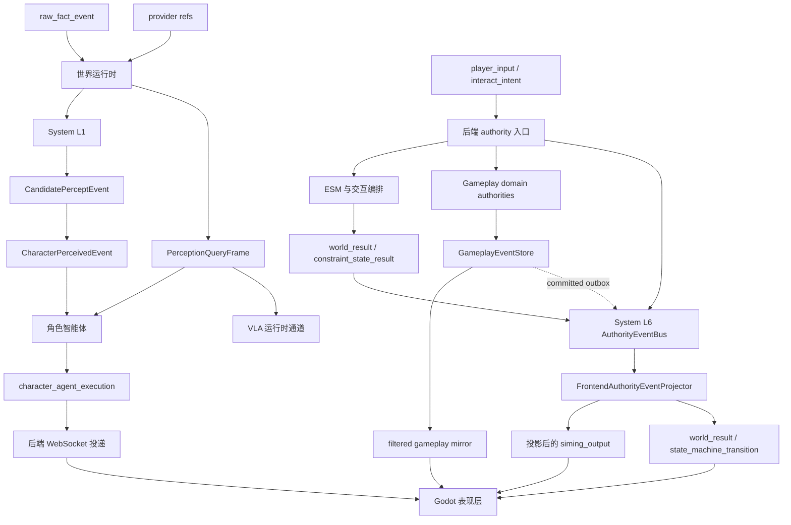

# 运行时总览

状态：`current-code runtime baseline; includes verified Gameplay Foundation substrate`

本文是 `docs/架构/运行时/` 的总入口，负责说明整体架构、整体运行时时序和整体数据流。
局部 owner、字段细节和验证证据仍以各模块文档为准。

## 总入口

| 层级 | 文档 |
| --- | --- |
| 覆盖矩阵 | `docs/架构/运行时/运行时覆盖矩阵.md` |
| 世界运行时 | `docs/架构/运行时/模块/世界运行时.md` |
| System L1 | `docs/架构/运行时/模块/SystemL1.md` |
| System L6 事件总线 | `docs/架构/运行时/模块/SystemL6事件总线.md` |
| Siming | `docs/架构/运行时/模块/Siming.md` |
| 角色智能体 | `docs/架构/运行时/模块/角色智能体.md` |
| ESM 与交互编排 | `docs/架构/运行时/模块/ESM与交互编排.md` |
| Gameplay Foundation 与领域结算 | `docs/架构/运行时/模块/GameplayFoundation与领域结算.md` |
| Godot 表现与角色入口 | `docs/架构/运行时/模块/Godot表现与角色入口.md` |
| VLA 运行时通道 | `docs/架构/运行时/模块/VLA运行时通道.md` |
| 模型服务通道 | `docs/架构/运行时/模块/模型服务通道.md` |
| Harness 验证证据 | `docs/架构/运行时/模块/Harness验证证据.md` |
| 运行时时序图 | `docs/架构/运行时/图表/整体运行时时序图.md` |
| 运行时数据流图 | `docs/架构/运行时/图表/整体运行时数据流图.md` |

## 整体架构图

## 整体运行时时序

本时序展示对象/环境交互路径。若命令修改的是账户、背包、装备、状态、产权、债务或
合同等玩法领域事实，则由对应 Gameplay authority 直接进入其 event-store 提交路径，
不经 ESM 取得通用所有权。

## Gameplay 领域结算

该路径的可回放事实由 `GameplayEventStore` 拥有；L6 只承接 commit 后的公共通知、
路由和投影。当前证据覆盖有界的 Gameplay Foundation 及 `adventure-basic` 参考闭环，
不覆盖动态市场、组织、税收或通用模拟时钟。

## 整体数据流

## 总体边界

- Godot 是本地输入、表现和高频具身 host，不是 world truth authority。
- 世界运行时是后端世界侧基础设施大类，承接 L1、PQF、VLA、provider readiness、调度和 continuity。
- System L1 是世界运行时下的事实、provider、PQF 和投影边界，不是角色脑，也不是 Siming。
- System L6 是跨层基础设施层，承接 authority event bus、路由、回放和审计辅助边界；前端投影由 `FrontendAuthorityEventProjector` 承接。
- Siming 消费公开 authority events 和全局态势输入，只输出高层 catalyst；进入 Godot 必须经过 `FrontendAuthorityEventProjector`，进入角色只能作为 catalyst input。
- 角色智能体拥有私有感知、记忆、解释、规划和执行语义，不拥有世界真相。
- ESM 与交互编排负责对象、环境和物理交互的 authority 结算与结果合并，不负责角色 cognition 或 Gameplay 的通用领域写入。
- Gameplay Foundation 的领域 authority 通过 `GameplayEventStore` 提交可回放的玩法事实；它是 authority substrate，不是另一个 runtime host。
- System L6 的 `AuthorityEvent` 路由不替代 Gameplay event store、账户账本或领域 replay。
- VLA 是已实现的视觉/空间慢路径运行时通道；它的输出必须经过受控消费路径，没有 authority 直接写权限。
- 模型服务通道记录 provider readiness 和真实调用证明，不直接改变世界或角色动作。
- Harness 记录验证证据，不替代运行时行为本身。

## 验证入口

- `python scripts/verification/harness.py --profile docs`
- `python scripts/verification/harness.py --profile mainline-unified-runtime`
- `python scripts/verification/harness.py --profile gameplay-foundation-all`
- `python scripts/verification/harness.py --profile adventure-basic`
- `python scripts/verification/harness.py --profile phase0`
