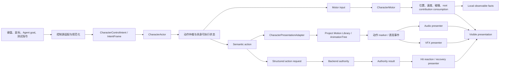

# 角色控制基础设施数据流转图

## 新增人物的配置与接纳数据

```mermaid
flowchart LR
    Package[package_id 模型引用 digest 资格报告 current] --> Check[Registry 检查 current]
    Skeleton[Skeleton3D 原生 profile 骨骼映射 current] --> Check
    Motion[动作库 ID 目标骨架 语义动作 clip current] --> Check
    Check --> Result[accepted reason scope 可用动作 current]
    Identity[独立 actor_id 出生变换 物理参数 current] --> Static[静态场景追加 current]
    Static --> Actor[独立人物实例 current]
    Actor --> Adapter[包适配器 ready current]
    Adapter --> Check
    Calibration[包朝向与人工校准 current] --> Adapter
    Adapter --> Visual[展示节点绝对旋转 current]
    Visual --> RootLocal[模型根位移 转 Actor 本地 current]
    RootLocal --> RootWorld[CharacterActor 转世界位移 current]
    RootWorld --> Motor[CharacterMotor 唯一身体写入者 current]
    AutoOrientation[几何自动识别正面 deferred] -. 校准建议 .-> Calibration
    Result --> Playback[接纳库的语义动作播放 current]
    Result -. 计划门禁 .-> Admission[身份冲突与资源接纳门禁 planned]
    Identity -. 计划输入 .-> Admission
    Admission --> Accepted[成功追加或拒绝并释放候选 planned]
    Accepted -. 成功 .-> Actor
    Actor --> Scan[bind 时组扫描 current]
    Old[原有人物身份 包 变换 current 保留] --> Scan
    Scan --> Control[控制名单 current]
    Actor -. 增量登记 .-> Incremental[保留控制对象的名单更新 planned]
    Incremental -. 更新 .-> Control
    SourceMotion[其他骨架动作源] -. 构建与资格化 .-> Retarget[批量自动重定向 deferred]
    Retarget -. 目标库 .-> Motion
    Binding[项目后端角色绑定 外部] --> Authority[后端 authority 外部所有者]
    Authority -. 确认结果 .-> Gameplay[玩法表现适配器]
```

`package_id` 可复用，`actor_id` 必须独立。前端注册输出只证明资源和表现能力；不能从中产生 HP、伤害、认知状态或世界交互授权。当前失败结果尚未阻止候选人物进入组扫描，计划门禁补齐后才满足完整接纳契约。

## 控制执行数据

```mermaid
flowchart LR
    Raw[键盘、鼠标、Agent goal、测试指令] --> Normalize[控制源适配与规范化]
    Normalize --> Intent[CharacterControlIntent / IntentFrame]
    Intent --> Actor[CharacterActor]
    Actor --> Decision[动作仲裁与具身可执行状态]
    Decision --> MotorInput[Motor input]
    Decision --> Action[Semantic action]
    MotorInput --> Motor[CharacterMotor]
    Motor --> Motion[位置、速度、碰撞、root contribution consumption]
    Action --> Adapter[CharacterPresentationAdapter]
    Adapter --> Library[Project Motion Library / AnimationTree]
    Library --> Marker[动作 marker / 表现事件]
    Marker --> Audio[Audio presenter]
    Marker --> Vfx[VFX presenter]
    AuthorityResult[Authority result] --> Reaction[Hit reaction / recovery presenter]
    Authority[Backend authority] --> AuthorityResult
    Action --> Request[Structured action request]
    Request --> Authority
    Motion --> Fact[Local observable facts]
    Reaction --> Visible[Visible presentation]
    Audio --> Visible
    Vfx --> Visible
    Motion --> Visible
```
