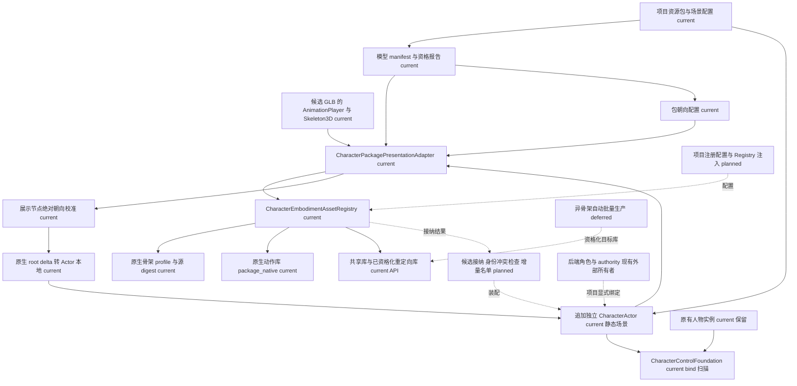
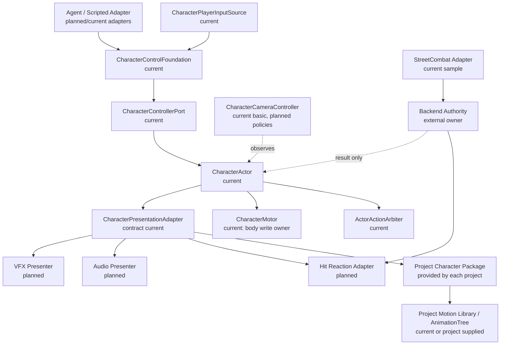

# 角色控制基础设施架构图

## 人物资源与场景装配

```mermaid
flowchart TD
    Config[项目资源包与场景配置 current] --> Manifest[模型 manifest 与资格报告 current]
    Manifest --> Adapter[CharacterPackagePresentationAdapter current]
    GLB[候选 GLB 的 AnimationPlayer 与 Skeleton3D current] --> Adapter
    Adapter --> Registry[CharacterEmbodimentAssetRegistry current]
    Registry --> Skeleton[原生骨架 profile 与源 digest current]
    Registry --> Native[原生动作库 package_native current]
    Registry --> Shared[共享库与已资格化重定向库 current API]
    Config --> NewActor[追加独立 CharacterActor current 静态场景]
    NewActor --> Adapter
    Manifest --> Alignment[包朝向配置 current]
    Alignment --> Adapter
    Adapter --> Visual[展示节点绝对朝向校准 current]
    Visual --> RootDelta[原生 root delta 转 Actor 本地 current]
    RootDelta --> NewActor
    NewActor --> Foundation[CharacterControlFoundation current bind 扫描]
    Existing[原有人物实例 current 保留] --> Foundation
    Admission[候选接纳 身份冲突检查 增量名单 planned] -. 装配 .-> NewActor
    Registry -. 接纳结果 .-> Admission
    Injection[项目注册配置与 Registry 注入 planned] -. 配置 .-> Registry
    Retarget[异骨架自动批量生产 deferred] -. 资格化目标库 .-> Shared
    Backend[后端角色与 authority 现有外部所有者] -. 项目显式绑定 .-> NewActor
```

Registry 不拥有场景节点；场景装配不授予后端能力。共享库与原生库的登记能力分别存在，当前包适配器的资格报告路径接入原生预览库，统一策略选择和失败回收仍为 planned。

## 控制与表现

```mermaid
flowchart TD
    Input[CharacterPlayerInputSource\ncurrent] --> Foundation[CharacterControlFoundation\ncurrent]
    Agent[Agent / Scripted Adapter\nplanned/current adapters] --> Foundation
    Foundation --> Port[CharacterControllerPort\ncurrent]
    Port --> Actor[CharacterActor\ncurrent]
    Actor --> Arbiter[ActorActionArbiter\ncurrent]
    Actor --> Motor[CharacterMotor\ncurrent: body write owner]
    Actor --> Presentation[CharacterPresentationAdapter\ncontract current]
    Presentation --> Package[Project Character Package\nprovided by each project]
    Camera[CharacterCameraController\ncurrent basic, planned policies] -. observes .-> Actor
    Package --> Motion[Project Motion Library / AnimationTree\ncurrent or project supplied]
    Presentation --> Hit[Hit Reaction Adapter\nplanned]
    Presentation --> Audio[Audio Presenter\nplanned]
    Presentation --> Vfx[VFX Presenter\nplanned]
    Authority[Backend Authority\nexternal owner] --> Hit
    Authority -. result only .-> Actor
    Combat[StreetCombat Adapter\ncurrent sample] --> Authority
```
